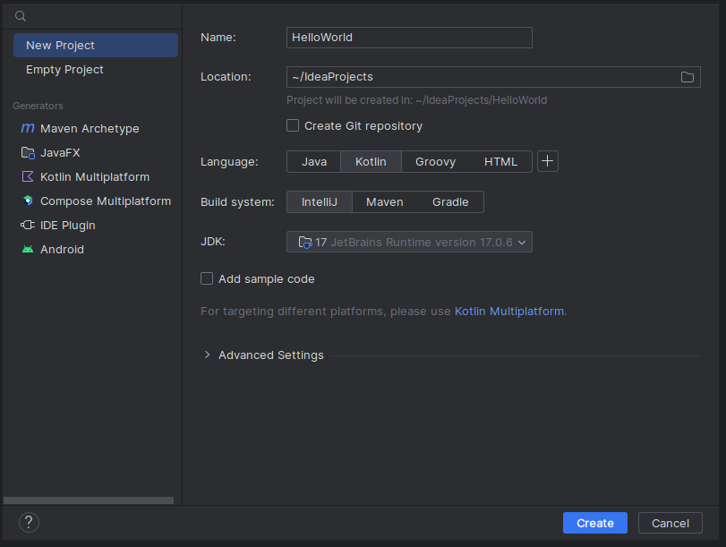
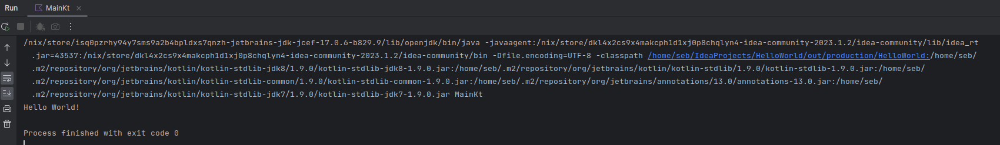
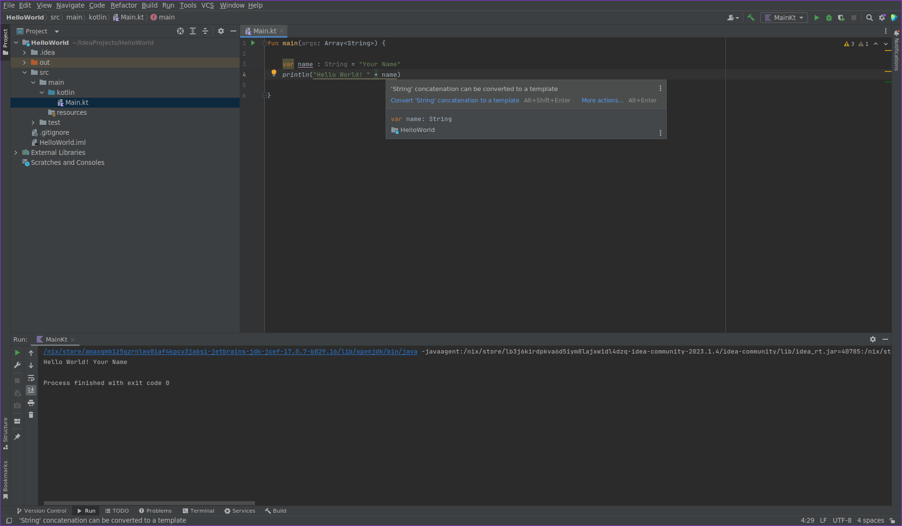
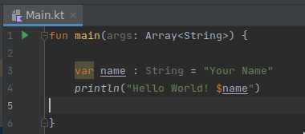
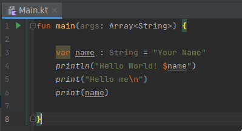
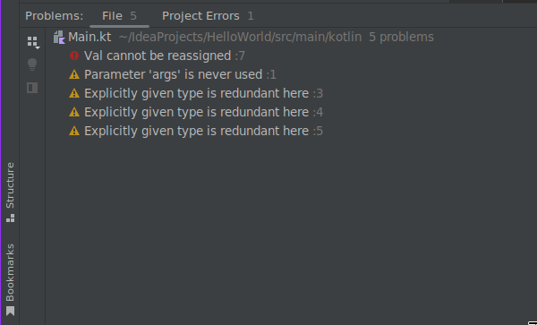
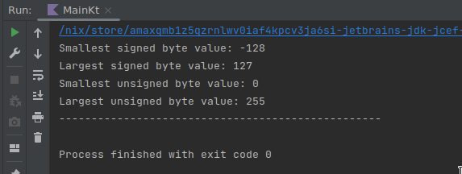

# Lab 1: Introduction to Kotlin

~~~admonish info

- You will be using IntelliJ IDE

- From your Start Menu type 'IntelliJ' and select run!

- If you want to run this on your own machine you can download the community Edition from here -> [https://www.jetbrains.com/idea/download/?section=windows](https://www.jetbrains.com/idea/download/?section=windows)

~~~

-----------------------

## 1. Getting Started 

1. Once opened you will be greeted with the landing page: 
    

2. Select **New Project**
   - Modify the *Name* to **HelloWorld**
   - Change Language to **Kotlin**
   - Uncheck **Add sample code**
   - Click **Create**
   
        

3. Once loaded (can take a few minutes) you will see the following project structure:

<div style="width: 60%; margin: 0px auto;">
    
 
</div>

4. Adding a Kotlin Class file

   - Right-click the highlighted Kotlin folder in the previous image
   - Once the context menu opens click 'New' and then Kotlin Class/file

5. Create a new **File** file called `Main`
   
<div style="width: 60%; margin: 0px auto;">


</div>

6. Now we can populate our new `Main.kt` file with some code.
   ~~~admonish info
   
   `.kt` is the extension for Kotlin files

   ~~~

7. Write the following: 
   
   ~~~admonish code

    ```kt
    fun main(args: Array<String>) {
        
        println("Hello World!")
    
    }   
    ```

    ~~~
   
    ~~~admonish example title='Explanation of code'
    
    - `fun` is a **hard keyword** that tells the Kotlin you are declaring a function.
    - `main()` is the function name, and any console-based program like this, `main()`, is the entry point of the program when it is executed by the OS.
    - `(args: Array<String>)`, is the way of telling the program that it can take in arguments supplied to it, in this instance `args`, the variable, will be an `Array` of strings` 
    - Everything between the `{}` braces is executed by the program. 
    - Lastly, `println("Hello World!")`, calls the function `println()` which prints whatever is in the brackets to the terminal with a `\n` new line at the end hence in the `ln` in `println`.
    
    ~~~

8. Now you can run the program using either of the green arrows:
   
      <div class="column" style="display: flex;">

      <div style="flex: 50%;">

      
      </div>

      <div style="flex: 50%;">

      
      </div>
      </div>

9. You should see a terminal appear at the bottom of the IDE that shows some output. 
         
      <div style="width:100%; margin: 0px auto;">
      
      

      </div>

10. Now you are going to modify the programme so that `printl()` takes a variable
   
   - Create a mutable variable called `name`
      
      ~~~admonish code
      
      ```kt
      fun main(args: Array<String>) {
        
        var name : String = "Your Name"

        println("Hello World! " + name)
    
      }  
      ```

      ~~~

11. Run and you should see the following output
   <div style="width:60%; margin: 0px auto;">
   
   

   </div>

12. Notice the green under-wave underneath the `println("Hello World! " + name)`
   <div style="width:60%; margin: 0px auto;">
   
   

   </div>

  ~~~admonish info

  You can find more if you go to File>Settings>Editor>Color Scheme > General > Errors and Warnings
  - Green = typo, literals, weak warnings
  - Red = Error (will not compile)

  ~~~

13.  This underwave can be corrected two ways, either hover over and follow the quick key shortcut '<kbd>Alt</kbd>+<kbd>Shift</kbd>+<kbd>Enter</kbd>'. Or Manually fix it by reproducing the output below.
     
      <div style="width:100%; margin: 0px auto;">
      
      

      </div>

14.  You will see the that `println("Hello World! " + name)` has been refactored to:

      <div style="width:45%; margin: 0px auto;">

      

      </div>

   ~~~admonish info
   
   - String literals may contain **template expressions** – pieces of code that are evaluated and whose results are concatenated into the string. 
   
   - A template expression starts with a dollar sign `$` and consists of either a name
   
   - or an expression in curly braces:

   ~~~

   ~~~admonish code

   ```kt
   val s = "Hello World"
   println("$s.length is ${s.length}") // Prints "Hello World.length is 11"
   ```

   ~~~

15. Run the program again, do you get the same output? 


16. Modify further with `print()` function

   <div style="width:45%; margin: 0px auto;">

   

   </div>

   ~~~admonish info

   - `print()` by default does not terminate with a  new line (`\n`) line character, unlike `println()`

   - however, you can tell it to, by adding a `\n` to the end of the message inbetweent the two brackets.

   ~~~

17. Run it and see for yourself, then remove the `\n` from the end of `print("Hello me\n)`, is it the same?

-------------

## 2 Mutable and immutable

1. `var` is a general variable and it's known as a **mutable** variable in Kotlin and can be assigned multiple times.


2. `val` is a final variable and it's known as **immutable** in Kotlin and can be initialised only a single time.

   ~~~admonish info

   - The term mutable comes from mutation, as is to mutate, to change. In computing this means **Read** & **Write** 

   - Therefore immutable is something that can not mutate nor change. In comupting this means **Read only**

   ~~~

3. Since you started we have been using `var` to define the variable `name`, this is technically incorrect, because we never change the value after declaration.
4. Let's change this to `val` to make our code more **clean**.
5. Reproduce the following:

   ~~~admonish code

   ```kt
   fun main(args: Array<String>) {

      val a: Int = 4
      val b: Int = 4
      var c: Int = 0

      print("$c = $a + $b")

   }
   ```

   ~~~

 6. Before running to code, predict what the outcome will be. Now run it, does it match your prediction?
      
      ~~~admonish success title='Answer'  collapsible=true

      `0 = 4 + 4`
      
      - This is because no mathematical operation is performed inside a String concatenation
      
      ~~~
   
 7. Modify the above code so that it looks like this:

      ~~~admonish code

      ```kt
      fun main(args: Array<String>) {

         val a: Int = 4
         val b: Int = 4
         var c: Int = 0

         c = a + b

         print("$c = $a + $b")i
      }
      ```
      
      ~~~

 8. Before running to code, predict what the outcome will be. Now run it, does it match your prediction?

      ~~~admonish success title='Answer' collapsible=true

      `8 = 4 + 4`
      
      - This is because the mathematical operation is performed outside a String concatenation, and the result of `a + b` is saved to `c`
      
      ~~~

9. Now let's change how `c` is declared, modify `c` so that `var` is now `val`:

   ~~~admonish code

   ```kt
   val c: Int = 0
   ```

   ~~~

10. Before running to code, predict what the outcome will be? Now run it, does it match your prediction?

      ~~~admonish success title='Answer'  collapsible=true

      - You can not, notice the red under-wave, this is an error, because `c` is **immutable** now. 
      - it is important to read the **Problems** tab at the bottom of the IDE.
      
      - Change it back to `var`.
      - We are not going to worry about the warnings for now, will come back to that later.

      ~~~

## 3. Data types

1. Remember from the lecture that data types are as follows: 

- **Numbers** (six built-in types)
  - Byte [ \\(-127\\) to \\(128\\) ]
  - Short [ \\(-32768\\) to \\(32767\\) ]
  - Int [ \\(-2^{31}\\) to \\(2^{31}-1\\) ]
  - Long [ \\(-2^{63}\\) to \\(2^{63}-1\\) ]
  - Float [ \\(2^{32}\\) ]
  - Double [ \\(2^{64}\\) ] 
  
- **Characters**
  - Chars [ \\(2^{16}\\) ]
    - because Unicode instead of just ASCII
    - `\u0000`,`\uFFFF`

- **Booleans**
  - true
  - false
  - Although 1 bit (1,0), it is technically a Byte.

- **Arrays**
  - get
  - set
  - size
  - length
  - etc...
- **Strings**
  - A class, not technically a data type

2. Let's check the maximum and minimum values available to you on your machine or VM
   - Start your program off as follows and run: 

      ~~~admonish code

      ```kt
      fun main(args: Array<String>) {

         val b1: Byte = Byte.MIN_VALUE
         val b2: Byte = Byte.MAX_VALUE
         println("Smallest signed byte value: " +b1)
         println("Largest signed byte value: " +b2)

         val ub1: UByte = UByte.MIN_VALUE
         val ub2: UByte = UByte.MAX_VALUE
         println("Smallest unsigned byte value: " +ub1)
         println("Largest unsigned byte value: " +ub2)

         println("--------------------------------------------------")
      }

      ```

      ~~~

      ~~~admonish output collapsible=true

      <div style="width:60%; margin: 0px auto;">

      

      </div>

      ~~~

   - Now repeat for each data type, remembering to include signed and unsigned variants:
      - `Short`
      - `Char`
      - `Int`
      - `Long`
      - `Float`
      - `Double`

         ~~~admonish info 
         
         - `Char` will need to be cast as an `Int` 
         
         - `Float` and `Double` can only be signed
         
         - eg.
         
         `val someVal: dataTypeYouWant = originalDataType`

         ~~~

         ~~~admonish code  collapsible=true title='Whole code, do it yourself first... [66 lines]'
            
            ```kt
            fun main(args: Array<String>) {

               val b1: Byte = Byte.MIN_VALUE
               val b2: Byte = Byte.MAX_VALUE
               println("Smallest signed byte value: " +b1)
               println("Largest signed byte value: " +b2)

               val ub1: UByte = UByte.MIN_VALUE
               val ub2: UByte = UByte.MAX_VALUE
               println("Smallest unsigned byte value: " +ub1)
               println("Largest unsigned byte value: " +ub2)

               println("--------------------------------------------------")

               val s1: Short = Short.MIN_VALUE
               val s2: Short = Short.MAX_VALUE
               println("Smallest signed short value: " +s1)
               println("Largest signed short value: " +s2)

               val us1: UShort = UShort.MIN_VALUE
               val us2: UShort = UShort.MAX_VALUE
               println("Smallest unsigned short value: " +us1)
               println("Largest unsigned short value: " +us2)

               println("--------------------------------------------------")

               val c1: Int = Char.MIN_VALUE.code
               val c2: Int = Char.MAX_VALUE.code
               println("Smallest Char value: " + c1)
               println("Largest Char value: " + c2)

               println("--------------------------------------------------")

               val i1: Int = Int.MIN_VALUE
               val i2: Int = Int.MAX_VALUE
               println("Smallest signed integer value: " +i1)
               println("Largest signed integer value: " +i2)

               val ui1: UInt = UInt.MIN_VALUE
               val ui2: UInt = UInt.MAX_VALUE
               println("Smallest unsigned integer value: " +ui1)
               println("Largest unsigned integer value: " +ui2)

               println("--------------------------------------------------")

               val l1: Long = Long.MIN_VALUE
               val l2: Long = Long.MAX_VALUE
               println("Smallest signed long integer value: " +l1)
               println("Largest signed long integer value: " +l2)

               val ul1: ULong = ULong.MIN_VALUE
               val ul2: ULong = ULong.MAX_VALUE
               println("Smallest unsigned long integer value: " +ul1)
               println("Largest unsigned long integer value: " +ul2)

               println("--------------------------------------------------")

               val F1: Float = Float.MIN_VALUE
               val F2: Float = Float.MAX_VALUE
               println("Smallest Float value: " +F1)
               println("Largest Float value: " + F2)

               val D1: Double = Double.MIN_VALUE
               val D2: Double = Double.MAX_VALUE
               println("Smallest Double value: " + D1)
               println("Largest Double value: " + D2)
            }
            ```

            ~~~

      - When done, you should get the same output as below:
      
         ~~~admonish output collapsible=true

         ```
         Smallest signed byte value: -128
         Largest signed byte value: 127
         Smallest unsigned byte value: 0
         Largest unsigned byte value: 255
         --------------------------------------------------
         Smallest signed short value: -32768
         Largest signed short value: 32767
         Smallest unsigned short value: 0
         Largest unsigned short value: 65535
         --------------------------------------------------
         Smallest Char value: 0
         Largest Char value: 65535
         --------------------------------------------------
         Smallest signed integer value: -2147483648
         Largest signed integer value: 2147483647
         Smallest unsigned integer value: 0
         Largest unsigned integer value: 4294967295
         --------------------------------------------------
         Smallest signed long integer value: -9223372036854775808
         Largest signed long integer value: 9223372036854775807
         Smallest unsigned long integer value: 0
         Largest unsigned long integer value: 18446744073709551615
         --------------------------------------------------
         Smallest Float value: 1.4E-45
         Largest Float value: 3.4028235E38
         Smallest Double value: 4.9E-324
         Largest Double value: 1.7976931348623157E308

         Process finished with exit code 0

         ```

         ~~~

3. **Arrays**
   - You can have an array of any data type 
   - They are stored in contiguous memory locations.
   - They can be accessed programmatically through their indexes (array[1], array[0], etc.)
   - They are mutable (`val`).
   - Their size is fixed.

      ~~~admonish info
      
      - `val num = arrayOf(1, 2, 3, 4)   //implicit type declaration`
      
      - `val num = arrayOf<Int>(1, 2, 3) //explicit type declaration`
      
      - `val sentence = String: "This is a sentence." // Strings are an array of characters`

      ~~~
   
   Reproduce the following to experiment with the various iterations of array manipulation:

   ~~~admonish code

   ```kt
   1 var sentence :String = "This is a sentence"
   2 
   3 for (i in 0 ..< sentence.length)
   4 {
   5   print(" "+sentence[i])
   6 }
   ```
   
   ~~~


   ~~~admonish info
   
   - A reminder that a `String` is a sequence or an array of characters.
   
   - The `for` is a keyword that enables the iteration through anything that provides an iterator. Here the iterator is the `i` a variable that iterates through a supplied list, collection, enumerable, or objects.

   - After the opening bracket `( i` the next keyword is `in` and is considered an *operator*, here `in` is to used to iterate over the length of `sentence` executing the `print(..)` method, until `i` is less than, `<`, the length.
   ~~~

   ~~~admonish output

   The output should look something like:

   ```kt
   T h i s  i s  a  s e n t e n e c e
   ```

   Notice the white spacing between each letter and the extra white space between the words.

   ~~~

   Another way to write the for loop:

   ~~~admonish code

   ```kt
   1 var sentence :String = "This is a sentence"
   2 
   3 for (element in sentence)
   4 {
   5   print(" "+ element)
   6 }
   ```

   ~~~

   A slight difference here is that instead of iterating using an iterator with an integer to a specified length we iterate over all elements of the object or list. The use of the word `element` is not reserved, and you could replace this with anything that makes sense, as long as it is not another keyword:

   ~~~admonish code

   ```kt
   1 var sentence :String = "This is a sentence"
   2 
   3 for (characters in sentence)
   4 {
   5   print(" "+ characters)
   6 }
   ```
   
   ~~~

   Run this code either way and you should still receive the same output as before: 

   ~~~admonish output

   ```kt
   T h i s  i s  a  s e n t e n e c e
   ```

   ~~~

   An array can be defined, explicitly or implicitly by doing the following:

   ~~~admonish code

   ```kt
   // declaring an array using arrayOf<Int> this is explicit
   val explicitArray = arrayOf<Int>(10, 20, 30, 40, 50)
   val implicitArray = arrayOf(10, 20, 30, 40, 50)
   ```
   
   ~~~

   Another way to iterate over the array is to do the following: 

   ~~~admonish code

   ```kt
   for (i in 0.rangeTo(explicitArray.size-1))
   {
      print(" "+explicitArray[i])
   }
   ```

   ~~~

   <details>
   <summary>Notice anything different than before? </summary>

   - `0.rangeTo(...)`
   - This is technically an operator function, where the preceding number `0`  can be any number less than the range provided in the arguments to the function.
   - `explicitArray.size`, where `size` is an attribute of the array, much like `length` was to `sentence` earlier. We minus 1 from the size because arrays are 0 indexed. Meaning that while there are 5 indices in the `explicitArray` it starts at at index 0 and goes to 4, which is a total of 5. 
   - modify the code and run it again to see why we need to subtract 1.
   - ```kt
      for (i in 0.rangeTo(explicitArray.size))
      {
         print(" "+explicitArray[i])
      }
      ```
   </details>

## 4. Conditionals

We are going to make a series of if statements to verify login details. 

   Reproduce the following: 

   ~~~admonish code

   ```kt
   fun main() {
      
      var showAccountPage : Boolean = false
      var user : Boolean = false
      var password : Boolean = false

      val userName : String = "AUsername"
      val userPassword: String = "1c4n234d13375p34k!" // if you know, you know...

      var inputtedUserName : String? = ""
      var inputtedPassword : String? = ""

      println("Username: ")
      inputtedUserName = readlnOrNull()
      println("Password: ")
      inputtedPassword = readlnOrNull()

      if (userName == inputtedUserName )
      {
         user = true
         if(userPassword == inputtedPassword){
               password = true
               if (user == true && password == true)
               {
                  showAccountPage = true
                  print("Successfully logged in")
               }
         }
         else{
               print("Password does not match: $inputtedPassword")
         }
      }
      else{
         print("Username does not match: $inputtedUserName")
      }
   }
   ```

   ~~~

   Breaking the code down:

   - **Booleans**

      - `showAccountPage`: A `Boolean` variable indicating whether the account page should be displayed. It is set to `true` only if both username and password match the predefined values.
      - `user`: A `Boolean` variable indicating whether the inputted username matches the predefined username. It is set to `true` if the usernames match.
      - `password`: A `Boolean` variable indicating whether the inputted password matches the predefined password. It is set to `true` if the passwords match.

   - **Strings**
      - `userName`: A predefined `String` containing the correct username.
      - `userPassword`: A predefined `String` containing the correct password.

   - **Inputs**
      - `inputtedUserName`: A `String` variable to store the username input by the user.
      - `inputtedPassword`: A `String` variable to store the password input by the user.
      Note that both of these are *nullable*, `?`, meaning that if not `String` is supplied it is not going to crash

   - **Nested `if`**
      - While the code will work as intended, readability is the issue, we have a **three** deep `if`. 
         -  `userName` is checked, if a match, then `password`, if a match, then account page. 

   Run the code and try to login using the correct and incorrect credentials. 

Let's refactor the code and reduce the number of nested `if`s:

   ~~~admonish code

   ```kt
   fun main() {

      var showAccountPage = false
      var user = false
      var password = false

      val userName = "AUsername"
      val userPassword = "1c4n234d13375p34k!" // if you know, you know...

      println("Username: ")
      val inputtedUserName = readlnOrNull()
      println("Password: ")
      val inputtedPassword = readlnOrNull()

      if (userName == inputtedUserName) {
         user = true
      }

      if (userPassword == inputtedPassword) {
         password = true
      }

      if (user && password) {
         showAccountPage = true
         println("Successfully logged in")
      }
      else {
         println("Username and or Password does not match")
         exitProcess(1)
      }
   }
   ```
  
   ~~~

   ~~~admonish note
   
   Note how we only check to see if the credentials are `true`, and if they both are we can login, else it does not. We have gone from 32 lines to 27, is there a way to refactor further?
  
   ~~~