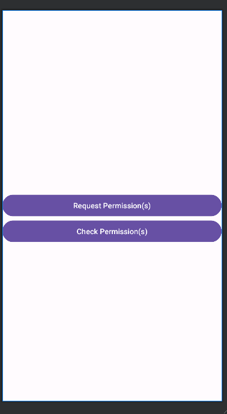

# Lab 10: Permissions

## What are Android Runtime Permissions?

With the introduction of Android 6.0 (SDK 23), users are prompted for some specific permissions at runtime when they become necessary to use. 

Will the older apps run on Android Marshmallow? 

------

<details>
<summary>Answer</summary>

- If the targetSdkVersion is 22 or less. 

- Thus android runtime permissions support backward compatibility.

- Now this doesn’t mean that you can work with old model of permissions by setting the sdk version to 22. 

</details>

-------

A user using Marshmallow can revoke the dangerous permissions (we’ll discuss the dangerous and normal permissions later) from the Settings->Apps->Permissions. 

In the case we try to call some function that requires a permission which user has not granted yet, the function will suddenly throw an Exception(`java.lang.SecurityException`) that will lead to the application crashing. 

Hence you need to implement this new android permissions model in the below application.

## Dangerous and Normal android permissions

Android defines some permissions as dangerous and some as normal. 

The common thing in both the types is that they need to be defined in the Manifest file.

From Android 6.0 only dangerous permissions are checked at runtime, normal permissions are not. An example of a normal permission is `android.permission.INTERNET`. 

Dangerous permissions are grouped into categories that make it easier for the user to understand what they are allowing the application to do. If the user accepts one permission in a group/category they accept the entire group. An example of dangerous permission is `android.permission.FINE_LOCATION` and `android.permission.COARSE_LOCATION`.

Enabling anyone of the location permissions enables all.

Now you are going to develop an application which checks if the permission is already present. If not, then it’s requested at runtime.

---------------------------------------------

## Build

1. Create application with at least API 28 selected.
2. Name it `permissions`
3. Open the `MainActivity.kt` and reproduce the following code:

-------------------------------------------


## Mainfest File

1. Open `AndroidMainfest.xml`

2. Add the following tags underneath the 4th line:

```xml
    <uses-permission android:name="android.permission.CAMERA" />
    <uses-permission android:name="android.permission.ACCESS_FINE_LOCATION" />
    <uses-permission android:name="android.permission.ACCESS_COARSE_LOCATION" />
```

--------------------------------------------

## `MainActivity.kt`

1. Open `MainActivity.kt`

2. Implement the necessary imports at the top of the file.

    ```kt
    package com.uog.permissions;

    import android.Manifest
    import android.content.pm.PackageManager
    import android.os.Bundle
    import androidx.activity.ComponentActivity
    import androidx.activity.compose.rememberLauncherForActivityResult
    import androidx.activity.compose.setContent
    import androidx.activity.result.contract.ActivityResultContracts
    import androidx.compose.foundation.layout.*
    import androidx.compose.material3.*
    import androidx.compose.runtime.*
    import androidx.compose.ui.Alignment
    import androidx.compose.ui.Modifier
    import androidx.compose.ui.graphics.Color
    import androidx.compose.ui.platform.LocalContext
    import androidx.compose.ui.tooling.preview.Preview
    import androidx.compose.ui.unit.dp
    import androidx.core.content.ContextCompat
    import com.uog.permissions.ui.theme.PermissionsTheme
    ```

3. See a few new lines within this code block you may not have seen before..

   - `import android.content.pm.PackageManager`
     - Class for retrieving various kinds of information related to the application packages that are currently installed on the device. 
     - recommended to read the documentation here -> [https://stuff.mit.edu/afs/sipb/project/android/docs/reference/android/content/pm/PackageManager.html](https://stuff.mit.edu/afs/sipb/project/android/docs/reference/android/content/pm/PackageManager.html)
   - `import android.Manifest`
     - So you can use the permissions stored in the `AndroidManifest.xml` file you will populate later.

4. Define variables for the UI components and override onCreate.

    ```kt
    ...
    class MainActivity : ComponentActivity() {

        override fun onCreate(savedInstanceState: Bundle?) {
            super.onCreate(savedInstanceState)
            setContent {
                PermissionsTheme {
                    PermissionsScreen()
                }
            }
        }
    }
    ```

-------------------------------------------

## Implement the `PermissionsScreen`

<table style="border-collapse: collapse; border: none;">
<tr style="border: none;">
<td style="border: none;">

1. We need to now replicate the screen on the right:
   - Within a Scaffold 
   - Topbar 
     - with the following colour 0xFF6A0DAD
   - Two Buttons placed in a column with a Spacer between them
     - The buttons have the colour 0xFF6A0DAD
</td>
<td style="border: none;">

<div align=center>



</div>

</td>

</tr>
<tr style="border: none;">

<td style="border: none;" colspan=2>

2. Code here if you are struggling:
    <details>
    <summary>Code here...[46 lines]</summary>

    ```kt
    @OptIn(ExperimentalMaterial3Api::class)
    @Composable
    fun PermissionsScreen() {
        Scaffold(
            topBar = {
                TopAppBar(
                    colors = TopAppBarDefaults.topAppBarColors(
                        containerColor = Color(0xFF6A0DAD),
                        titleContentColor = Color.White
                    ),
                    title = { Text("Permissions") }
                )
            },
            content = { paddingValues ->
                Column(
                    modifier = Modifier
                        .fillMaxSize()
                        .padding(paddingValues)
                        .padding(16.dp),
                    verticalArrangement = Arrangement.Center,
                    horizontalAlignment = Alignment.CenterHorizontally
                ) {
                    Button(
                        onClick = { /* TODO: Add Action */ },
                        colors = ButtonDefaults.buttonColors(
                            containerColor = Color(0xFF6A0DAD),
                            contentColor = Color.White
                        )
                    ) {
                        Text("Check Permission")
                    }

                    Spacer(modifier = Modifier.height(16.dp))

                    Button(
                        onClick = { /* TODO: Add Action */ },
                        colors = ButtonDefaults.buttonColors(
                            containerColor = Color(0xFF6A0DAD),
                            contentColor = Color.White
                        )
                    ) {
                        Text("Request Permission")
                    }
                }
            }
        )
    }
    ```

    </details>

</td>
</tr>
</table>

3. Now add two `var`iables at top of the function, that have presistence during composable calls called `showSnackbar` and `snackbarMessage`

    <details>
    <summary>Code here... [4 lines]</summary>

    ```kt
    fun PermissionsScreen(){
        var snackbarMessage by remember { mutableStateOf("") }
        var showSnackbar by remember { mutableStateOf(false) }
    ...
    }
    ```

    </details>

4. Add an `if` for the `showSnackBar`, assume default value `true`
   -  where the a `SnackBar` with a `Button` as a composable with the the `Text` "Dimiss"
   -  The Button onclick should set `showSnackbar` to `false` 
   -  a `Text` composable for the body of the `SnackBar` that takes the `snackBarMessage` variable as the input.

        <details>
        <summary>Code here... [11 lines]</summary>

        ```kt
        ...
        Button(){...}
        if (showSnackbar) {
            Snackbar(
                action = {
                    Button(onClick = { showSnackbar = false }) {
                        Text("Dismiss")
                    }
                }
            ) {
                Text(snackbarMessage)
            }
        }
        ```

        </details>

5. Next we need to modify the `Buttons` `onclick` for `"Check Permission"` and `"Request Permission"` so that they set the snackBarMessage as `"Check Permission Clicked"` and `"Request Permission Clicked"`. Additionally the buttons should set the `showSnackbar` to `true` too.


    <details>
    <summary>Code here ... [21 lines]</summary>

    ```kt
    ...
    Button(
        onClick = {
            snackbarMessage = "Check Permission clicked!"
            showSnackbar = true
        },
        colors = ButtonDefaults.buttonColors(
            containerColor = Color(0xFF6A0DAD),
            contentColor = Color.White
        )
    ) {
        Text("Check Permission")
    }

    ...

    Button(
        onClick = {
            snackbarMessage = "Request Permission clicked!"
            showSnackbar = true
        },
        colors = ButtonDefaults.buttonColors(
            containerColor = Color(0xFF6A0DAD),
            contentColor = Color.White
        )
    ) {
        Text("Request Permission")
    }
    ```

    </details>


## Adding Permission Handling

Now, we will integrate permission handling using Jetpack Compose's support for the Activity Result API. This enables us to check and request permissions dynamically.


1. A reminder from earlier Android Eco system requires users to explicitly grant permissions for certain app features, like accessing the camera or location. We'll use:

- `ACCESS_FINE_LOCATION`: For precise location access.
  - `ACCESS_COARSE_LOCATION`: is required when using `ACCESS_FINE_LOCATION`
- `CAMERA`: For taking photos or scanning QR codes.

2. To manage permissions dynamically, we use the `rememberLauncherForActivityResult` API. Add the following to the `PermissionsScreen()`:


    - You need to place the following underneath the `showSnackbar by remember ...` line
  
    ```kt
    ...
    val context = LocalContext.current
    val requestPermissionsLauncher = rememberLauncherForActivityResult()
    ...
    ```

3. Now we need to populate `rememberLauncherForActivityResult` to provide:
    
    - A contract to define the action (e.g., requesting permissions).
    - A result handler to process the result.

    ```kt
    val requestPermissionsLauncher = rememberLauncherForActivityResult(
        contract = ActivityResultContracts.RequestMultiplePermissions(),
        onResult = { permissions -> 
        }
    )
    ```

4. We now need to check if each permission has been granted, after `permission ->` lambda expression:

    ```kt
    // Check if each permission is granted or denied
    val locationPermissionGranted = permissions[Manifest.permission.ACCESS_FINE_LOCATION] == true
    val cameraPermissionGranted = permissions[Manifest.permission.CAMERA] == true
    ```

5.  Lastly, within this function we need select `when` `locationPermissionGranted` && `cameraPermissionGranted`, `locationPermissionGranted` only, `cameraPermissionGranted` only or no permissions have been granted. Whereby the `snackbarMessage` as a meaningful message

    <details>
    <summary>Code here... [16 lines]</summary>

    ```kt
    ...
    // Provide feedback based on permission status
        when {
            locationPermissionGranted && cameraPermissionGranted -> {
                snackbarMessage = "Both permissions granted."
            }
            locationPermissionGranted -> {
                snackbarMessage = "Location permission granted, but Camera permission denied."
            }
            cameraPermissionGranted -> {
                snackbarMessage = "Camera permission granted, but Location permission denied."
            }
            else -> {
                snackbarMessage = "Both permissions denied."
            }
        }
        showSnackbar = true
    }
    ...
    ```

    </details>

------------------------------

## `checkPermissions()`

1. You now need to create a function called `checkPermissions` that can be called by the `Button` `"Check Permissions"`

    ```kt
    // Check if permissions are granted
    fun checkPermissions(context: android.content.Context): Boolean {
        val locationPermission = ContextCompat.checkSelfPermission(
            context, Manifest.permission.ACCESS_FINE_LOCATION
        )
        val cameraPermission = ContextCompat.checkSelfPermission(
            context, Manifest.permission.CAMERA
        )
        return locationPermission == PackageManager.PERMISSION_GRANTED &&
                cameraPermission == PackageManager.PERMISSION_GRANTED
    }
    ```

    - `ContextCompat.checkSelfPermission`: A convenience method for checking if a specific permission is granted.
      - **Parameters**:
      -   `context`: The app's context, providing access to the permission system.
      -   `Manifest.permission.ACCESS_FINE_LOCATION`: The permission being checked.
      - **Return Value**: An integer representing the permission status:
        - `PackageManager.PERMISSION_GRANTED`: Indicates the permission is granted.
        - `PackageManager.PERMISSION_DENIED`: Indicates the permission is denied.
      - The result is stored in `locationPermission`

---------------------------

## Involking `checkPermissions()`

1. Update the the `"Check Permission"` `Button` to invoke the `checkPermissions` function:

    ```kt
    onClick = {
        // Check if the permissions are already granted
        val permissionsGranted = checkPermissions(context)
        if (permissionsGranted) {
            snackbarMessage = "Permissions already granted."
        } else {
            snackbarMessage = "Please request permission."
        }
        showSnackbar = true
    }
    ```

2. Update the `"Request Permissions"` `Button` to make use of `requestPermissionsLauncher.launch`:

    ```kt
    onClick = {
        // Request permissions using the launcher
        requestPermissionsLauncher.launch(
            arrayOf(Manifest.permission.ACCESS_FINE_LOCATION, Manifest.permission.CAMERA)
        )
    }
    ```

---------------------------

## Running the App

1. Build and run your app on an Android emulator or a physical Android device.

2. Click the "Check Permission" button to see if permissions are already granted.

3. Click the "Request Permission" button to request permissions if they are not granted.

4. Verify that the Snackbar messages are displayed appropriately based on permission status.


<table style="border-collapse: collapse; border: none; table-layout: fixed; width: 100%;" >
<tr style="border: none;">
<td style="border: none; width:33%;">

Output shows All permissions granted.


</td>
<td style="border: none; width:33%;">

Output shows one permission granted.


</td>
<td style="border: none;width:33%;">

You will need to reset the permission once permanently granted.


</td>
</tr>
</table>

<div align=center>


</div>


---------------------------

## Full code

<details>
<summary>Full Code here... [159 lines]</summary>

```kt
package com.uog.permissions

import android.Manifest
import android.content.pm.PackageManager
import android.os.Bundle
import androidx.activity.ComponentActivity
import androidx.activity.compose.rememberLauncherForActivityResult
import androidx.activity.compose.setContent
import androidx.activity.result.contract.ActivityResultContracts
import androidx.compose.foundation.layout.*
import androidx.compose.material3.*
import androidx.compose.runtime.*
import androidx.compose.ui.Alignment
import androidx.compose.ui.Modifier
import androidx.compose.ui.graphics.Color
import androidx.compose.ui.platform.LocalContext
import androidx.compose.ui.tooling.preview.Preview
import androidx.compose.ui.unit.dp
import androidx.core.content.ContextCompat
import com.uog.permissions.ui.theme.PermissionsTheme

class MainActivity : ComponentActivity() {

    override fun onCreate(savedInstanceState: Bundle?) {
        super.onCreate(savedInstanceState)
        setContent {
            PermissionsTheme {
                PermissionsScreen()
            }
        }
    }
}

@OptIn(ExperimentalMaterial3Api::class)
@Composable
fun PermissionsScreen() {
    val context = LocalContext.current
    var snackbarMessage by remember { mutableStateOf("") }
    var showSnackbar by remember { mutableStateOf(false) }

    // Define the permission launcher using the new Activity Result API
    val requestPermissionsLauncher = rememberLauncherForActivityResult(
        contract = ActivityResultContracts.RequestMultiplePermissions(),
        onResult = { permissions ->
            // Check if each permission is granted or denied
            val locationPermissionGranted = permissions[Manifest.permission.ACCESS_FINE_LOCATION] == true
            val cameraPermissionGranted = permissions[Manifest.permission.CAMERA] == true

            // Provide feedback based on permission status
            when {
                locationPermissionGranted && cameraPermissionGranted -> {
                    snackbarMessage = "Both permissions granted."
                }
                locationPermissionGranted -> {
                    snackbarMessage = "Location permission granted, but Camera permission denied."
                }
                cameraPermissionGranted -> {
                    snackbarMessage = "Camera permission granted, but Location permission denied."
                }
                else -> {
                    snackbarMessage = "Both permissions denied."
                }
            }
            showSnackbar = true
        }
    )

    Scaffold(
        topBar = {
            TopAppBar(
                colors = TopAppBarDefaults.topAppBarColors(
                    containerColor = Color(0xFF6A0DAD),
                    titleContentColor = Color.White
                ),
                title = { Text("Permissions") }
            )
        },
        content = { paddingValues ->
            Column(
                modifier = Modifier
                    .fillMaxSize()
                    .padding(paddingValues)
                    .padding(16.dp),
                verticalArrangement = Arrangement.Center,
                horizontalAlignment = Alignment.CenterHorizontally
            ) {
                Button(
                    colors = ButtonDefaults.buttonColors(
                        containerColor = Color(0xFF6A0DAD),
                        contentColor = Color.White
                    ),
                    onClick = {
                        // Check if the permissions are already granted
                        val permissionsGranted = checkPermissions(context)
                        if (permissionsGranted) {
                            snackbarMessage = "Permissions already granted."
                        } else {
                            snackbarMessage = "Please request permission."
                        }
                        showSnackbar = true
                    }
                ) {
                    Text("Check Permission")
                }

                Spacer(modifier = Modifier.height(16.dp))

                Button(
                    colors = ButtonDefaults.buttonColors(
                        containerColor = Color(0xFF6A0DAD),
                        contentColor = Color.White
                    ),
                    onClick = {
                        // Request permissions using the launcher
                        requestPermissionsLauncher.launch(
                            arrayOf(Manifest.permission.ACCESS_FINE_LOCATION, Manifest.permission.CAMERA)
                        )
                    }
                ) {
                    Text("Request Permission")
                }

                if (showSnackbar) {
                    Snackbar(
                        action = {
                            Button(onClick = { showSnackbar = false }) {
                                Text("Dismiss")
                            }
                        }
                    ) {
                        Text(snackbarMessage)
                    }
                }
            }
        }
    )
}

// Check if permissions are granted
fun checkPermissions(context: android.content.Context): Boolean {
    val locationPermission = ContextCompat.checkSelfPermission(
        context, Manifest.permission.ACCESS_FINE_LOCATION
    )
    val cameraPermission = ContextCompat.checkSelfPermission(
        context, Manifest.permission.CAMERA
    )
    return locationPermission == PackageManager.PERMISSION_GRANTED &&
            cameraPermission == PackageManager.PERMISSION_GRANTED
}

@Preview(showBackground = true)
@Composable
fun DefaultPreview() {
    PermissionsTheme {
        PermissionsScreen()
    }
}
```

</details>

## Afterwards

1. Create functionality to revoke permissions whilst in the app.

2. Experiment with other permissions

    > - [https://gist.github.com/Arinerron/1bcaadc7b1cbeae77de0263f4e15156f](https://gist.github.com/Arinerron/1bcaadc7b1cbeae77de0263f4e15156f) and see what they mean.
    > - [https://github.com/aosp-mirror/platform_frameworks_base/blob/master/core/res/AndroidManifest.xml#L833](https://github.com/aosp-mirror/platform_frameworks_base/blob/master/core/res/AndroidManifest.xml#L833)