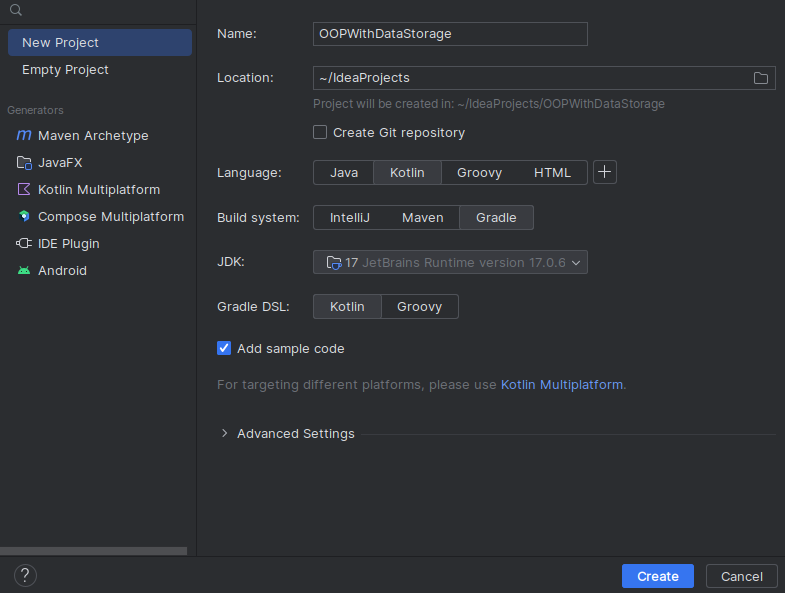
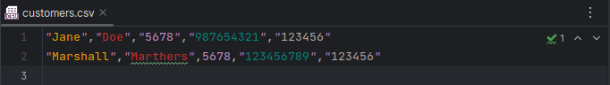

# Lab 12: OOP with Data Storage

## Introduction

In this lab you are going to utilise what you have learnt about Object Oriented Program, methods, error handling, XML, JSON and CSV.

Remember that when you see `...` in a code block it means code before or after is not shown for readability.

In this lab you will write 414 lines of code.

## Step 1: Initialise the Project

1. Launch a new IntelliJ project and give it an appropriate name
2. Select `Kotlin` as the **Language**
3. Select `Gradle` as the **Build system**

<div align=center>



</div>

4. Make these files in the directory `src/main/kotlin`:
   - `BankCustomer` Class (Kotlin Class/File)
   - `DataUtils.kt` File (Kotlin Class/File)
   - `MyMutuableExtensions` Object (Kotlin Class/File)

5. Make these files in `src`:
    - `customers.csv` File (File)
    - `customers.json` File (File)
    - `customers.xml` File (File)

    <div align=center>

    

    </div>

## Step 2: `BankCustomer` Class Part 1

We are using the some of the BankCustomer code we had from **Lab 10**.

6. Reproduce the following as is: 

    ```kt
    /**
    * Represents a bank customer with basic information such as first name, last name, PIN, account number,
    * and sort code.
    *
    * @property firstName The first name of the customer.
    * @property lastName The last name of the customer.
    * @property pin The PIN (Personal Identification Number) of the customer.
    * @property account The account number of the customer.
    * @property sortCode The sort code associated with the customer's account.
    *
    * @constructor Creates a new [BankCustomer] with the specified details.
    * @param fn The first name of the customer.
    * @param ln The last name of the customer.
    * @param p The PIN (Personal Identification Number) of the customer.
    * @param acc The account number of the customer.
    * @param sc The sort code associated with the customer's account.
    */
    class BankCustomer {
        var firstName: String? = null
        var lastName: String? = null
        var pin: Int? = null
        var account: String? = null
        var sortCode: String? = null

        /**
        * Default constructor for [BankCustomer].
        */
        constructor()

        /**
        * Creates a new [BankCustomer] with the specified details.
        *
        * @param fn The first name of the customer.
        * @param ln The last name of the customer.
        * @param p The PIN (Personal Identification Number) of the customer.
        * @param acc The account number of the customer.
        * @param sc The sort code associated with the customer's account.
        */
        constructor(fn: String, ln: String, p: Int, acc: String, sc: String) {
            firstName = fn
            lastName = ln
            pin = p
            account = acc
            sortCode = sc
        }

        /**
        * Prints the details of the customer, including name, PIN, account number, and sort code.
        */
        fun printMe() {
            println(
                "Customer:\n\tName: ${this.firstName} ${this.lastName}\n\tPin: ${this.pin}\n\t" +
                        "Account: ${this.account}\n\tSort Code:${this.sortCode}"
            )
        }
    }
    ```

## Step 3: `Main` class Part 1

7. Open the `Main.kt` file and modify the contents to look like this:

8. We are going to initialise **three** bankCustomers, the two you see below and one more of your choice.

    ```kt
    fun main(args: Array<String>) {

        // Create a new BankCustomer
        val newCustomer = BankCustomer(
            "Jane",
            "Doe",
            5678,
            "987654321",
            "123456"
        )
        val customer = BankCustomer(
            "Marshall",
            "Mathers",
            5678,
            "123456789",
            "123456"
        )
    }
    ```

## Step 4: `build.gradle.kts` Part 1

9. Open the `build.gradle.kts` file located in the project view just under the **`test\`** folder.

10. Navigate to the `dependices` sections and add the following code to import the CSV library using `implementation("com.opencsv:opencsv:3.7")` into the project; 

<div align=center>


</div>

>**Note**
>> - Any version greater than `opencsv:3.7` has security vulnerabilities.

## Step 5: `DataUtils.tk` Part 1

We are now going to create functionality to read and write to a CSV, our fist type of data storage file. 

11. Open the `DataUtils.kt` file
12. Reproduce the following code: 
    
    ```kt
    import com.opencsv.CSVReaderBuilder // implementation("com.opencsv:opencsv:3.7")
    import com.opencsv.CSVWriter // implementation("com.opencsv:opencsv:3.7")
    import java.io.File // for writing and reading from a file.


    /**
    * Utility object for handling data operations, including loading and writing data in JSON, CSV, and XML formats.
    */
    object DataUtils {

        /**
        * Loads a list of [BankCustomer] objects from a CSV file.
        *
        * @param filePath The path to the CSV file.
        * @return A [MutableList] of [BankCustomer] objects loaded from the CSV file.
        */
        fun loadCustomersFromCSV(filePath: String): MutableList<BankCustomer> {
            val file = File(filePath)
            
            // create file if needed
            makeFile(filePath)

            if (file.exists()) {
                file.reader().use { reader ->
                    try {
                        val csvReader = CSVReaderBuilder(reader).build()
                        val lines = csvReader.readAll()
                        val customerList = mutableListOf<BankCustomer>()

                        for (line in lines) {
                            // Create BankCustomer objects from CSV lines
                            // for each column in a a line[#]
                            val customer = BankCustomer(line[0], line[1], line[2].toInt(), line[3], line[4])

                            // add customer to the list of BankCustomers
                            customerList.add(customer)
                        }
                        // once finished return the list
                        return customerList
                    } catch (e: Exception) {
                        // Handle exceptions during CSV parsing
                        // return and empty list if fails
                        return mutableListOf()
                    }
                }
            } else {
                // return and empty list if all fails
                return mutableListOf()
            }
        }

        /**
        * Writes a list of [BankCustomer] objects to a CSV file.
        *
        * @param customerList The list of [BankCustomer] objects to be written to the CSV file.
        * @param filePath The path to the CSV file.
        */
        fun writeCustomersToCSV(customerList: List<BankCustomer>, filePath: String) {
            val file = File(filePath)
            
            // create file if needed
            makeFile(filePath)
            
            if (file.exists()) {
                file.writer().use { writer ->
                    val csvWriter = CSVWriter(writer)

                    for (customer in customerList) {
                        // Convert BankCustomer objects to CSV records
                        val record = arrayOf(
                            customer.firstName.orEmpty(),
                            customer.lastName.orEmpty(),
                            customer.pin?.toString() ?: "",
                            customer.account.orEmpty(),
                            customer.sortCode.orEmpty()
                        )
                        csvWriter.writeNext(record)
                    }

                    csvWriter.close()
                }
            } else {
                println("File doesn't exist")
            }
        }

        /**
        * Creates a new file at the specified [filePath].
        *
        * @param filePath The path to the file to be created.
        */
        fun makeFile(filePath: String) {
            val file = File(filePath)

            try {
                if (file.createNewFile()) {
                    println("File created successfully.")
                } else {
                    println("File already exists.")
                }
            } catch (e: Exception) {
                // Handle exceptions during file creation
                println("An error occurred while creating the file: ${e.message}")
            }
        }
    }
    ```

Remember each `KDoc` you create provides helper inforamtion when you hover over each function/method.

## Step 6: `MyMutuableExtensions.kt`

We are going to create some extension methods for the `MutuableList` class. Sometimes for example we need to extra features where sometimes you don't want to add duplicates by mistake.

13.  Open the `MyMutuableExtensions`
14.  Reproduce the follwing code:

        ```kt
        /**
        * Extension functions for [MutableList] of [BankCustomer] to perform various operations.
        */
        object MyMutableExtensions {

            /**
            * Removes duplicate [BankCustomer] objects based on their account numbers.
            *
            * @return A new [MutableList] containing distinct [BankCustomer] objects based on account numbers.
            */
            fun MutableList<BankCustomer>.removeDuplicatesByAccountNumber() : MutableList<BankCustomer>{
                return this.distinctBy { it.account }.toMutableList()
            }

            /**
            * Adds a [BankCustomer] to the [MutableList] only if a customer with the same account number
            * does not already exist in the list.
            *
            * @param customer The [BankCustomer] to be added.
            */
            fun MutableList<BankCustomer>.addIfNotDuplicate(customer: BankCustomer) {
                if (this.all { it.account != customer.account }) {
                    this.add(customer)
                }
            }

            /**
            * Extension function to remove a [BankCustomer] from the [MutableList] based on the account number.
            *
            * @param accountNumber The account number of the customer to be removed.
            */
            fun MutableList<BankCustomer>.removeByAccountNumber(accountNumber: String?) {
                val customerToRemove = this.find { it.account == accountNumber }

                if (customerToRemove != null) {
                    this.remove(customerToRemove)
                    println("Customer with account number $accountNumber removed successfully.")
                } else {
                    println("No customer found with account number $accountNumber. No customer removed.")
                }
            }

            /**
            * Prints details of all [BankCustomer] objects in the [MutableList].
            */
            fun MutableList<BankCustomer>.printAll() {
                this.forEach { customer -> customer.printMe() }
            }

            /**
            * Prints details of [customer] object in the [MutableList] of [BankCustomer]s .
            */
            fun MutableList<BankCustomer>.printOne(acc:String) {
                for ((index, customer) in this.withIndex()) {
                    if (customer.account == acc) {
                        customer.printMe()
                    }
                    else {
                        println("Error: ${acc} not found")
                    }
                }
            }
        }
        ```

## Step 7: `Main.kt` Part 2

15. ReOpen the `Main.kt` and modify the top of the file so we can import the our code:


```kt
// MyMutableExtensions file
import MyMutableExtensions.addIfNotDuplicate
import MyMutableExtensions.printAll
import MyMutableExtensions.removeByAccountNumber
import MyMutableExtensions.removeDuplicatesByAccountNumber

// DataUtils file
import DataUtils.loadCustomersFromCSV
import DataUtils.writeCustomersToCSV

fun main(args: Array<String>){
    ...
}
```

16. Now lets use some of these functions and methods we have now imported to write and read unique values to/from the a `customers.csv`.

    ```kt
    ...
    fun main(args: Array<String>){

        // Load the content of the customers.csv as a [MutuableList] of [BankCustomers] 
        var csvExistingCustomers = loadCustomersFromCSV("customers.csv")

        // add the first two customers using the built-in MutuableList.add method. 
        csvExistingCustomers.add(newCustomer)
        csvExistingCustomers.add(customer)
       
        println("All Customers:")
        // print all the customers using the print function
        println(csvExistingCustomers)
        // and again using our own extension for the MutuableList
        csvExistingCustomers.printAll()

        // Now write the csvExisitingCusomters to a the customers.csv
        writeCustomersToCSV(csvExistingCustomers,"customers.csv")
    }
    ```
17. Run the program, and you should see a very similar output:
    ```
    File already exists.
    [BankCustomer@4cb2c100, BankCustomer@6fb554cc]
    All Customers:
        Customer:
        Name: Jane Doe
        Pin: 5678
        Account: 987654321
        Sort Code:123456
    Customer:
        Name: Marshall Mathers
        Pin: 5678
        Account: 123456789
        Sort Code:123456
    ```

    > **Note:**
    >>
    >> `[BankCustomer@4cb2c100, BankCustomer@6fb554cc]`:
    >>    - the characters after the `@` will be unique 

18. Check in the `customers.csv` to see the output of `writeCustomersToCSV(csvExistingCustomers,"customers.csv")`.

    <div align=center>

    

    </div>

19. Modify the first the line ` csvExistingCustomers.add(newCustomer)` in `Main.kt` to use our add method:

    ```kt
    ...
    fun main(args: Array<String>){

        // Load the content of the customers.csv as a [MutuableList] of [BankCustomers] 
        var csvExistingCustomers = loadCustomersFromCSV("customers.csv")

        // add the first customers using our MutuableList.addIfNotDuplicate() method. 
        csvExistingCustomers.addIfNotDuplicate(newCustomer)
        / add the second customer using the built-in MutuableList.add method. 
        csvExistingCustomers.add(customer)

        ...
    }
    ```

20. Run again and you should see the following:

    ```
    File already exists.
    All Customers:
    [BankCustomer@4cb2c100, BankCustomer@6fb554cc, BankCustomer@614c5515]
    Customer:
        Name: Jane Doe
        Pin: 5678
        Account: 987654321
        Sort Code:123456
    Customer:
        Name: Marshall Marthers
        Pin: 5678
        Account: 123456789
        Sort Code:123456
    Customer:
        Name: Marshall Mathers
        Pin: 5678
        Account: 123456789
        Sort Code:123456
    ```

    <div align=center>

    

    </div>

    - You will see that the `Jane Doe`, has not been duplicated because we used our `addIfNotDuplicate()` that does not duplicate based on account number. However, `add()` does not have this functionality by default. 

21. To remove any duplicates we can use the exentsion we made `removeDuplicatesByAccountNumber()` and we will also replace the `add()` for the second customer:
    ```kt
    ...
    fun main(args: Array<String>){

        // Load the content of the customers.csv as a [MutuableList] of [BankCustomers] 
        var csvExistingCustomers = loadCustomersFromCSV("customers.csv")
        // remove duplicates in the list read from the `customers.csv`
        csvExistingCustomers = csvExistingCustomers.removeDuplicatesByAccountNumber()

        // add the first customers using our MutuableList.addIfNotDuplicate() method. 
        csvExistingCustomers.addIfNotDuplicate(newCustomer)
        / add the second customer using the built-in MutuableList.add method. 
        csvExistingCustomers.addIfNotDuplicate(customer)
        ...
    }
    ```

22. Now run again and you should only have the two customers in your `customers.csv` now

    <div align=center>
   
    

    </div>

## Step 8: Storage using JSON

23. ReOpen the `build.gradle.kts` and add the following, ` implementation("com.google.code.gson:gson:2.8.9")`, to the dependicies section so we can utilise a library for reading and writing a JSON: 

    ```kt
    ...
    dependencies {
    testImplementation(kotlin("test"))

    // Library for CSV
    implementation("com.opencsv:opencsv:3.7")

    // Library for JSON
    implementation("com.google.code.gson:gson:2.8.9")
    ```

24. ReOpen the `DataUtils.kt` and modify the top of the file to include `import com.google.gson.Gson`

    ```kt
    ...
    import java.io.File

    import com.google.gson.Gson

    ...
    object DataUtils { ... }
    ```


25.  Navigate to the end of `writeCustomersToCSV(...)` and still inside the `object DataUtils{` reproduce the following code. We using the `Gson()` Class that we imported to load (read) and write the the `BankCustomers` list from/to `customers.json`:

        ```kt
        ...
        fun writeCustomersToCSV(customerList: List<BankCustomer>, filePath: String) {
            ...
        }

        /**
        * Loads a list of [BankCustomer] objects from a JSON file.
        *
        * @param filePath The path to the JSON file.
        * @return A [MutableList] of [BankCustomer] objects loaded from the JSON file.
        */
        fun loadCustomersFromJSON(filePath: String): MutableList<BankCustomer> {
            val gson = Gson()

            val file = File(filePath)
            if (file.exists()) {
                file.reader().use { reader ->
                    try {
                        // Deserialize JSON into a list of BankCustomer objects
                        return gson.fromJson(reader, Array<BankCustomer>::class.java).toMutableList()
                    } catch (e: Exception) {
                        // Handle exceptions during JSON parsing
                        return mutableListOf()
                    }
                }
            } else {
                // If the file does not exist, return an empty list
                return mutableListOf()
            }
        }

        /**
        * Writes a list of [BankCustomer] objects to a JSON file.
        *
        * @param customerList The list of [BankCustomer] objects to be written to the JSON file.
        * @param filePath The path to the JSON file.
        */
        fun writeCustomersToJSON(customerList: List<BankCustomer>, filePath: String) {
            val gson = Gson()
            val file = File(filePath)
            if (file.exists()) {
                // Convert the updated list to a formatted JSON string
                // Convert the list to a JSON string with each property on a new line
                val formattedJson = gson.toJson(customerList)

                // Write the formatted JSON to the file (overwrite)
                file.writer().use { writer ->
                    writer.write(formattedJson)
                }
            } else {
                println("File doesn't exist")
            }
        }
        ```

26. Modifty `Main.kt` so that we can store data in a JSON format. We will also need to import from out `DataUtils.kt` at the top of the file like last time:
    ```kt
    import MyMutableExtensions.addIfNotDuplicate
    ...

    import DataUtils.loadCustomersFromJSON
    import DataUtils.writeCustomersToJSON

    fun main(args: Array<String>) {
    ```
27. We are essentially repeating what we did last time for the CSV but using the JSON functionality we have written:
    
    ```kt
    ...

    fun main(args: <String>){
    
    ...
    
    //CSV
    ...
    writeCustomersToCSV(csvExistingCustomers,"customers.csv")

    //JSON
    var jsonExistingCustomers = loadCustomersFromJSON("customers.json")
    jsonExistingCustomers = jsonExistingCustomers.removeDuplicatesByAccountNumber()

    jsonExistingCustomers.addIfNotDuplicate(newCustomer)
    jsonExistingCustomers.addIfNotDuplicate(customer)

    writeCustomersToJSON(jsonExistingCustomers,"customers.json")
    
    }
    ```

28. Run and check the `customers.json` and see that you have one long line:

    ```
    [{"firstName":"Jane","lastName":"Doe","pin":5678,"account":"987654321","sortCode":"123456"},{"firstName":"Steph","lastName":"Jupe","pin":5678,"account":"123456789","sortCode":"123456"}]
    ```

    <div align=center>

    

    </div>

29. Modify the `DataUtils.kt` so that we can have a more human readable version of the `customers.json`:

    ```kt
    ...
    fun writeCustomersToJSON(customerList: List<BankCustomer>, filePath: String) {
            val gson = Gson()
        ...
                val formattedJson = gson.toJson(customerList)
                    .replace("[", "[\n\t")
                    .replace(",", ",\n\t\t")
                    .replace("{", "{\n\t\t")
                    .replace("}", "\n\t}")
                    .replace("},\n\t\t{", "},\n\t{")
                    .replace("]", "\n]")
            ...
        }
    ```

    - `.replace("old", "new")`, so we for the most part we are getting a new line `\n` and a tab `\t` appended to each brace `[{}]` and comma `,`.

30. Run again and see the difference in the `customers.json`
    
    <div align=center>

    
    
    </div>

## Step 9: XML Storage

This step is a little more involved than the previous two storage options. 

31. ReOpen the `build.gradle.kts` so that the XML libraries can be installed:
    ```kt
    dependencies {
        ...
        // Library for JSON
        ...

        // Libraries needed for XML
        implementation("org.jetbrains.kotlinx:kotlinx-serialization-json:1.3.0")
        implementation("javax.xml.bind:jaxb-api:2.3.1")
        implementation("org.glassfish.jaxb:jaxb-runtime:2.3.3")
    }
    ```

32. Now we are going to map our `BankCustomer` Class by implementing `@XmlRootElement(name = "customer")` and importing `import javax.xml.bind.annotation.XmlRootElement` in the `BankCusotmer.kt` file. Make sure to reproduce as shown below:

    ```kt
    import javax.xml.bind.annotation.XmlRootElement
    /**
    ...
    */
    @XmlRootElement(name = "customer")
    class BankCustomer {
    ...

    }
    ``` 

33. Then navigate to `DataUtils.kt` and add the imports for XML functionality at the top of the file like the other imports:

    ```kt
    import com.opencsv.CSVReaderBuilder
    
    ...

    import javax.xml.bind.JAXBContext
    import javax.xml.bind.Marshaller
    import javax.xml.bind.annotation.XmlElement
    import javax.xml.bind.annotation.XmlRootElement
    import javax.xml.bind.annotation.XmlAccessType
    import javax.xml.bind.annotation.XmlAccessorType
    ```

34. Now we can add the write and load functions for the XML in the `DataUtils.kt`, navigate to the end `writeCustomersToJSON(...)` and between that and the `makeFile(...)` function add the following `loadCustomersFromXml()` and `writeCustomersToXml()` as seen below:

    ```kt
    ...
    fun writeCustomersToJSON(customerList: List<BankCustomer>, filePath: String) {
        ...
        }

    /**
     * Loads a list of [BankCustomer] objects from an XML file.
     *
     * @param filePath The path to the XML file.
     * @return A [MutableList] of [BankCustomer] objects.
     */
    fun loadCustomersFromXml(filePath: String): MutableList<BankCustomer> {
        try {
            val context = JAXBContext.newInstance(CustomersWrapper::class.java)
            val unmarshaller = context.createUnmarshaller()
            val wrapper = unmarshaller.unmarshal(File(filePath)) as CustomersWrapper
            return wrapper.customerList.toMutableList()
        } catch (e: Exception) {
            // Handle exceptions during XML parsing
            e.printStackTrace()
        }
        return mutableListOf()
    }

    /**
     * Writes a list of [BankCustomer] objects to an XML file.
     *
     * @param customers The list of [BankCustomer] objects to write.
     * @param filePath The path to the XML file.
     * @throws Exception to log
     */
    fun writeCustomersToXml(customers: List<BankCustomer>, filePath: String) {
        try {
            val context = JAXBContext.newInstance(CustomersWrapper::class.java)
            val marshaller = context.createMarshaller()
            marshaller.setProperty(Marshaller.JAXB_FORMATTED_OUTPUT, true)

            val wrapper = CustomersWrapper()
            wrapper.customerList = ArrayList(customers)

            marshaller.marshal(wrapper, File(filePath))
        } catch (e: Exception) {
            // Handle exceptions during XML writing
            e.printStackTrace()
        }
    }

    /**
    ...
     */
    fun makeFile(filePath: String) {
        ...
    }
    ```
35. At the end of the `object DataUtils{...}` or if you like the very end of the `DataUtils.kt` add the following `CustomersWrapper` `Wrapper` class:

    ```kt
    object DataUtils {
        /**
        ...
        */
        fun makeFile(filePath: String) {
        ...
        }
    }

    /**
    * Wrapper class for marshalling and unmarshalling a list of [BankCustomer] objects.
    */
    @XmlRootElement(name = "customersWrapper")
    @XmlAccessorType(XmlAccessType.FIELD)
    class CustomersWrapper {
        @XmlElement(name = "customer")
        var customerList: List<BankCustomer> = ArrayList()
    }
    ```

36. Now we need to modify `Main.kt` to use the load and write XML functions we have made. Firstly, add reference to the new xml functions we have in the `DataUtils.kt`: 

    ```kt
    ...
    import DataUtils.writeCustomersToJSON

    import DataUtils.loadCustomersFromXml
    import DataUtils.writeCustomersToXml


    fun main(args : <String>){
    ... 
    }
    ```

37. Modify the code inside `main(args : <String>)` so that the functions `writeCustomersToXml` and `loadCustomersToXml`. Navigate to the end of  `main(...)`:

    ```kt
    fun main(arg: <String>){

        ...
       
         writeCustomersToJSON(jsonExistingCustomers,"customers.json")

        ...

         // XML
        var existingCustomers = loadCustomersFromXml("customers.xml")
        existingCustomers = existingCustomers.removeDuplicatesByAccountNumber()

        // Add the new customer to the existing list
        existingCustomers.addIfNotDuplicate(newCustomer)
        existingCustomers.addIfNotDuplicate(customer)

        println("All Customers:")
        existingCustomers.printAll()

        // Write the updated list back to XML
        writeCustomersToXml(existingCustomers, "customers.xml")
    }
    ```

38. Run the code, and your `customers.xml` file should look like: 
    
    <div align=center>

    

    </div>


## Step 10: More 

39.  The third customer you made at the beginning can be added to all three files. Try and do this now.


40. Try removing a record by first using the mutable extension method we made but have not used yet to remove the `customer` whose name is `Marshal Mathers`, for example: 
    
    ```kt
    existingCustomer = existingCustomer.removeByAccountNumber(customer.account)
    ```
    >**Note:**
    >> Remember you can hover over a class/method/function etc to see what they do if they have the KDoc written for them. Like we have done for that function. 

41. Now that the `existingCustomer` has that customer removed try using the `writeCustomersTo<XML/JSON/CSV>(...)`... which ever one you used and see the change in the file. 

## Completed project

You can download the completed project from here as a zip, if you have not completed the lab or just want to explore and play with as is: 

- [PresistentData.zip](PersistentData.zip)

