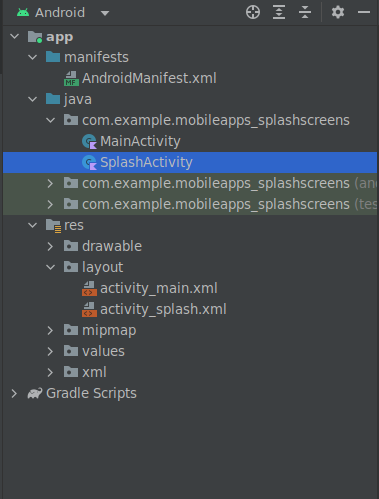

# Lab 15: Splash Screens

## Introduction 

Android Splash Screen is the first screen visible to the user when the application is launched. Splash screen is one of the most vital screens in the application since it’s the user’s first experience with the application. Splash screens are used to display some animations (typically of the application logo) and illustrations while some data for the next screens are fetched.

Typically, the Activity that has the following intent filter set in the `AndroidManifest.xml` file is the Splash Activity.

```xml
<intent-filter>
            <action android:name="android.intent.action.MAIN" />
            <category android:name="android.intent.category.LAUNCHER" />
</intent-filter>
```

## Android Splash Screen Example Project Structure

<div align=center>



</div>

----------- 

## Task 1: Classical Approach

> Remember to open a new project in Android studio and call it `splashscreen`.


- Don't modify the `MainActivity.java` file.
- Modify the `AndroidMainfest.xml` 
  - to launch Splash screen

```xml
<?xml version="1.0" encoding="utf-8"?>
<manifest xmlns:android="http://schemas.android.com/apk/res/android"
    package="com.example.splashscreen">

    <application
        android:allowBackup="true"
        android:icon="@mipmap/ic_launcher"
        android:label="@string/app_name"
        android:roundIcon="@mipmap/ic_launcher_round"
        android:supportsRtl="true"
        android:theme="@style/AppTheme">
        <activity android:name=".SplashActivity"
            android:theme="@style/SplashTheme">
            <intent-filter>
                <action android:name="android.intent.action.MAIN" />
                <category android:name="android.intent.category.LAUNCHER" />
            </intent-filter>
        </activity>
        <activity android:name=".MainActivity"/>
    </application>

</manifest>
```

- Create a `SplashActivity.kt` file and modify the content as such:

```kt
package com.example.splashscreen;

import android.content.Intent
import android.os.Bundle
import android.os.Handler
import androidx.appcompat.app.AppCompatActivity

class SplashActivity : AppCompatActivity() {
    override fun onCreate(savedInstanceState: Bundle?) {
        super.onCreate(savedInstanceState)
        setContentView(R.layout.activity_splash)
        Handler().postDelayed({
            // This method will be executed once the timer is over
            val i = Intent(this@SplashActivity, MainActivity::class.java)
            startActivity(i)
            finish() // explore the class Intent.
        }, 5000) // Number is in milliseconds.
    }
}
```

- Create an `activity_splash.xml` in the `res/layout` folder

```xml
<?xml version="1.0" encoding="utf-8"?>
<android.support.constraint.ConstraintLayout xmlns:android="https://schemas.android.com/apk/res/android"
    xmlns:app="https://schemas.android.com/apk/res-auto"
    xmlns:tools="https://schemas.android.com/tools"
    android:layout_width="match_parent"
    android:layout_height="match_parent"
    android:background="@android:color/black"
    tools:context="com.example.splashscreen.SplashActivity">

    <ImageView
        android:id="@+id/imageView"
        android:layout_width="72dp"
        android:layout_height="72dp"
        android:src="@mipmap/ic_launcher"
        app:layout_constraintBottom_toBottomOf="parent"
        app:layout_constraintLeft_toLeftOf="parent"
        app:layout_constraintRight_toRightOf="parent"
        app:layout_constraintTop_toTopOf="parent" />

    <ProgressBar
        android:layout_width="wrap_content"
        android:layout_height="wrap_content"
        android:indeterminate="true"
        app:layout_constraintLeft_toLeftOf="parent"
        app:layout_constraintRight_toRightOf="parent"
        android:layout_marginTop="8dp"
        app:layout_constraintTop_toBottomOf="@id/imageView" />

</android.support.constraint.ConstraintLayout>
```

If you run this in the emulator, what happens?

<details>
<summary>Click to see</summary>

<div align=center>


</div>

Did you see the blank page that came up before the Splash Screen was visible to you? 

The above approach isn’t the correct approach. It’ll give rise to **cold** starts. 

The purpose of a Splash Screen is to quickly display a beautiful screen while the application fetches the relevant content if any (from network calls/database). With the above approach, there’s an additional overhead that the `SplashActivity` uses to create its layout. 

It’ll give rise to slow starts to the application which is bad for the user experience (wherein a blank black/white screen appears).


</details>

-------

## Aninmation

This has been written for SDK 33, and core-ktx:1.8.0 so ensure you follow the steps below:

1. Open the build gradle file change your `compileSdk 34` to `compileSdk 33`, and change the `targetSdk 33` to `targetSdk 32`

2. Navigate down to the `dependicies {...}` and change the following line from -> to:

    - `implementation 'androidx.core:core-ktx:+'` -> `implementation 'androidx.core:core-ktx:1.8.0'`

3. Sync your project to download the new dependicies and sdk.


4. Ensure you have a mobile emulator with API 30, such as `Pixel Pro API 30`.

5. Create a new resource directory in the res directoru called `anim` of Resource type `anim`, like below: 

    

6. Reproduce the following layout for `activity_main.xml`:

    

7. Modify the `strings.xml`, and set the text for each button: 
    ```xml
    <string name="app_name">MobileApps-SplashScreens</string>
    <string name="trans_slide_in_out">Slide in out</string>
    <string name="trans_rotate">Rotate</string>
    <string name="trans_slide_down">Slide down</string>
    <string name="trans_slide_up">Slide up</string>
    <string name="trans_slide_in_left">Slide in left</string>
    <string name="trans_slide_out_left">Slide out left</string>
    <string name="trans_slide_in_right">Slide in right</string>
    <string name="trans_slide_out_right">Slide out right</string>
    <string name="trans_fade_out">Fade out</string>
    <string name="trans_scale">Scale</string>
    ``` 
8. We are going to produce the following files that will contain our animations for transitioning from one activity to another: 

    

9.  Now we will create those 9 files inside the `res/anim` directory: 
    
    - `rotate.xml`
        ```xml
        <set xmlns:android="http://schemas.android.com/apk/res/android">
            <!-- Rotate the view from 0 degrees to 359 degrees -->
            <rotate
                android:fromDegrees="0"
                android:toDegrees="359"
                android:pivotX="50%"
                android:pivotY="50%"
                android:duration="1000" />
        </set>

        ```

    - `slide_in_left.xml`
      ```xml
      <set xmlns:android="http://schemas.android.com/apk/res/android">
            <translate
                android:fromXDelta="-100%"
                android:toXDelta="0" 
                android:duration="1000"/>
      </set>
      ```

    - `slide_out_left.xml`
      ```xml
      <set xmlns:android="http://schemas.android.com/apk/res/android">
            <translate
                android:fromXDelta="0"
                android:toXDelta="-100%"
                android:duration="1000" />
      </set>
      ```

    - `slide_in_right.xml`
      ```xml
      <set xmlns:android="http://schemas.android.com/apk/res/android">
            <translate
                android:fromXDelta="100%"
                android:toXDelta="0"
                android:duration="1000" />
      </set>
      ```

    - `slide_out_right.xml`
      ```xml
      <set xmlns:android="http://schemas.android.com/apk/res/android">
            <translate
                android:fromXDelta="0"
                android:toXDelta="100%"
                android:duration="1000" />
      </set>
      ```   

    - `slide_down.xml`
      ```xml
      <set xmlns:android="http://schemas.android.com/apk/res/android">
          <translate
              android:fromYDelta="0"
              android:toYDelta="100%"
              android:duration="1000"/>
          <alpha
              android:fromAlpha="1"
              android:toAlpha="0.5"/>
      </set>
      ```

    - `slide_up.xml`
      ```xml
      <set xmlns:android="http://schemas.android.com/apk/res/android">
           <translate
              android:fromYDelta="100%"
              android:toYDelta="0"
              android:duration="1000"/>
           <alpha
              android:fromAlpha="0.5"
              android:toAlpha="1"/>
      </set>
      ```

    - `scale_in.xml`
      ```xml
      <scale xmlns:android="http://schemas.android.com/apk/res/android"
          android:fromXScale="0.0"
          android:fromYScale="0.0"
          android:toXScale="1.0"
          android:toYScale="1.0"
          android:pivotX="50%"
          android:pivotY="50%"
          android:duration="1000" />
      ```
    
    - `scale_out.xml`
      ```xml
      <scale xmlns:android="http://schemas.android.com/apk/res/android"
          android:fromXScale="1.0"
          android:fromYScale="1.0"
          android:toXScale="0.0"
          android:toYScale="0.0"
          android:pivotX="50%"
          android:pivotY="50%"
          android:duration="1000" />
      ```

10. Revisit `MainActivty.kt` so we can implement the button functionality to invoke each animation.

11. Your `class MainActivty : ...` needs to implement a `View`
    
    ```Kotlin
    ...
    class MainActivity : AppCompatActivity(),View.OnClickListener {
        ...
    }
    ```
12. Create a reference for each Button on the `activity_main.xml` by using `findViewById()`, remember each `R.id.<name>` is how I defined them in the `activity_main.xml`:
    ```kotlin
    val slideInLeftButton : Button = findViewById(R.id.slideLeftInButton)
    val slideOutLeftButton : Button = findViewById(R.id.slideLeftOutButton)
    val slideInRightButton : Button = findViewById(R.id.slideRightInButton)
    val slideOutRightButton : Button = findViewById(R.id.slideRightOutButton)
    val slideUpButton : Button = findViewById(R.id.slideUpButton)
    val slideDownButton : Button = findViewById(R.id.slideDownButton)
    val fadeButton : Button = findViewById(R.id.fadeOutButton)
    val rotateButton : Button = findViewById(R.id.rotateButton)
    val scaleButton : Button = findViewById(R.id.scaleButton)
    ```

13. Now we are going to `setOnClickListener` for each button, you will need to reproduce this line for each button:
    ```kotlin
    ...
    slideDownButton.setOnClickListener(this)
    slideUpButton.setOnClickListener(this)
    ...
    ```

14. Outside of the `override fun OnCreate?(){ ... }`, create a new function called `onClick()`:
    ```kotlin
    ...
    override fun onClick(view: View?) {
        val intent = Intent(this, MainActivity::class.java)
        startActivity(intent)
         when (view?.id) {
            R.id.fadeOutButton-> {
                overridePendingTransition(android.R.anim.fade_out,android.R.anim.fade_in)
            }
            R.id.slideLeftInButton -> {
                overridePendingTransition(0,R.anim.slide_in_left)
            }
            R.id.slideLeftOutButton -> {
                overridePendingTransition(0,R.anim.slide_out_left)
            }
         }
         finish()
    }
    ...
    ```
    This function will detect when each button is pressed and invoke the corresponding animation. All we are doing here is reopening the `MainActivity` with that animation.

    If you run this in its current state you will see the following: 

    <div align=center>

    

    </div>

15. Complete the rest of the buttons.

16. Run the activity and you should see the following:
    
      <div align=center>

    

    </div>

---------------------

Downloaded a completed version of the lab here: [SplashScreens.zip](./SplashScreens.zip)