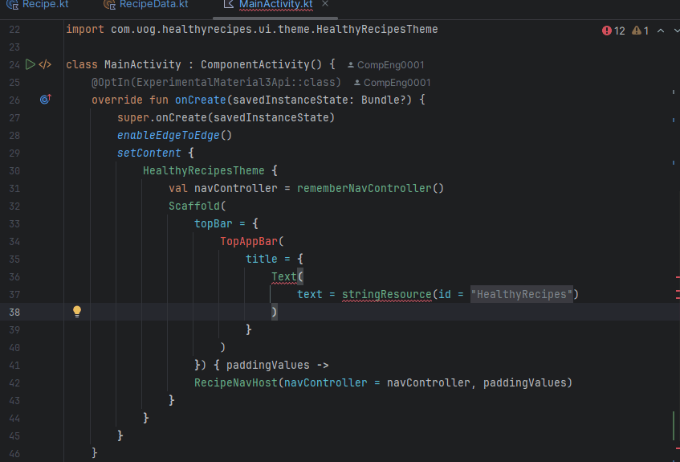
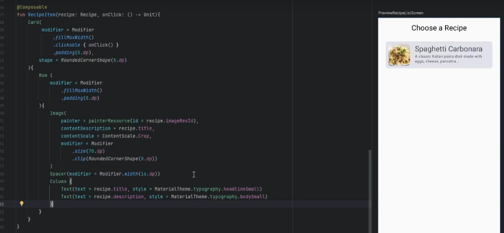
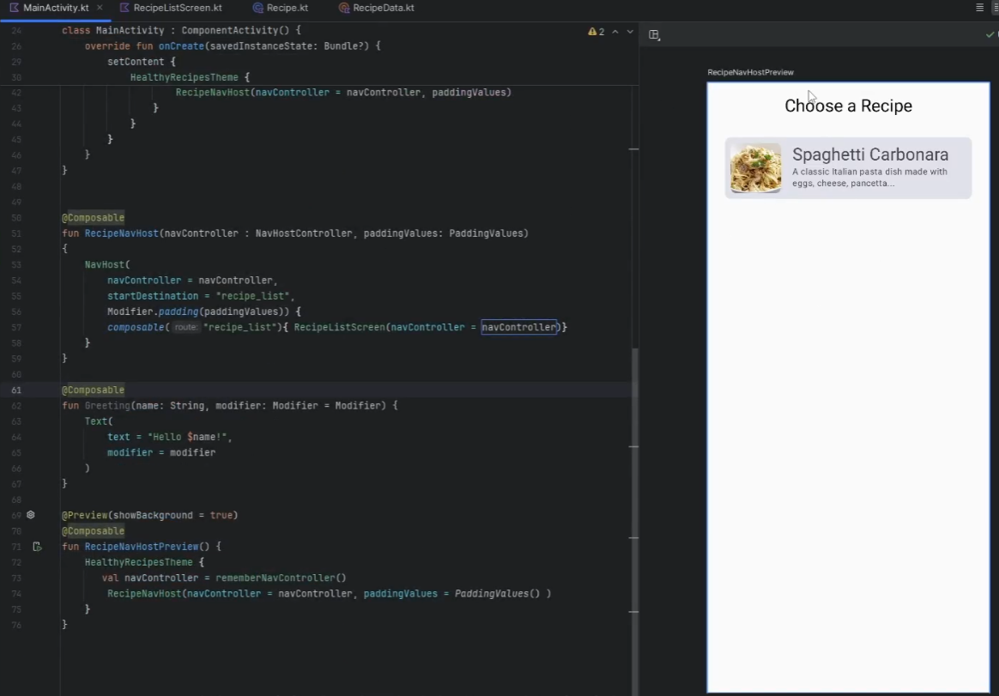
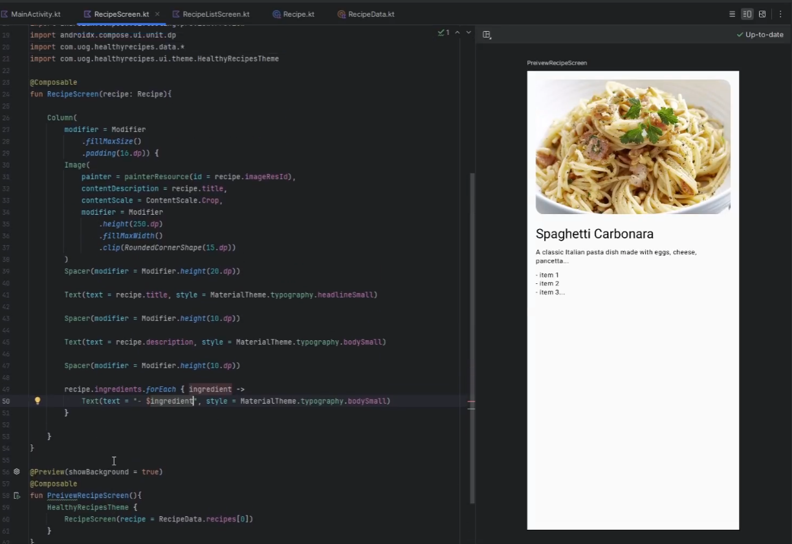
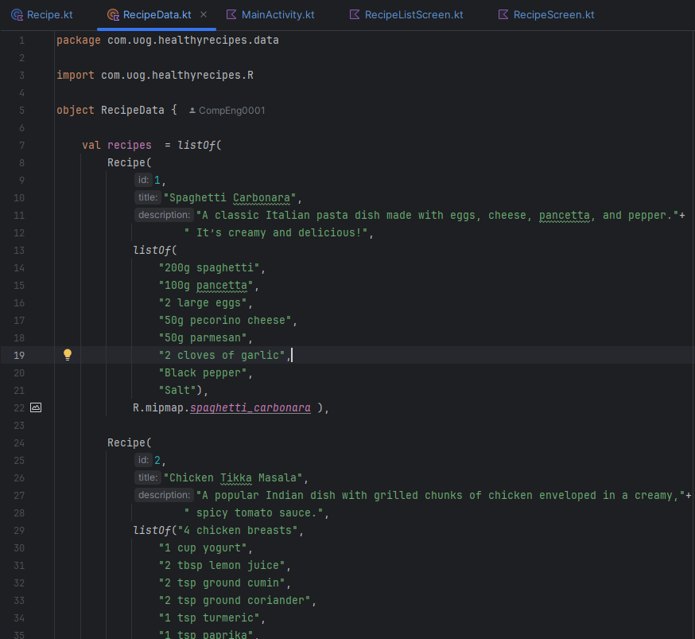
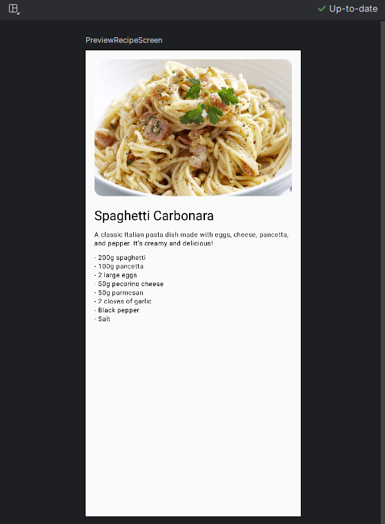

# Healthy Recipe App Walkthrough

## Introduction

Welcome to this walkthrough guide for building a healthy recipes app using Kotlin and Jetpack Compose in Android Studio.

~~~admonish info

Download and extract all pictures from the [Pictures_Lab_3.zip](./pictures_lab_3.zip).

~~~

---

## Setting Up the Project

### Video @ 0:02 - 1:45

1. **Create a New Project:**
    - Select "Empty Activity" and click "Next".
    - Name your application "Healthy Recipes".
    - Ensure the package name is set to `com.uog.healthyrecipes`.
    - Set the minimum API level to 24.
    - Click "Finish" to create the project.


        

2. **Project Structure:**
    - Expand the project structure and locate the `values` and `mipmap` directories under `res`.

    - Open the preview window to see the default layout.
    
       

---

## Creating the Data Model

### Video @ 2:33 - 10:11

1. **Create a Data Package:**
    - Right-click on the `healthyrecipes` package.
    - Select "New" > "Package" and name it `data`.

2. **Define the Recipe Data Class:**
    - Right-click on the `data` package, select "New" > "Kotlin Class/File", and name it `Recipe`.
    - Modify the class as follows:

        ~~~admonish code

        ```kotlin
        data class Recipe(
            val id: Int,
            val title: String,
            val description: String,
            val ingredients: List<String>,
            val imageResId: Int
        )
        ```
        ~~~

    - **Data Classes**: In Kotlin, data classes are used to hold data. They automatically provide getter and setter methods, `equals()`, `hashCode()`, and `toString()` methods. 

3. **Create the Recipe Data Object:**
    - In the `data` package, create a new Kotlin file named `RecipeData`.
    - Define the object as follows:

        ~~~admonish code
        
        ```kotlin
        import com.uog.healthyrecipes.R
        import com.uog.healthyrecipes.data.Recipe

        object RecipeData {
            val recipes = listOf(
                Recipe(
                    id = 1,
                    title = "Spaghetti Carbonara",
                    description = "A classic Italian pasta dish made with eggs, cheese, pancetta...",
                    ingredients = listOf("item 1", "item 2", "item 3..."),
                    imageResId = R.drawable.spaghetti_carbonara
                )
                // Add more recipes here
            )
        }
        ```

        ~~~

    - **Objects**: In Kotlin, objects are used to create singleton instances. They can hold state and behavior, and there is only one instance of the object created in the entire application.
    
        ~~~admonish note
        
        - Remember to import those images from the Downloaded Picture file <p></p>
        
            
        
        ~~~

---

## Setting Up the Main Activity

### Video @ 10:11 - 19:44

1. **Modify the Main Activity Layout:**
    - Open `MainActivity.kt`.
    - Replace the content of the `setContent` block with a `Scaffold` layout and a `topBar`.

        ~~~admonish code

        ```kotlin
        package com.uog.healthyrecipes

        ...

        class MainActivity : ComponentActivity() {
            @OptIn(ExperimentalMaterial3Api::class)
            override fun onCreate(savedInstanceState: Bundle?) {
                super.onCreate(savedInstanceState)
                enableEdgeToEdge()
                setContent {
                    HealthyRecipesTheme {
                        val navController = rememberNavController()
                        Scaffold(
                            topBar = {
                                TopAppBar(
                                    title = {
                                        Text(
                                            text = stringResource(id = R.string.app_name)
                                        )
                                    }
                                )
                            }) { paddingValues ->
                            RecipeNavHost(navController = navController, paddingValues)
                        }
                    }
                }
            }
        }
        ```

        ~~~

    - **Scaffold**: In Jetpack Compose, `Scaffold` is a component that provides a structure for implementing the basic material design layout. It contains slots for the top bar, bottom bar, floating action button, and a content area.

    - **NavController**: The `NavController` is the central API for navigating between composables in Jetpack Compose. It handles the navigation stack and the navigation destinations.

    - **rememberNavController**: This function provides an instance of `NavController` that is remembered across recompositions, ensuring that the navigation state is retained.

    - **enableEdgeToEdge**: This function enables edge-to-edge display on Android devices, allowing your app to use the entire screen space.

        ~~~admonish note
        
        - Import all libraries as needed, <kbd>Alt</kbd>+<kbd>Enter</kbd> <p></p>
            

        ~~~

    - Add a preview function:

        ~~~admonish code

        ```kotlin
        @Preview(showBackground = true)
        @Composable
        fun RecipeNavHostPreview() {
            HealthyRecipesTheme {
                val navController = rememberNavController()
                RecipeNavHost(navController = navController, paddingValues = PaddingValues())
            }
        }
        ```
        ~~~

        ~~~admonish warning
        
        The renderer will still have some errors due to the missing 

        ~~~

---

## Creating the Navigation Host

### Video @ 19:44 - 26:02

1. **Define the Navigation Host:**
    - Create a new Kotlin file named `RecipeNavHost.kt`.
    - Define the composable function as follows:

        ~~~admonish code

        ```kotlin
        @Composable
        fun RecipeNavHost(navController : NavHostController, paddingValues: PaddingValues)
        {
            NavHost(
                navController = navController,
                startDestination ="recipe_list",
                Modifier.padding(paddingValues)) {
                // NEED TO BUILD RecipeListScreen
 
            }
        }
        ```

        ~~~

    - **NavHost()**: `NavHost` is a container composable that hosts the navigation graph. It connects the NavController with the navigation graph, allowing navigation between `composable` destinations.

    - **composable()**: This function is used to define a navigation destination in the `NavHost`. Each composable represents a screen in the app.

    - **Modifier.padding()**: This `modifier` adds padding around the `composable`. In this case, it applies the padding values passed from the `Scaffold`.


---

## Building the Recipe List Screen

### Video @ 26:02 - 26:42

1. **Create the Recipe List Screen:**
    - Create a new Kotlin file named `RecipeListScreen.kt`.
    - Define the composable function as follows:

        ~~~admonish code

        ```kotlin
        package com.uog.healthyrecipes
        
        ...

        @Composable
        fun RecipeListScreen(navController: NavHostController) {
            Column(
                modifier = Modifier
                    .fillMaxSize()
                    .padding(16.dp),
                horizontalAlignment = Alignment.CenterHorizontally
            ) {
                Text(
                    text = "Choose a Recipe",
                    style = MaterialTheme.typography.headlineSmall
                )
                Spacer(modifier = Modifier.height(20.dp))
                RecipeData.recipes.forEach { recipe ->
                    RecipeItem(recipe = recipe, onClick = {
                        navController.navigate("recipe/${recipe.id}")
                    })
                    Spacer(modifier = Modifier.height(10.dp))
                }
            }
        }
        ```

        ~~~

    - **Column**: `Column` is a layout composable that places its children in a vertical sequence. It's similar to a vertical LinearLayout in traditional Android development.

    - **Modifier**: Modifiers in Jetpack Compose are used to decorate or augment composables. They can be used to adjust the layout, add padding, set click actions, and more.

    - **Text**: The `Text` composable is used to display text on the screen. It can be styled using various properties.

    - **Spacer**: `Spacer` is a composable used to create space between other composables. It can be given specific height or width to create padding.

    - **MaterialTheme**: `MaterialTheme` provides theming capabilities based on Material Design principles. It includes typography, shapes, and colors that can be applied to composables.

    - Add a preview function:

        ~~~admonish code

        ```kotlin
        @Preview(showBackground = true)
        @Composable
        fun PreviewRecipeListScreen(){
            HealthyRecipesTheme {
                val navController = rememberNavController()
                RecipeListScreen(navController = navController)
            }
        }
        ```
        
        ~~~

        

---


## Building the Recipe Item Component

### Video @ 26:42 - 35:40

1. **Create the Recipe Item Component:**
    - Conitinuing in the `RecipeListScreen.kt` file, add the following composable function:

        ~~~admonish code

        ```kotlin
        @Composable
        fun RecipeItem(recipe: Recipe, onClick: () -> Unit) {
            Card(
                modifier = Modifier
                    .fillMaxWidth()
                    .padding(8.dp)
                    .clickable(onClick = onClick),
                shape = RoundedCornerShape(8.dp)
            ) {
                Row(modifier = Modifier.padding(8.dp)) {
                    Image(
                        painter = painterResource(id = recipe.imageResId),
                        contentDescription = recipe.title,
                        modifier = Modifier.size(70.dp).clip(RoundedCornerShape(8.dp)),
                        contentScale = ContentScale.Crop
                    )
                    Spacer(modifier = Modifier.width(16.dp))
                    Column {
                        Text(text = recipe.title, style = MaterialTheme.typography.headlineSmall)
                        Text(text = recipe.description, style = MaterialTheme.typography.bodySmall)
                    }
                }
            }
        }
        ```

        ~~~

    - **Card**: `Card` is a composable that displays its children with a customizable background, elevation, and rounded corners. It is used to create a consistent look for elements like cards.

    - **Row**: `Row` is a layout composable that places its children in a horizontal sequence. It's similar to a horizontal LinearLayout in traditional Android development.

    - **Image**: The `Image` composable is used to display images. It can be loaded from resources or URLs and can be styled with modifiers.

    - **painterResource**: This function loads an image resource into an `Image` composable.

        
---


## Updating the Recipe Nav Host 1

### Video @ 35:40 - 38.00

1. Go back to the MainActivity.kt and navigate the function `RecipeNavHost(...)`, we are going add a `composable()` for our `recipeListScreen()` to for MainActivity.kt

2. We are going to add this line in the body of the `NavHost(){...}`: `composable("recipe_list){ RecipeListScreen(navController = navController)}`

    ~~~admonish code

    ```kt
    @Composable
    fun RecipeNavHost(navController : NavHostController, paddingValues: PaddingValues)
    {
        NavHost(
            navController = navController,
            startDestination = stringResource(id = R.string.recipe_list),
            Modifier.padding(paddingValues)) {
            composable("recipe_list"){ RecipeListScreen(navController = navController)}
            // TO DO show each recipe onclick.
        }
    }
    ```

    ~~~

3. The build preview should update and you'll see the same preview as in `RecipeListScreen.kt`


     

---

## Building the Recipe Screen

### Video @ 38.00 - 47.05

1. **Create the Recipe Screen:**
    - Create a new Kotlin file named `RecipeScreen.kt`.
    - Define the composable function as follows:

        ~~~admonish code

        ```kotlin
        package com.uog.healthyrecipes

        ...

        @Composable
        fun RecipeScreen(recipe: Recipe) {
            Column(
                modifier = Modifier
                    .fillMaxSize()
                    .padding(16.dp)
            ) {
                Image(
                    painter = painterResource(id = recipe.imageResId),
                    contentDescription = recipe.title,
                    modifier = Modifier
                        .height(200.dp)
                        .fillMaxWidth()
                        .clip(RoundedCornerShape(8.dp)),
                    contentScale = ContentScale.Crop
                )
                Spacer(modifier = Modifier.height(16.dp))
                Text(text = recipe.title, style = MaterialTheme.typography.headlineSmall)
                Spacer(modifier = Modifier.height(10.dp))
                Text(text = recipe.description, style = MaterialTheme.typography.bodySmall)
                Spacer(modifier = Modifier.height(16.dp))
                Text(text = "Ingredients", style = MaterialTheme.typography.headlineSmall)
                Spacer(modifier = Modifier.height(8.dp))
                recipe.ingredients.forEach { ingredient ->
                    Text(text = "• $ingredient", style = MaterialTheme.typography.bodySmall)
                }
            }
        }
        ```

        ~~~

    - **Image**: The Image composable is used to display images. It can be loaded from resources or URLs and can be styled with modifiers.

    - **Spacer**: Spacer is a composable used to create space between other composables. It can be given specific height or width to create padding.

    - **Column**: Column is a layout composable that places its children in a vertical sequence. It's similar to a vertical LinearLayout in traditional Android development.

    - **Modifier**: Modifiers in Jetpack Compose are used to decorate or augment composables. They can be used to adjust the layout, add padding, set click actions, and more.

    - **MaterialTheme**: MaterialTheme provides theming capabilities based on Material Design principles. It includes typography, shapes, and colors that can be applied to composables.

2. Remember we should add a preview to see what we are doing:

    ~~~admonish code

    ```kt
    @Preview(showBackground = true)
    @Composable
    fun PreviewRecipeScreen(){
        HealthyRecipesTheme {
            RecipeScreen(recipe = RecipeData.recipes[0])
        }
    }
    ```

    ~~~
    
    

---

## Updating the Recipe Nav Host 2

### Video @ 47.05 - 49.45

1. Go back to the MainActivity.kt and navigate the function `RecipeNavHost(...)`, we are going add a `composable()` for our `recipeListScreen()` to for MainActivity.kt

2. We are going to add this line in the body of the `NavHost(){...}`: `composable("recipe_1"){ RecipeScreen(RecipeData.recipes[0])}`

    ~~~admonish code

    ```kt
    @Composable
    fun RecipeNavHost(navController : NavHostController, paddingValues: PaddingValues)
    {
        NavHost(
            navController = navController,
            startDestination = stringResource(id = R.string.recipe_list),
            Modifier.padding(paddingValues)) {
            composable("recipe_list"){ RecipeListScreen(navController = navController)}
            composable("recipe_1"){ RecipeScreen(RecipeData.recipes[0])}
        }
    }
    ```

    ~~~

3. If you run the app in the emulator, you will see the following: 

    ~~~admonish error

    ```
    ... Navigation destination that mathces request NavDeepLinkRequest{ uri=android-app://androidx.navigation/recipe1} cannot be found...
    ```
     

    ~~~

4. This is because we did not reference the correct format of a route, go back to RecipeListScreen.kt, and you will see the block of code:
    
    ~~~admonish code

    ```kt
    RecipeData.recipes.forEach { recipe ->
    RecipeItem(recipe = recipe, onClick = {
        navController.navigate(
            "recipe${recipe.id}"
        )
    })
    ```

    ~~~

    - the line `"recipe${recipe.id}"` is a different format that one we have provide `composable("Recipe_1",...)`, update the line:

    ~~~admonish code

    ```kt
    RecipeData.recipes.forEach { recipe ->
    RecipeItem(recipe = recipe, onClick = {
        navController.navigate(
            "recipe_${recipe.id}"
        )
    })
    ```

    ~~~

    


## Filling out Recipe Data

### Video @ 49.50 to 53.28


1. Navigate back to the RecipeData.kt file and lets add some more recipes and fill out the carbonara too.

    ~~~admonish code

    ```kt
    Recipe(
        1,
        "Spaghetti Carbonara",
        "A classic Italian pasta dish made with eggs, cheese, pancetta, and pepper."+
                " It’s creamy and delicious!",
        listOf(
            "200g spaghetti",
            "100g pancetta",
            "2 large eggs",
            "50g pecorino cheese",
            "50g parmesan",
            "2 cloves of garlic",
            "Black pepper",
            "Salt"),
        R.mipmap.spaghetti_carbonara ),

    Recipe(
        2,
        "Chicken Tikka Masala",
        "A popular Indian dish with grilled chunks of chicken enveloped in a creamy,"+
                " spicy tomato sauce.",
        listOf("4 chicken breasts",
            "1 cup yogurt",
            "2 tbsp lemon juice",
            "2 tsp ground cumin",
            "2 tsp ground coriander",
            "1 tsp turmeric",
            "1 tsp paprika",
            "1 tsp chili powder",
            "2 tbsp vegetable oil",
            "1 onion",
            "2 cloves of garlic",
            "1 tsp ginger",
            "1 can of tomatoes",
            "1 cup cream",
            "Fresh coriander"),
        R.mipmap.chicken_tikka_masala),

    Recipe(
        3,
        "Avocado Toast",
        "A simple and healthy breakfast option with mashed avocado spread on toasted"+
                " bread, often topped with various ingredients.",
        listOf(
            "2 slices of bread",
            "1 ripe avocado",
            "Salt", "Pepper",
            "Lemon juice",
            "Chili flakes (optional)",
            "Cherry tomatoes (optional)",
            "Feta cheese (optional)"),
        R.mipmap.avocado_toast
    )
    ```

    ~~~
    
    <div style="display:flex">
    <div style="margin: 5px;">
    
    

    </div>
    <div width="50%">
    
    

    </div>
    </div>

2. Go back to the MainActivity.kt and navigate the function `RecipeNavHost(...)`, we are going add a `composable()` for our `recipeListScreen()` to for MainActivity.kt

3. We are going to add this line in the body of the `NavHost(){...}`: `composable("recipe_1"){ RecipeScreen(RecipeData.recipes[0])}`

    ~~~admonish code

    ```kt
    @Composable
    fun RecipeNavHost(navController : NavHostController, paddingValues: PaddingValues)
    {
        NavHost(
            navController = navController,
            startDestination = stringResource(id = R.string.recipe_list),
            Modifier.padding(paddingValues)) {
            composable("recipe_list"){ RecipeListScreen(navController = navController)}
            composable("recipe_1"){ RecipeScreen(RecipeData.recipes[0])}
            composable("recipe_2"){ RecipeScreen(RecipeData.recipes[1])}
            composable("recipe_3"){ RecipeScreen(RecipeData.recipes[2])}
        }
    }
    ```

    ~~~

4. Build and run to see the "finished" application...

    

## Conclusion

Congratulations! You have successfully built a Healthy Recipe App using Kotlin and Jetpack Compose. You can now extend this app by adding more recipes, improving the UI, and using external data sources and much more.

----------


## Extra's

You can use the lab above as a guide on building the following apps:

~~~admonish info

You can find royalty-freee images here: [https://www.freeimages.com/](https://www.freeimages.com)

~~~

### 1. Youth Hostel App

|Application Title|Youth Hostel App|
|---|---|
|Purpose|In a youth hostel reservation app, a hostel is selected and an address and other information is displayed|
|Algorithm 1:|The opening screen displays the name of a hostel, an image (provided in the Pictures folder at top of workbook), and a Button control. Research a real name of a hostel and address and cost range to display in your own customized app (do not use the one in the figure below!)
|Algorithm 2:|When the user selects a hostel, an address and a cost range are displayed in a second screen.|

---------

### 2. Segway Rental App

|Application Title|Segway Rental App|
|---|---|
|Purpose|In this app, a Segway tour is selected and a Segway image is displayed with rental information|
|Algorithm 1:|The opening screen displays the title of the app, a description and a Button control.|
|Algorithm 2:|When the user chooses to rent a Segway, an image (provided in the Pictures folder at top of workbook) displaying the Segway and tour price is shown.|


-----

### 3. Business Card App

|Application Title|Business Card App|
|---|---|
|Purpose|This app provides your business card information with your own picture. Create two screens for the business card app.  You use the app to select the name of a business contact, and then display detailed business card information|
|Algorithm 1:|The opening screen displays the name of the contact, your picture converted to a .png file, and a Button control. Create your own layout.|
|Algorithm 2:|The second screen displays your business card information.  Create your own layout.|