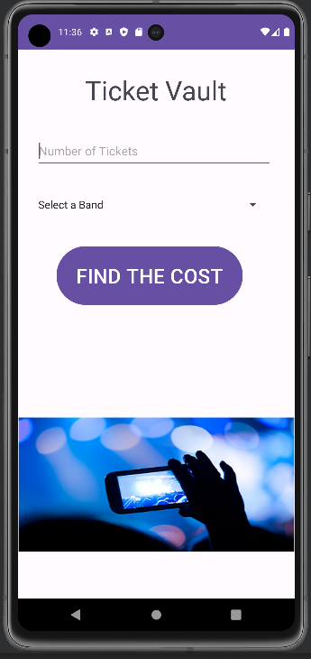
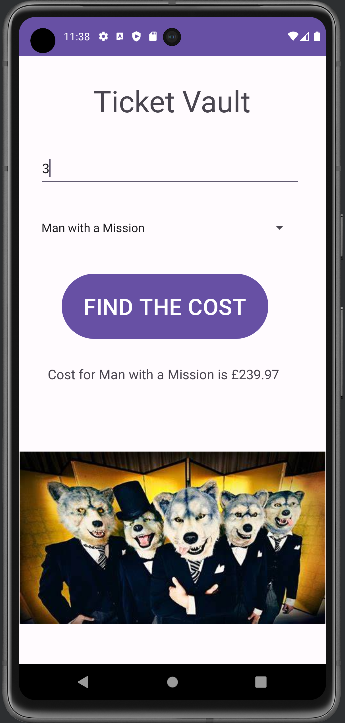
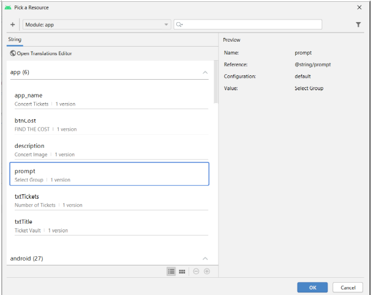
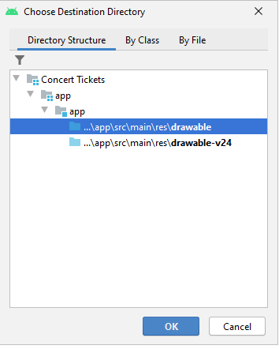
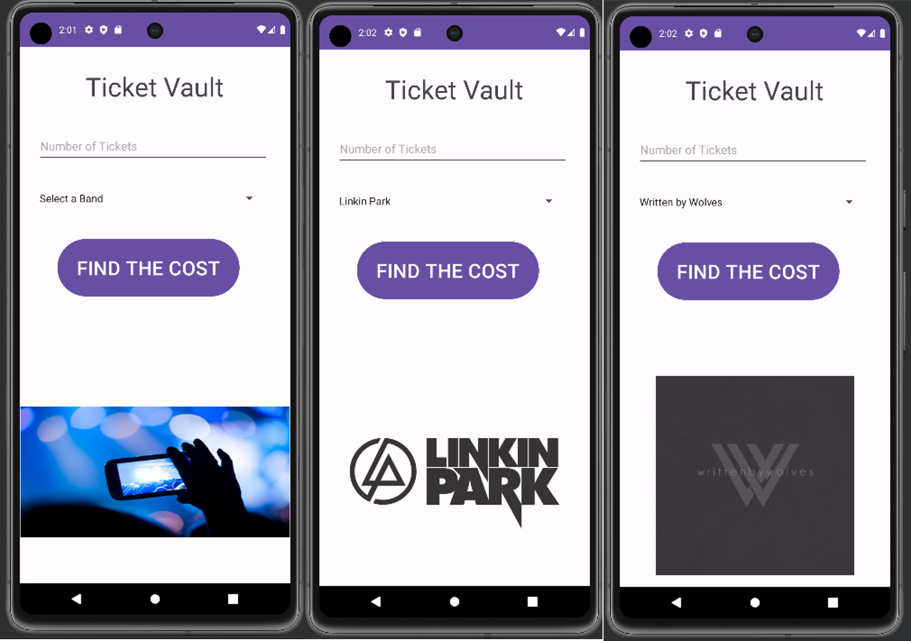

# Lab 4: Android User Input, Variables and Operations

> You will need to download the following picture folder -> [Lab_4_Picture.zip](Lab_4_Pictures.zip)

## 1. Concert Ticket App

You are to develop a Concert Tickets App as shown below:

<div align=center>



</div>

In the field **Number of Tickets**, you are to enter a positive integer.  You can also choose from the drop-down list the concert you are interested in and then click the **FIND THE COST** button.  Then the cost of the tickets will be displayed just above the picture as shown below (it is assumed that a single ticket is priced at £79.99):

<div align=center>



</div>


### Using the String Table

- Double-click on the strings.xml file in the values subfolder to display its contents

- Click the Add key (plus sign) in the Translations Editor and type txtTitle in the Key text box and Ticket Vault in the Default Value text box as shown below:

<div align=center>


</div>

- Using the `string.xml` file add the strings specified in the table below:

    ```xml
    <string name="txtTitle">Ticket Vault</string>
    <string name="txtTickets">Number of Tickets</string> 
    <string name="prompt">Select Group</string>
    <string name="description">Concert Image</string>
    <string name="btnCost">FIND THE COST</string>
    ```

### Adding a String Array

- Now you need to add a string array, modify the `string.xml` with the following code:

    ```xml
    <string-array name="txtGroup">
        <item>Select a Band</item>
        <item>Linkin Park</item>
        <item>Hollywood Undead</item>
        <item>Man with a Mission</item>
        <item>Written by Wolves</item>
    </string-array>
    ```

### Adding Controls to the Emulator
**Step 1:**
- Click the Save All button on the Standard toolbar and close `strings.xml` tab.
- With `activity_main.xml` opened and displaying the emulator screen, from the Palette, choose the Common category and then choose the **TextView** widget 
- Drag the **TextView** widget to the center of the emulator screen until a dashed vertical line identifying the screen’s center is displayed and drop it onto the top part of the emulator.  
- In the Attributes Pane click on the vertical bar next to the **text** attribute to open the Pick a Resource dialog. 
- Choose **txtTitle** from the list to name the TextView widget.
- Press the Ok button.
- In the **textSize** property, type **48sp** and then press Enter.  
- Right -click on the **TextView** widget and choose Center/Horizontally form the drop down list. 

<div align=center>


</div>

**Step 2:**
- In the Text category in the Palette, scroll down to the Number control.
- Drag and drop the Number control onto the emulator bellow the Ticket Vault text.
- Drag the control to the center of the screen until a dashed vertical line identifying the screen center is displayed.
- Set the **textSize** property to **28sp** from the drop-down list. 

### Setting the Hint Property for the Text Field

**Step 1:**
- With the Number control selected in the emulator, find the hint property in the Attributes pane (by typing hint in the search box for example) and then click on the vertical line next to the hint property.
- Pick a Resource dialog box will appear.  Click **txtTickets** to select the assigned string. Click the OK button as shown below:

<div align=center>


</div>

### Using the Android Spinner Control

**Step 1:**
- With the `activity_main.xml` tab open, scroll to view the Containers category in the Palette.
- Drag and drop the Spinner control below the Number control and center it horizontally. 

**Step 2:**
- In the Attributes pane using search facility at the top of the pane, type in prompt and click to the right of the prompt property on the vertical line to display the Pick a Resources dialog box. 
- Find the prompt and click it to display instructions when the user touches the Spinner control.
- Click the OK button as shown below:

<div align=center>



</div>

- In the Attributes pane, click the vertical bar to the right of the entries property.
- Choose txtGroup from the dialog box as shown below. Press OK.

<div align=center>


</div>

### Adding the Button, TextView and ImageView Controls

**Step 1:**
- In the `activity_main.xml` tab, the Common category in the Palette, drag the Button control to the emulator and center it below the Spinner control.
- Click on the vertical bar next to the text attribute and from the Pick a Resource dialog box choose btnCost and then press ok. 
- Change the **textSize** property to **36sp** from the drop-down list and save your work. 

**Step 2:**
- From the Common category in the Palette, choose the **TextView** control and drag the control to the emulator and center it below the Button control.
- Inside the **text** property delete **TextView**.
- Change the **textSize** property to **24sp** from the drop-down list. 

**Step 3:**
- To add the **Image View** control, copy the file `concert.png` from the Pictures folder on moodle to your computer. 
- Copy the `concert.png` file (CTRL + C) and then Right -click the drawable folder in the Android project view pane. Click Paste. From the Choose Destination Directory dialog choose the **drawable folder** and then click the Ok button as shown below.

<div align=center>



</div>

- Click OK on the next Copy dialog which appears to copy the concert.png file into the drawable directory.
- From the Common category in the Palette, drag the ImageView control to the emulator and center it below the TextView control at the bottom of the emulator.
- From the Pick a Resources dialog box which appears, choose the concert picture. Now click the OK button.  
- With the image selected, click the vertical bar to the right of the contentDescription property in the Attributes pane.  Select description and then click the OK button.

**Step 4:**
- Now apply Infer Constraints by clicking the button on the top of the emulator.  
- Run the emulator to see if your interface looks like what you expected.  If you are happy with the interface, proceed with the next step.  If not – fix it!

### Coding the EditText Class for the TextField, the Spinner Control and the Button Control

>**IMPORTANT**
>> Throughout this exercise you are encouraged to write comments in the code to explain what different bits do, this is to help remind yourself of what is going on. 
>>
>> Comments are indicated by using `//` symbols for inline comments, or `/* */`  for multiline:
>> ```kt
>>   // intialise a variable that stores the information about currency that can be update later
>>   val format: NumberFormat = NumberFormat.getCurrencyInstance()
>>
>>     /* using the format object I have set the currency to ,'£', using the country code "GBP"
>>      * Additionaly I have set the format so that the maximum and minimum fractional digits are 2
>>      * i.e ##.## 
>>      */
>>   format.currency = Currency.getInstance("GBP")
>>   format.maximumFractionDigits = 2
>>   format.minimumFractionDigits = 2
>>   ```

**Step 1:**
- In the Android project view, expand the java folder and the first folder under it and, then double-click to open the `MainActivity.java` file.
- Click to the right of the line `setContentView(R.layout.activity_main)`

- Press **Enter** to insert a blank line.

- To initialise and reference the `Spinner` control with the `Id` name of `spinner`, type:
  - `val group = findViewById<Spinner>(R.id.spinner)`

- After you have entered the line above, press Enter. 
- To initialise the `Button` control with the id of button type:
  - `val costBtn = findViewById<Button>(R.id.button)`

- Press **Enter** to insert a blank line.
- To initialise and reference the `EditText` class with the Id name of **editText** type: 
  - `val tickets = findViewById<EditText>(R.id.editTextNumber)`

- After you have entered the line above, press Enter. 
- To initialise the `TextView` for the resulting calculations with the id of TextView type:
  - `val result = findViewById<TextView>(R.id.textView)`

- New line
- To reference the `ImageView` to be able to change images based on the `Spinner`'s selected item:
  - `val groupImage = findViewById<ImageView>(R.id.imageView)`


- Finally, after you have entered the line above, press 
**Enter**
- To initialise and reference the `NumberFormat` class: 
  - ```kt 
    val format: NumberFormat = NumberFormat.getCurrencyInstance()

    format.currency = Currency.getInstance("GBP")
    format.maximumFractionDigits = 2
    format.minimumFractionDigits = 2
    ```
- The result is shown below:

    ```kt

    package com.example.concerttickets

    import ...

    class MainActivity : AppCompatActivity() {

        override fun onCreate(savedInstanceState: Bundle?) {
            super.onCreate(savedInstanceState)
            setContentView(R.layout.activity_main)

            val group = findViewById<Spinner>(R.id.spinner)
            val costBtn = findViewById<Button>(R.id.costButton)
            val tickets = findViewById<EditText>(R.id.editTextNumber)
            val result = findViewById<TextView>(R.id.resultsTextView)
            val groupImage = findViewById<ImageView>(R.id.imageView)
            val format: NumberFormat = NumberFormat.getCurrencyInstance()

            format.currency = Currency.getInstance("GBP")
            format.maximumFractionDigits = 2
            format.minimumFractionDigits = 2

        }
    }
    ```

### Declaring Variables
**Step 1:**
-  In `MainActivity.java` on the line declaring the class, after the `{`, press Enter:

    ```kt 
    class MainActivity : AppCompatActivity() {


    override fun onCreate(savedInstanceState: Bundle?) {
    ...
    ```

- Press the Tab key to indent the text, and then insert the following four lines of code to initialize the variables in this activity:
  
    ```kt
    private val costPerTicket : Double = 79.99
    private var numberOfTickets : Int = 0
    private var totalCost : Double = 0.0
    private var groupChoice: String? = null
    ```
    > **Note**
    >> `private` means that only this class `MainActivity` can reference these global variables

- The result is shown below:

    ```kt

    package com.example.concerttickets;

    import ...

    class MainActivity : AppCompatActivity() {

        private val costPerTicket : Double = 79.99
        private var numberOfTickets : Int = 0
        private var totalCost : Double = 0.0
        private var groupChoice: String? = null

        override fun onCreate(savedInstanceState: Bundle?) {
            super.onCreate(savedInstanceState)
            setContentView(R.layout.activity_main)

            val group = findViewById<Spinner>(R.id.spinner)
            val costBtn = findViewById<Button>(R.id.costButton)
            val tickets = findViewById<EditText>(R.id.editTextNumberSigned)
            val result = findViewById<TextView>(R.id.resultsTextView)
            val groupImage = findViewById<ImageView>(R.id.imageView)
            val format: NumberFormat = NumberFormat.getCurrencyInstance()

            format.currency = Currency.getInstance("GBP")
            format.maximumFractionDigits = 2
            format.minimumFractionDigits = 2
        }
    }
    ```
### Coding the `onItemSelectedListener`

**Step 1:**
- To code the `Spinner` listener that awaits user interaction, after the line for the **format.minimumFractionDigits = 2**, type:
  ```kt
  group?.onItemSelectedListener = object : AdapterView.OnItemSelectedListener{

  }
  ```
- You should be able to auto-complete by pressing the **Tab key**
- Else you will need to add the following inside this new method:
  ```kt
  override fun onNothingSelected(parent: AdapterView<*>?) {
            }

  override fun onItemSelected(parent: AdapterView<*>?, view: View?, position: Int, id: Long) {
  }
  ```

  > **Note**:
  >> If auto completion has worked removed the lines `TODO("Not yet implemented")`

- The result is shown below:

  ```kt

  package com.example.concerttickets;

  import ...

  class MainActivity : AppCompatActivity() {

      private val costPerTicket : Double = 79.99
      private var numberOfTickets : Int = 0
      private var totalCost : Double = 0.0
      private var groupChoice: String? = null

      override fun onCreate(savedInstanceState: Bundle?) {
          super.onCreate(savedInstanceState)
          setContentView(R.layout.activity_main)

          val group = findViewById<Spinner>(R.id.spinner)
          val costBtn = findViewById<Button>(R.id.costButton)
          val tickets = findViewById<EditText>(R.id.editTextNumberSigned)
          val result = findViewById<TextView>(R.id.resultsTextView)
          val groupImage = findViewById<ImageView>(R.id.imageView)
          val format: NumberFormat = NumberFormat.getCurrencyInstance()

          format.currency = Currency.getInstance("GBP")
          format.maximumFractionDigits = 2
          format.minimumFractionDigits = 2

          group?.onItemSelectedListener = object: AdapterView.OnItemSelectedListener {
              override fun onNothingSelected(parent: AdapterView<*>?) {
              }

              override fun onItemSelected(parent: AdapterView<*>?, view: View?, position: Int, id: Long) {
              }
      }
  }
  ```

- Inside the `group?.onItemSelected(parent: AdapterView<*>?,...){}` reproduce the following:

    ```kt
    val groupSelected = group.selectedItem
    if (groupSelected == "Written by Wolves")
        groupImage.setImageResource(R.drawable.written_by_wolves)
    else if (groupSelected == "Linkin Park")
        groupImage.setImageResource(R.drawable.linkin_park)
    else if (groupSelected == "Man with a Mission")
        groupImage.setImageResource(R.drawable.man_with_a_mission)
    else if (groupSelected == "Hollywood Undead")
        groupImage.setImageResource(R.drawable.hollywood_undead)
    else
        groupImage.setImageResource(R.drawable.concert)
    ```
- Here, whenever, an item is selected from the `Spinner` the selected item is stored in the `groupSelected` variable.

- A comparison is made to which `String` matches too the `groupSelected` variable.

- If a match is found let's say `"Written by Wolves"`, then the `ImageView` is updated to store the corresponding image via the `groupImage` variable/objet using the `setImageResource(...)` method. 

- Of course, the default case `else` implicitly says that if `groupSelected` is `"Select a Band"` as all other options have been programmed, then display the default image `R.drawable.concert`

<div align="center>



</div>

### Coding the `costBtn.setOnClickListener`

This code block will provide the functionality to calculate the cost of the number of tickets for the selected group.

- So after the closing brace '}' of the `group?.onItemSelectedListener = object: AdapterView.OnItemSelectedListener {...}` write the following:

    ```kt
    costBtn.setOnClickListener{
        groupChoice = group.getSelectedItem( ).toString( )
        numberOfTickets = tickets.getText().toString().toIntOrNull() ?: 0
    }
    ```

- The selected item from the `group`, (`Spinner`), is converted to a `String` and assigned to the `groupChoice` variable.
- Next the `numberOfTickets` is assigned the value entered in to the `tickets` (`editText` widget) field. We first convert the method gets the text, `getTexts`, converts this to `String` like in the previous line. But is then converted through parsing,`.toIntOrNull() ?: 0` to an interger or `Int`, where if you have a value in the field that is castable you will get that value i.e:
- `1` would give you `1` 
- `a` would give you `null`, and therefore using the operator `?:` if `null` give me a `0` instead

Now we are ready to do something with these two variables:
- First by ensuring that a band has not been selected
- Then check to see if the number of tickets is equal to `0`.

If either of these conditions is `true` then we will get a Toast Notification or pop up telling the user to fix the issue. 

- Repeat the below after the `numberOfTickets = Integer.parseInt(tickets.getText().toString())` line:

    ```kt
    if (groupChoice == "Select a Band") {
        val toast = Toast.makeText(this, "Please select a band", Toast.LENGTH_LONG) 
        toast.show()
    }
    else if (numberOfTickets == 0 ) {
        val toast = Toast.makeText(this, "Enter value greater than 0", Toast.LENGTH_LONG) 
        toast.show()
    }
    else {
        totalCost = costPerTicket * numberOfTickets
        groupChoice = group.getSelectedItem().toString()
        result.setText("Cost for " + groupChoice + " is " + format.format(totalCost))
    }
    ```

Should look something like this when complete: 

<div align="center">


</div>

<details>
<summary>The whole program should look like this: </summary>

```kt
package com.example.concerttickets

import androidx.appcompat.app.AppCompatActivity
import android.os.Bundle
import android.view.View
import android.widget.AdapterView
import android.widget.Button
import android.widget.EditText
import android.widget.ImageView
import android.widget.Spinner
import android.widget.TextView
import android.widget.Toast
import java.text.NumberFormat
import java.util.Currency

class MainActivity : AppCompatActivity() {

    private val costPerTicket : Double = 79.99
    private var numberOfTickets : Int = 0
    private var totalCost : Double = 0.0
    private var groupChoice: String? = null

    override fun onCreate(savedInstanceState: Bundle?) {
        super.onCreate(savedInstanceState)
        setContentView(R.layout.activity_main)

        val group = findViewById<Spinner>(R.id.spinner)
        val costBtn = findViewById<Button>(R.id.costButton)
        val tickets = findViewById<EditText>(R.id.editTextNumberSigned)
        val result = findViewById<TextView>(R.id.resultsTextView)
        val groupImage = findViewById<ImageView>(R.id.imageView)
        val format: NumberFormat = NumberFormat.getCurrencyInstance()

        format.currency = Currency.getInstance("GBP")
        format.maximumFractionDigits = 2
        format.minimumFractionDigits = 2

        group?.onItemSelectedListener = object: AdapterView.OnItemSelectedListener {
            override fun onNothingSelected(parent: AdapterView<*>?) {
            }

            override fun onItemSelected(parent: AdapterView<*>?, view: View?, position: Int, id: Long) {
                val groupSelected = group.selectedItem
                if (groupSelected == "Written by Wolves")
                    groupImage.setImageResource(R.drawable.written_by_wolves)
                else if (groupSelected == "Linkin Park")
                    groupImage.setImageResource(R.drawable.linkin_park)
                else if (groupSelected == "Man with a Mission")
                    groupImage.setImageResource(R.drawable.man_with_a_mission)
                else if (groupSelected == "Hollywood Undead")
                    groupImage.setImageResource(R.drawable.hollywood_undead)
                else
                    groupImage.setImageResource(R.drawable.concert)
            }
        }

        costBtn.setOnClickListener{
            groupChoice = group.getSelectedItem( ).toString( )
            numberOfTickets = tickets.getText().toString().toIntOrNull() ?: 0

            if (groupChoice == "Select a Band") {
                val toast = Toast.makeText(this, "Please select a band", Toast.LENGTH_LONG) 
                toast.show()
            }
            else if (numberOfTickets == 0 ) {
                val toast = Toast.makeText(this, "Enter value greater than 0", Toast.LENGTH_LONG)
                toast.show()
            }
            else {
                totalCost = costPerTicket * numberOfTickets
                groupChoice = group.getSelectedItem().toString()
                result.setText("Cost for " + groupChoice + " is " + format.format(totalCost))
            }
        }
    }
}
```
</details>

>**MORE!**
>> If you are finished with this guided part of the lab try to do the following, based off of what you know now:
>> - Add more bands of your choice with more images
>> - Have a range of prices for different bands
>>    - Consider using more `if ,else if and else` statements 
>>    - add different currencies, remember there are 230 pf them.
>>    - additional `ticketCost<SomeBandName>` variables for different bands, remeber to make them a `Double`
>> -  Add another `TextView` that shows the cost of one ticket for any band selected, and when the cost botton is pressed the total appears in the `result` like normal

------------------------------------------------
------------------------------------------------

## Continue Here...


> You will need to download the following picture folder -> [Lab_4-2_Picture.zip](Lab_4-2_Pictures.zip)

For the exercises below, follow the steps in the Ticket Vault example (above).

## 1. Catalina Island Boat Express App

|Application Title|Catalina Island Boat Express App|
|---|---|
|Purpose|Catalina Express has 30 daily departures between Long Beach and Catalina Island. Create a simple app that determines how many boat tickets the user needs and whether the ticket is for going to Catalina Island or heading back to Long Beach. The app displays the total price for the fare in one direction|
|Algorithm 1:|The app displays a title; an image (provided in the Pictures folder at top of workbook), and a Text Field, Spinner, and Button control. The two options in the Spinner control include To Catalina Island and To Long Beach. Each single passenger ticket is $34 for one way.
|Algorithm 2:|When the user taps or clicks the Button control, the number of tickets and the total cost of the fare is displayed|
|Alogrithm 3:|Use a black theme, Spinner prompt, string array, and a hint property.|

<div align=center>


</div>

---------

## 2. Triathlon Registration App

|Application Title|Triathlon Registration App|
|---|---|
|Purpose|A triathlon registration app allows an athlete to register for one of three national triathlons to qualify for the Ironman World Championship|
|Algorithm 1:|The triathlon registration app has two Text Fields: one requests the number of athletes on the user’s team and the other requests the location. A Spinner control allows the athlete to select one of three possible locations: Lake Placid, Big Island Hawaii, and Miami. The app also displays a title, an image (called triathlon.png in the Pictures folder you downloaded) and a Button control.|
|Algorithm 2:|After the user clicks the Button control, the selected location and the total team coast are displayed in the TextView control.|
|Algorithm 3:|Use a theme, a title, an image, a Spinner prompt, a string array, and a hint property|


<div align=center>


</div>

-----

## 3. Medway Cab Fare App

|Application Title|Medway Cab Fare App|
|---|---|
|Purpose|Create an app that estimates the cost for cab fare in Medway. The app calculates the cost of the trip and request a reservation for a smart car, traditional sedan or a minivan|
|Algorithm 1:|The app requests the distance in miles for the cab ride and your preference for the requested cab: a smart car, traditional sedan or a minivan.  The cab fare has an initial fee of £3.00. The mileage rate of £3.50 is also charged.|
|Algorithm 2:|The app displays the name of a cab company (do your own research what kind of cab companies are available in Medway and choose one), a picture of a logo, and the results of the requested type of cab with the cost of the fare. Create your own layout.|
|Algorithm 3:|Use a theme, Spinner prompt, string array, and hint property.  Decimal mileage is possible.|

------


## 4. Split the Bill App

|Application Title|Split the Bill App|
|---|---|
|Purpose|You are out with friends at a nice restaurant.  This app splits the bill, including the tip, among the members of your party.|
|Algorithm 1:|A welcome screen displays the title, image, and button that displays a second screen when clicked. The input/output screen requests the restaurant bill and the number of people in your group. The Spinner control asks about the quality of service: Excellent, Average or Poor.|
|Algorithm 2:|Calculate a 15% tip and divide the restaurant bill with the tip included among the members of your party. Display the tip amount and the individual share of the bill.|
|Algorithm 3:|Use a theme, Spinner prompt, string array, and hint property.|