# Lab 5: Mass Converter App

## 1. Mass Converter App Setup


<div align=center>

<table>
<tr>
<td style="width: 50%; padding: 10px; border: 0px solid #ddd;">

You will be developing concert ticket app that lets you select predifined bands and check the cost of each ticket.  The Mass Converter App is demoed right:

> You will need to download the following picture folder -> [Lab_5_Picture.zip](Lab_5_Pictures.zip)
> - The completed project can be found here at end of session -> [https://github.com/UniOfGreenwich/MobileApps-MassConvertor](https://github.com/UniOfGreenwich/MobileApps-MassConvertor)

</td>
<td style="width: 50%; padding: 10px; border: 0px solid #ddd;">

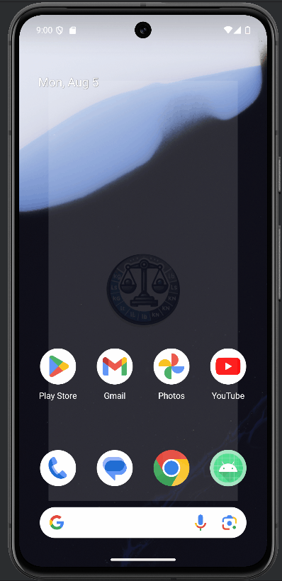
</td>
</tr>
</table>

</div>


----

## Setting Up the Project

### Video @ 1:13 - 2:02

1. **Create a New Project:**
    - Select "Empty Activity" and click "Next".
    - Name your application "Mass Converter".
    - Ensure the package name is set to `com.uog.massconverter`.
    - Set the minimum API level to 24.
    - Click "Finish" to create the project.


    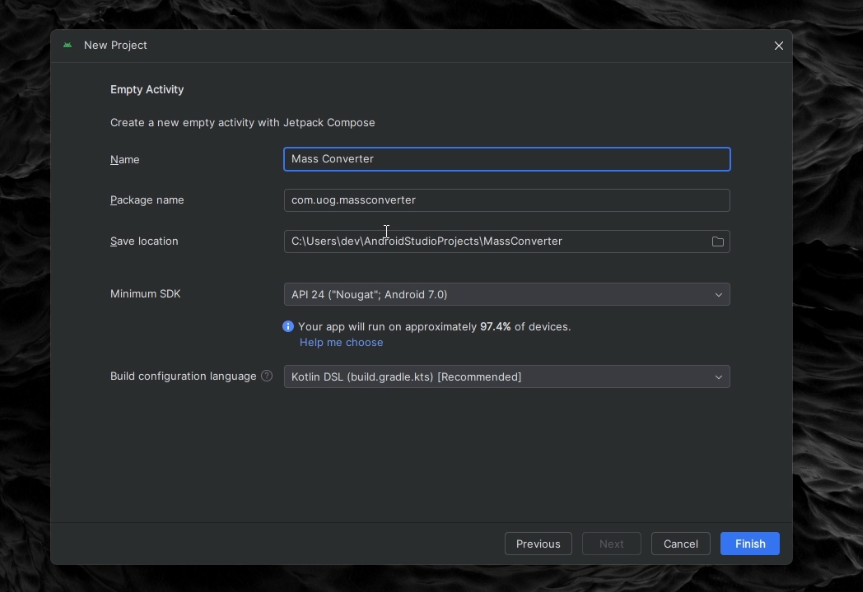
    
2. **Adding images and creating logo assest**

<table>
<tr>
<td style="width: 70%; padding: 10px; border: 0px solid #ddd;">

- All the images are available in the Pictures folder downloaded in the zip.  Drag the files to the mipmap folder.
- For the assest right clock the `conversion_logo.png` and get the `absolute path` 
- right click the res folder and add new image asset
- In the Path: field paste the **Absolute File** path you copied earlier, and then select the file. 
- Click the Next button to add the custom launcher icon. 
- On the next dialog window, click the Finish button. The custom icons will be displayed in `res/mipmap` folder


</td>
<td style="width: 100%; padding: 20px; border: 0px solid #ddd;">


</td>
</tr>
</table>

--- 

## Modifying MainActivity

### Video @ 2.02 - 10.21

1. **Modify the Main Activity Layout:**

- Update the `MainActivity.kt` file so that we have our own layout and set of Composables etc... 

    ```kt
    class MainActivity : ComponentActivity() {
        override fun onCreate(savedInstanceState: Bundle?) {
            super.onCreate(savedInstanceState)
            setContent {
                MassConvertorTheme {
                    WeightConverterApp()
                }
            }
        }

        @Composable
        fun WeightConverterApp() {
            var massEntered by remember { mutableStateOf("") }

            Column(
                modifier = Modifier
                    .padding(16.dp)
                    .fillMaxSize()
            ) {
                Text(text = "Mass Converter", style = MaterialTheme.typography.headlineSmall)
                Spacer(modifier = Modifier.height(16.dp))

                TextField(
                    value = massEntered,
                    onValueChange = { massEntered = it },
                )
            }
        }

        private fun converter(){

        }

    @Preview(showBackground = true)
        @Composable
        fun DefaultPreview() {
            MassConvertorTheme {
                WeightConverterApp()
            }
        }
    }
    ```

    >> **Notes:**
    >> - **@Composable**: This annotation is used to mark a function as composable. Functions marked with `@Composable` can be used to describe part of a UI in Jetpack Compose. This allows you to build UI elements declaratively.
    >>
    >> - **by**: This is used for delegation in Kotlin. Here, it is used with `remember` and `mutableStateOf` to create a state variable.
    >>
    >> - **remember**: This composable function is used to **remember** a single object in a composable function. It retains state across recompositions.
    >>
    >> - **mutableStateOf("")**: This creates a mutable state initialized with an empty `string`. `mutableStateOf` is used to create state that Jetpack Compose can observe and react to changes
    >> 
    >> - **Column**: This is a composable function that places its children in a vertical sequence.
    >> 
    >> - **modifier**: This parameter allows you to modify the layout or behavior of a Composable.
    >>
    >> - **Spacer**: This composable function is used to create empty space in layouts.
    >> 
    >> - **TextField**: This composable function creates an editable text input field.
    >>
    >> - **onValueChange = { massEntered = it }**: A **lambda** function that updates the `massEntered` state variable whenever the text in the text field changes.
    >>
    >> - **lamdba**: In Kotlin, a lambda is an anonymous function (a function without a name) that can be treated as a value. Lambdas are often used to pass functions as arguments to higher-order functions, which are functions that take other functions as parameters or return functions.


    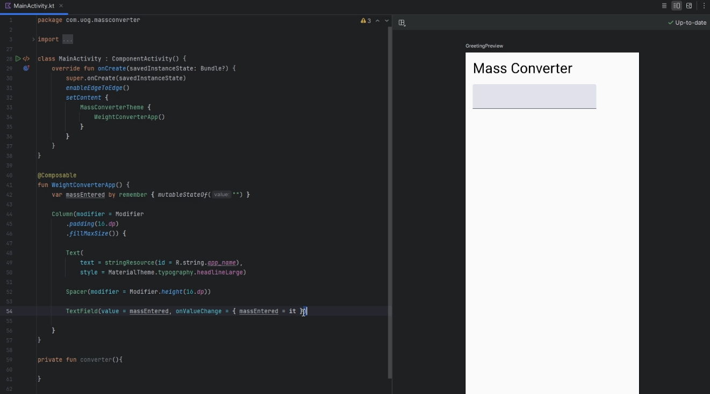

- Finish modifying the `TextField` so that only a number style keyboard is displayed on focus and give the field a hint/ghost text "Enter Mass"

    ```kt
    @Composable
    fun WeightConverterApp() {
        var massEntered by remember { mutableStateOf("") }

        Column(
            modifier = Modifier
                .padding(16.dp)
                .fillMaxSize()
        ) {
            Text(text = "Mass Converter", style = MaterialTheme.typography.headlineSmall)
            Spacer(modifier = Modifier.height(16.dp))

            TextField(
                value = massEntered,
                onValueChange = { massEntered = it },
                modifier = Modifier
                    .fillMaxWidth()
                    .padding(16.dp),
                label = { Text("Enter mass") },
                keyboardOptions = KeyboardOptions.Default.copy(keyboardType = KeyboardType.Number)
            )

            Spacer(modifier = Modifier.height(16.dp))
        }
    }
    ```

    >**Notes:**
    >> - **label** - this is a parameter for the TextField composable in Jetpack Compose. It specifies a label for the text field.
    >>
    >> - **{ Text("Enter mass") }**: This is a lambda expression that defines the content of the `label`. In this case, the `label` is a `Text` composable displaying the string `"Enter mass"`.
    >>
    >> - **keyboardOptions**: This is another parameter for the `TextField` composable. It specifies the behavior of the on-screen keyboard that appears when the text field gains focus.
    >> 
    >> - **KeyboardOptions.Default**: This provides the default keyboard options. 
    >>
    >> - **.copy(keyboardType = KeyboardType.Number)**: This creates a copy of the default keyboard options, modifying the `keyboardType` to `KeyboardType.Number`.

    
    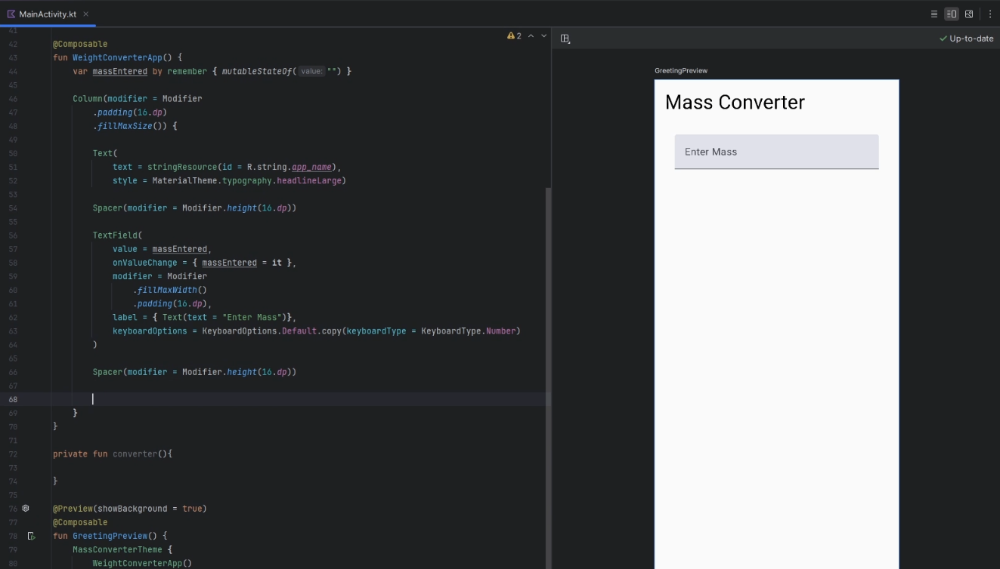

------

## MainActivity: RadioButtons

### Video @ 10.21 - 17.11

1. **Creating InputMass RadioButtons:**

 - We now are going to use some `RadioButtons` that can be selected by the user to indicate their choices, after the `TextField` and `Spacer` add a `Text` Composable and a `Row` Composable with 3 RadioButtons, 3 `Text` and 2 `Spacers`:

    ```kt
    ... 

    TextField(){...}

    Spacer(modifier = Modifier.height(16.dp))

    Text("Input Mass Unit")
    Row {
        RadioButton(
            selected = inputMassUnit == "kg",
            onClick = { inputMassUnit = "kg" })
        
        Text("Kilograms")
        
        Spacer(modifier = Modifier.width(8.dp))
        
        RadioButton(
            selected = inputMassUnit == "lbs", 
            onClick = { inputMassUnit = "lbs" })
        
        Text("Pounds")
        
        Spacer(modifier = Modifier.width(8.dp))
        
        RadioButton(
            selected = inputMassUnit == "stone", 
            onClick = { inputMassUnit = "stone" })
        
        Text("Stone")
    }

    Spacer(modifier = Modifier.height(16.dp))

    ...

    ```

- Also, note that the `inputMassUnit` needs to bound to the so that it stores data during recomposition process, add the line below where you create the `massEntered` variable, you could also add the `outputMassUnit` too:

    ```kt
    var inputMassUnit by remember { mutableStateOf("kg") }
    var outputMassUnit by remember { mutableStateOf("lbs") }
    ```


    >>**Notes:**
    >> - **Row** - This is a composable that arranges its children in a horizontal sequence.
    >>
    >> - **RadioButton**: This composable represents a radio button, which is a circular button that can be either selected or unselected. It is typically used in groups to allow users to select one option from a set.
    >> 
    >> - **selected**: This parameter determines whether the radio button is `selected` or not.
    >>
    >> - **inputMassUnit == "kg"**: This expression checks if the current value of `inputMassUnit` is equal to `"kg"`. If it is, the radio button will be shown as `selected`.
    >>
    >> - **onClick**: This is a lambda function that gets executed when the radio button is clicked.
    >>
    >> - **{ inputMassUnit = "kg" }**: This lambda sets the value of `inputMassUnit` to `"kg"` when the radio button is clicked. This means that clicking the radio button will update the state to indicate that "kg" is the selected unit.

    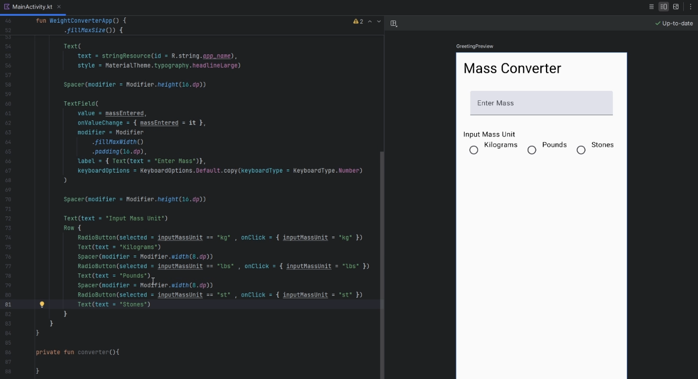

- Create a new `Row` that replicates the previous `Row` for `outputMassUnit`

    ```kt
    Row{...}

    Spacer(modifier = Modifier.height(16.dp))

    Text("Convert to Mass Unit")
    Row {
        RadioButton(
            selected = outputMassUnit == "kg",
            onClick = { outputMassUnit = "kg" })

        Text("Kilograms")

        Spacer(modifier = Modifier.width(8.dp))

        RadioButton(
            selected = outputMassUnit == "lbs",
            onClick = { outputMassUnit = "lbs" })
        Text("Pounds")

        Spacer(modifier = Modifier.width(8.dp))

        RadioButton(
            selected = outputMassUnit == "stone",
            onClick = { outputMassUnit = "stone" })
        
        Text("Stone")
    }
    ```

    


## MainActivity: Button and Converter Function

### Video @ 17.11 - 27.39

- Now we are going to use a `Button` Composable that invokes and `onClick` method to calcualte the user input and their selected `RadioButton` options. Underneath the last `Row{...}` create a new `Spacer` Composable and a `Button` Composable:

    ```kt
    Row{...}
    Spacer(modifier = Modifier.height(16.dp))

    Button(onClick = { /*TODO*/}) { 

    }
    ...
    ```

    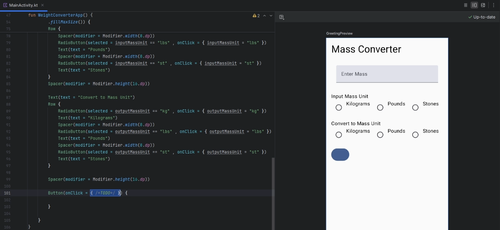

- Navigate back up to where you defined the variables that are remembered across recompositon and define the following; ` var massEntered by remember { mutableStateOf("") }` and `var convertedValues by remember { mutableStateOf(arrayOf("","","")) }`


- Continue building the functionality of the `Button` and update the arguments field of the `converter` function where it is declared:

    ```kt
    Row{
        ...
        Button(
            onClick = {
                val mass = massEntered.toDoubleOrNull()

                if (mass != null && mass > 0) {
                    convertedValues = convertor(numberFormat,mass, 
                                        inputMassUnit, outputMassUnit)
                } 
            }
    }

    private fun convertor(numberFormat: NumberFormat, mass: Double, inputUnit: String,
                          outputUnit: String) : Array<String> {

        val conversionsToBeReturned = arrayOf<String>("","","")

        return conversionsToBeReturned
    }
    ```

    >**Notes:**
    >> - **onClick** - This is a lambda function that gets executed when the button is clicked.
    >>
    >> - **massEntered.toDoubleOrNull()**: This function attempts to convert the string `massEntered` into a `Double`. If the conversion is not possible (e.g., if `massEntered` is not a valid number), it returns `null`.
    >> - **mass != null**: This checks if the conversion was successful.
    >>
    >> - **mass > 0**: This checks if the mass entered is greater than zero.

    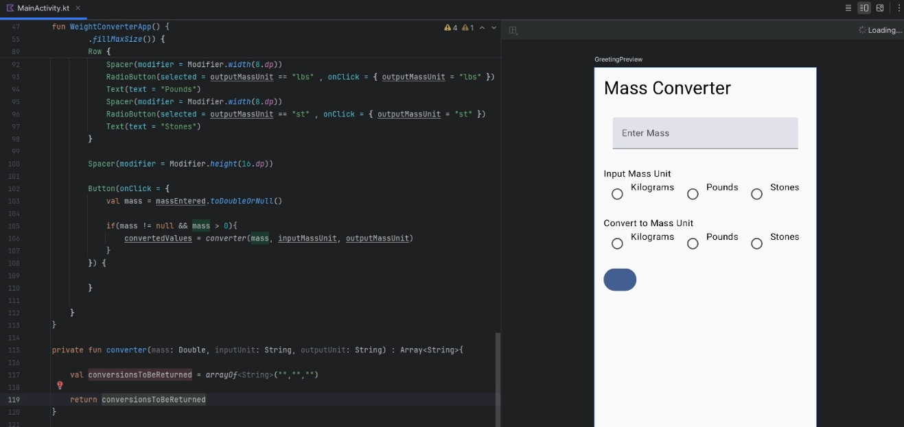

- Continuing with the conditions inside the `Button`, we will add an `else` to catch the inverse of the `if` and display at `Toast` Notification. We also going to add a `Spacer` after the Button and 3 `Text` Composables that will display the result of the `converter` function by referencing the respectively array index of the `convertedValues` variable:

    ```kt
    Button(onClick = {
        val mass = massEntered.toDoubleOrNull()

        if (mass != null && mass > 0) {
            convertedValues = convertor(numberFormat,mass, inputMassUnit, outputMassUnit)

        } else {
            Toast.makeText(context, "Mass must be greater than 0",
                Toast.LENGTH_LONG).show()
        }
    }) {
        Text("Convert")
    }

    Spacer(modifier = Modifier.height(16.dp))

    Text("Converted Mass: ${convertedValues[0]}")
    Text("Weight in Newtons: ${convertedValues[1]}")
    Text("Weight in Kilonewtons: ${convertedValues[2]}")
    }
    ```

- declare the `context` variable at the underneath the remembered variables.

    ```kt
    ...

    var massEntered by remember { mutableStateOf("") }
    var convertedValues by remember { mutableStateOf(arrayOf("","","")) }
    var inputMassUnit by remember { mutableStateOf("kg") }
    var outputMassUnit by remember { mutableStateOf("lbs") }

    var context =  LocalContext.current
    ...

    ```

    > **Notes:**
    >> - **else**: This keyword is used to define a block of code that runs if the preceding `if` condition(s) is `false`. In this case, it runs when the mass is not greater than 0.
    >>
    >> - **Toast.makeText**: This function creates a Toast message, which is a small popup message that briefly appears on the screen.
    >>
    >> - **context**: This is the `context` in which the `Toast` should run. It is obtained from the `LocalContext.current` in a Compose function defined after remembered variables we declared.
    >>
    >> - **Toast.LENGTH_LONG**: This is the duration for which the `Toast` will be shown. `Toast.LENGTH_LONG` means it will be displayed for a long duration.
    >>
    >> - **show()**: This function call displays the `Toast`.
    >> 
    >> - **Text("Converted Mass: $\{convertedValues[0]}")** -  Displays the first converted value, we use the `${}` to reference variable that are are defined as collection, list and arrays etc

    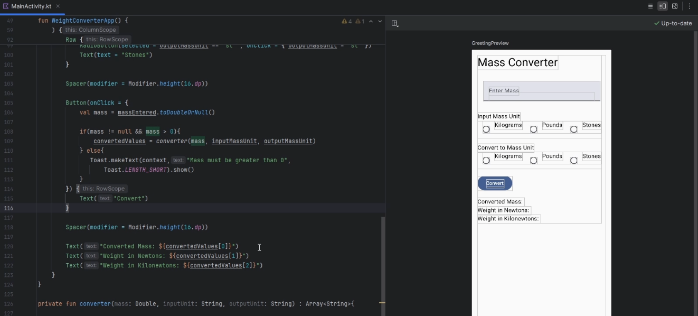


## MainActivity: Converter Functionality

### Video @ 27.39 - 43.24

- Navigate to the top of the `MainActivty()` add the following variables that stored constant conversion values and the `NumberFormat` to the `WeightConverterApp()`: 

    ```kt
    class MainActivity : ComponentActivity() {

        private val conversionToPounds: Double = 2.20462262 // lbs to kg
        private val conversionToStones: Double = 0.15747304 // lbs to kg
        private val gravity : Double = 9.81 // m/s^2

        ...
            override fun onCreate(savedInstanceState: Bundle?) { ... }


        @Composable
        fun WeightConverterApp() {
            var massEntered by remember { mutableStateOf("") }
            ...

            val numberFormat = remember {
                NumberFormat.getInstance().apply {
                    maximumFractionDigits = 2
                    minimumFractionDigits = 2
                }
            }
        
        ```

    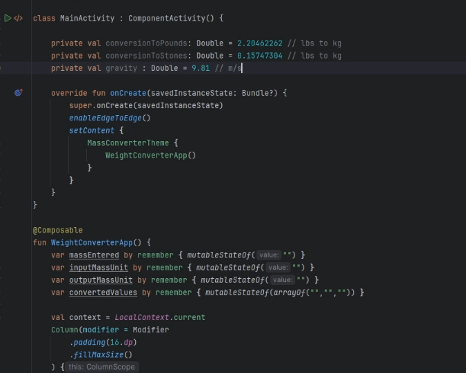

- Next go back `Converter()` and let's create the calculations to convert between different units

    ```kt
    private fun converter(numberFormat: NumberFormat, mass : Double,
                            inputUnit: String, outputUnit: String) : Array<String>{

        val conversionsToBeReturned = arrayOf<String>("","","")

        val massInKg = when (inputUnit) {
            "kg" -> mass
            "lbs" -> mass / conversionToPounds
            "st" -> mass / conversionToStones
            else -> 0.0
        }

        val converted = when (outputUnit){
            "kg" -> "$massInKg kg"
            "lbs" -> "${numberFormat.format(mass * conversionToPounds)} lbs"
            "st" -> "${numberFormat.format(mass * conversionToStones)} stone"
            else -> ""
        }

        conversionsToBeReturned[0] = converted
        conversionsToBeReturned[1] = "${numberFormat.format(massInKg * gravity)} N"
        conversionsToBeReturned[2] = "${numberFormat.format(massInKg * gravity / 1000)}  kN"

        return conversionsToBeReturned
    }

    ```
    > **Notes:**
    >> - **val massInKg** - Declares a read-only variable that stores the `mass` converted to kilograms.
    >> 
    >> - **when (inputUnit)** - Checks the value of the `inputUnit` variable and performs different actions based on its value.
    >>  - **"kg"** - If the `inputUnit` is kilograms, it directly assigns the input mass to `massInKg`.
    >>  - **"lbs"** - If the `inputUnit` is pounds, it converts the mass from pounds to kilograms by dividing it by `conversionToPounds`.
    >>  - **"st"** - If the `inputUnit` is stones, it converts the mass from stones to kilograms by dividing it by `conversionToStones`.
    >>  - **else** - For any other unit (or if `inputUnit` doesn't match any of the specified cases), it assigns `0.0` to `massInKg`.
    >> 
    >> - **when (outputUnit)**: Checks the value of the `outputUnit` variable and performs different actions based on its value.
    >>  - **"kg"** - If the `outputUnit` is kilograms, it creates a string that includes the mass in kilograms (`massInKg`).
    >>  - **"lbs"** - If the `outputUnit` is pounds, it converts the mass from kilograms to pounds by multiplying it by `conversionToPounds` and formats the result using `numberFormat`. The formatted string includes the mass in pounds.
    >>  - **"st"** - If the `outputUnit` is stones, it converts the mass from kilograms to stones by multiplying it by `conversionToStones` and formats the result using `numberFormat`. The formatted string includes the mass in stones.
    >>  - **else** - For any other unit (or if `outputUnit` doesn't match any of the specified cases), it assigns an empty string to converted.

    - Without the **Formater**:

        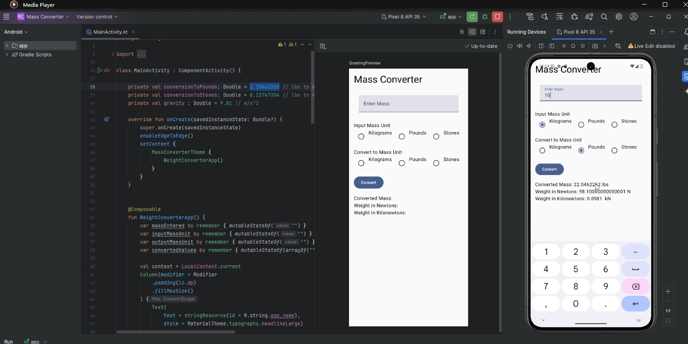

    - With the **Formater**:

        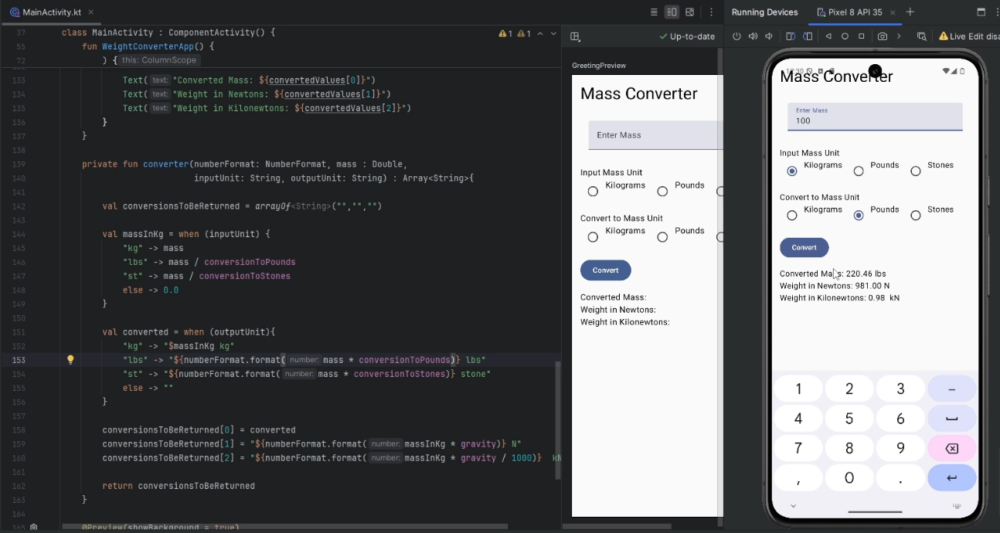

-----


<table>
<tr>
<td style="width: 50%; padding: 10px; border: 0px solid #ddd;">

If you run the app you should now be able to reproduce the following: 

</td>
<td style="width: 50%; padding: 10px; border: 0px solid #ddd;">


</td>
</tr>
</table>


-----------


<details>

<summary>The whole program should look like this: </summary>

```kt
package com.uog.massconverter

import android.os.Bundle
import android.widget.Toast
import androidx.activity.ComponentActivity
import androidx.activity.compose.setContent
import androidx.activity.enableEdgeToEdge
import androidx.compose.foundation.layout.Column
import androidx.compose.foundation.layout.Row
import androidx.compose.foundation.layout.Spacer
import androidx.compose.foundation.layout.fillMaxSize
import androidx.compose.foundation.layout.fillMaxWidth
import androidx.compose.foundation.layout.height
import androidx.compose.foundation.layout.padding
import androidx.compose.foundation.layout.width
import androidx.compose.foundation.text.KeyboardOptions
import androidx.compose.material3.Button
import androidx.compose.material3.MaterialTheme
import androidx.compose.material3.RadioButton
import androidx.compose.material3.Scaffold
import androidx.compose.material3.Text
import androidx.compose.material3.TextField
import androidx.compose.runtime.Composable
import androidx.compose.runtime.getValue
import androidx.compose.runtime.mutableStateOf
import androidx.compose.runtime.remember
import androidx.compose.runtime.setValue
import androidx.compose.ui.Modifier
import androidx.compose.ui.platform.LocalContext
import androidx.compose.ui.res.stringResource
import androidx.compose.ui.text.input.KeyboardType
import androidx.compose.ui.tooling.preview.Preview
import androidx.compose.ui.unit.dp
import com.uog.massconverter.ui.theme.MassConverterTheme
import java.text.NumberFormat

class MainActivity : ComponentActivity() {

    private val conversionToPounds: Double = 2.20462262 // lbs to kg
    private val conversionToStones: Double = 0.15747304 // lbs to kg
    private val gravity : Double = 9.81 // m/s^2

    override fun onCreate(savedInstanceState: Bundle?) {
        super.onCreate(savedInstanceState)
        enableEdgeToEdge()
        setContent {
            MassConverterTheme {
                WeightConverterApp()
            }
        }
    }


    @Composable
    fun WeightConverterApp() {
        var massEntered by remember { mutableStateOf("") }
        var inputMassUnit by remember { mutableStateOf("") }
        var outputMassUnit by remember { mutableStateOf("") }
        var convertedValues by remember { mutableStateOf(arrayOf("","","")) }

        val numberFormat = remember {
            NumberFormat.getInstance().apply {
                maximumFractionDigits = 2
                minimumFractionDigits = 2
            }
        }

        val context = LocalContext.current
        Column(modifier = Modifier
            .padding(24.dp)
            .fillMaxSize()
        ) {
            Text(
                text = stringResource(id = R.string.app_name),
                style = MaterialTheme.typography.headlineLarge)

            Spacer(modifier = Modifier.height(16.dp))

            TextField(
                value = massEntered,
                onValueChange = { massEntered = it },
                modifier = Modifier
                    .fillMaxWidth()
                    .padding(16.dp),
                label = { Text(text = "Enter Mass")},
                keyboardOptions = KeyboardOptions.Default.copy(keyboardType = KeyboardType.Number)
            )

            Spacer(modifier = Modifier.height(16.dp))

            Text(text = "Input Mass Unit")
            Row {
                RadioButton(selected = inputMassUnit == "kg" , onClick = { inputMassUnit = "kg" })
                Text(text = "Kilograms")
                Spacer(modifier = Modifier.width(8.dp))
                RadioButton(selected = inputMassUnit == "lbs" , onClick = { inputMassUnit = "lbs" })
                Text(text = "Pounds")
                Spacer(modifier = Modifier.width(8.dp))
                RadioButton(selected = inputMassUnit == "st" , onClick = { inputMassUnit = "st" })
                Text(text = "Stones")
            }
            Spacer(modifier = Modifier.height(16.dp))

            Text(text = "Convert to Mass Unit")
            Row {
                RadioButton(selected = outputMassUnit == "kg" , onClick = { outputMassUnit = "kg" })
                Text(text = "Kilograms")
                Spacer(modifier = Modifier.width(8.dp))
                RadioButton(selected = outputMassUnit == "lbs" , onClick = { outputMassUnit = "lbs" })
                Text(text = "Pounds")
                Spacer(modifier = Modifier.width(8.dp))
                RadioButton(selected = outputMassUnit == "st" , onClick = { outputMassUnit = "st" })
                Text(text = "Stones")
            }

            Spacer(modifier = Modifier.height(16.dp))

            Button(onClick = {
                val mass = massEntered.toDoubleOrNull()

                if(mass != null && mass > 0){
                    convertedValues = converter(numberFormat, mass, inputMassUnit, outputMassUnit)
                } else{
                    Toast.makeText(context,"Mass must be greater than 0",
                        Toast.LENGTH_SHORT).show()
                }
            }) {
                Text("Convert")
            }

            Spacer(modifier = Modifier.height(16.dp))

            Text("Converted Mass: ${convertedValues[0]}")
            Text("Weight in Newtons: ${convertedValues[1]}")
            Text("Weight in Kilonewtons: ${convertedValues[2]}")
        }
    }

    private fun converter(numberFormat: NumberFormat, mass : Double,
                          inputUnit: String, outputUnit: String) : Array<String>{

        val conversionsToBeReturned = arrayOf<String>("","","")

        val massInKg = when (inputUnit) {
            "kg" -> mass
            "lbs" -> mass / conversionToPounds
            "st" -> mass / conversionToStones
            else -> 0.0
        }

        val converted = when (outputUnit){
            "kg" -> "$massInKg kg"
            "lbs" -> "${numberFormat.format(mass * conversionToPounds)} lbs"
            "st" -> "${numberFormat.format(mass * conversionToStones)} stone"
            else -> ""
        }

        conversionsToBeReturned[0] = converted
        conversionsToBeReturned[1] = "${numberFormat.format(massInKg * gravity)} N"
        conversionsToBeReturned[2] = "${numberFormat.format(massInKg * gravity / 1000)}  kN"

        return conversionsToBeReturned
    }

    @Preview(showBackground = true)
    @Composable
    fun GreetingPreview() {
        MassConverterTheme {
            WeightConverterApp()
        }
    }

}
```

</details>

-------------------------------------------------------
-------------------------------------------------------

## Continue Here....

>**Note**:
>> - You can find royalty-freee images here: [https://www.freeimages.com/](https://www.freeimages.com)

For the exercises below, us the above lab as a reference.

## 1. Phone Photo Prints App

|Application Title|Phone Photo Prints App|
|---|---|
|Purpose|The app determines the cost of printing photos from your phone. The pictures are delivered directly to your home|
|Algorithm 1:|The opening screen requests the number of photos to print form a user’s phone|
|Algorithm 2:|The user selects a `radio button` labelled 4 x 6 prints (19 pence each), 5 x 7 prints (49 cent each) and 8 x 10 prints (79 cents each) then selects ORDER PRINTS button.|
|Alogrithm 3:|The cost is displayed for the number of prints and the result is rounded to the nearest cent. Do not enter more than 50 prints.|
|Alogrithm 4:|Use a theme that displays an Action bar with the custom Action bar icon in the finished layout.  Use a custom launcher icon named ic_aluncher_photo.png from the downloaded zip folder.|

<div align=center>

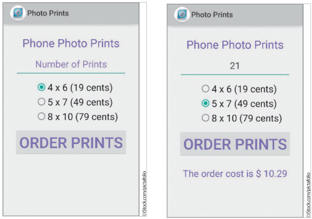

</div>

---------

## 2. Car Wash App

|Application Title|Car Wash App|
|---|---|
|Purpose|Large cities provide car wash apps where you can purchase packages for your vehicle.|
|Alogrithm 1:|The opening screen requests the type of car wash package you would like to purchase.|
|Algorithm 2:|The user selects which type of car wash – exterior only or exterior with interior vacuum services. The Car Wash App charges $8.99 for an exterior wash and $12.99 for an exterior wash with an interior vacuum for a package of 12 or more car washes. If you select less than 12 washes, the charge is $10.99 for an exterior wash and $15.99 for an exterior with interior vacuum.|
|Algorithm 3:|After the user clicks the `Button` control, the selected location and the total team coast are displayed in the `TextView` control.|
|Algorithm 4:|Use a customized launcher icon ic_launcher_carwash.png (from the zip folder) and display the same icon in the Action Bar using Theme.`AppCompat.Light theme`. Display an `ImageView` control (carwash.png, from the zip folder).  Only one `RadioButton` control can be selected. A toast message should pop up when the user enters less than 12 washes that they must buy 12 washes to receive a discount.|


<div align=center>


</div>

-----

## 3. Power Tool Rental App

|Application Title|Power Tool Rental App|
|---|---|
|Purpose|The app determines the cost of power washer or tiller|
|Algorithm 1:|The opening screen requests the number of days that the power tool will be rented.|
|Algorithm 2:|The user selects a radio button labelled Power Washer or Tiller and then selects the `COMPUTE COST` button.|
|Algorithm 3:|The final cost is displayed for the number of days rented and the result is rounded to the nearest penny.|
|Alogrithm 4:|The power washer costs £55.99 a day and the tiller - £68.99 a day.  Do not enter more than 7 days.|
|Alogrithm 5:|Locate an image online and resize it for use as a custom launcher icon and Action bar icon.|

------


## 4. Floor Tiling App

|Application Title|Floor Tiling App|
|---|---|
|Purpose|The tiling app allows you to calculate how many tiles you need to cover a rectangular area.|
|Algorithm 1:|The opening screen requests the length and the width of a room in whole feet.|
|Algorithm 2:|The user selects whether the tiles are 12 inches by 12 inches or 18 inches by 18 inches.|
|Algorithm 3:|The number of tiles to cover the area in square feet is displayed|
|Algorithm 4:|Ensure that the user can have other units of measurement, centimeters\\(^{2}\\), meters\\(^{2}\\) etc.
