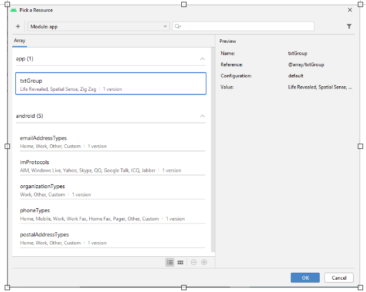

# Lab 5 Android User Input, Variables and Operations. Part 1

> You will need to download the following picture folder -> [Lab_5_Picture.zip](Lab_5_Pictures.zip)

## 1. Concert Ticket App

You are to develop a Concert Tickets App as shown below:

<div align=center>


</div>

In the field **Number of Tickets**, you are to enter a positive integer.  You can also choose from the drop-down list the concert you are interested in and then click the **FIND THE COST** button.  Then the cost of the tickets will be displayed just above the picture as shown below (it is assumed that a single ticket is priced at £79.99):

<div align=center>


</div>

### Using the String Table

- Double click on the strings.xml file in the values subfolder to display its contents

- Click the Add key (plus sign) in the Translations Editor and type txtTitle in the Key text box and Ticket Vault in the Default Value text box as shown below:

<div align=center>


</div>

- Using the `string.xml` file add the strings specified in the table below:

```xml
<string name="txtTickets">Number of Tickets</string> 
<string name="prompt">Select Group</string>
<string name="description">Concert Image</string>
<string name="btnCost">FIND THE COST</string>
```

### Adding a String Array

Now you need to add a string array, modify the `string.xml` with the following code:

```xml
<string-array name="txtGroup">
    <item>Linkin Park</item>
    <item>Hollywood Undead</item>
    <item>Man with a Mission</item>
    <item>Life Revealed</item>
</string-array>
```

### Adding Controls to the Emulator
**Step 1:**
- Click the Save All button on the Standard toolbar and close `strings.xml` tab.
- With `activity_main.xml` opened and displaying the emulator screen, from the Palette, choose the Common category and then choose the **TextView** widget 
- Drag the **TextView** widget to the centre of the emulator screen until a dashed vertical line identifying the screen’s centre is displayed and drop it onto the top part of the emulator.  
- In the Attributes Pane click on the vertical bar next to the **text** attribute to open the Pick a Resource dialog. 
- Choose **txtTitle** from the list to name the TextView widget.
- Press the Ok button.
- In the **textSize** property, type **48sp** and the press Enter.  
- Right click on the **TextView** widget and choose Center/Horizontally form the drop down list. 

<div align=center>


</div>

**Step 2:**
- In the Text category in the Palette, scroll down to the Number control.
- Drag and drop the Number control onto the emulator bellow the Ticket Vault text.
- Drag the control to the centre of the screen until a dashed vertical line identifying the screen centre is displayed.
- Set the **textSize** property to **28sp** from the drop-down list. 

### Setting the Hint Property for the Text Field

**Step 1:**
- With the Number control selected in the emulator, find the hint property in the Attributes pane (by typing hint in the search box for example) and then click on the vertical line next to the hint property.
- Pick a Resource dialog box will appear.  Click **txtTickets** to select the assigned string. Click the OK button as shown below:

<div align=center>


</div>

### Using the Android Spinner Control

**Step 1:**
- With the `activity_main.xml` tab open, scroll to view the Containers category in the Palette.
- Drag and drop the Spinner control below the Number control and centre it horizontally. 

**Step 2:**
- In the Attributes pane using search facility at the top of the pane, type in prompt and click to the right of the prompt property on the vertical line to display the Pick a Resources dialog box. 
- Find the prompt and click it to display instructions when the user touches the Spinner control.
- Click the OK button as shown below:

<div align=center>


</div>

- In the Attributes pane, click the vertical bar to the right of the entries property.
- Choose txtGroup from the dialog box as shown below. Press OK.

<div align=center>



</div>

### Adding the Button, TextView and ImageView Controls

**Step 1:**
- In the `activity_main.xml` tab, the Common category in the Palette, drag the Button control to the emulator and centre it below the Spinner control.
- Click on the vertical bar next to the text attribute and from the Pick a Resource dialog box choose btnCost and then press ok. 
- Change the **textSize** property to **36sp** from the drop-down list and save your work. 

**Step 2:**
- From the Common category in the Palette, choose the **TextView** control and drag the control to the emulator and centre it below the Button control.
- Inside the **text** property delete **TextView**.
- Change the **textSize** property to **24sp** from the drop-down list. 

**Step 3:**
- To add the **Image View** control, copy the file `concert.png` from the Pictures folder on moodle to your computer. 
- Copy the `concert.png` file (CTRL + C) and then right click the drawable folder in the Android project view pane. Click Paste. From the Choose Destination Directory dialog choose the **drawable folder** and then click the Ok button as shown below.

<div align=center>


</div>

- Click OK on the next Copy dialog which appears to copy the concert.png file into the drawable directory.
- From the Common category in the Palette, drag the ImageView control to the emulator and centre it below the TextView control at the bottom of the emulator.
- From the Pick a Resources dialog box which appears, choose the concert picture. Now click the OK button.  
- With the image selected, click the vertical bar to the right of the contentDescription property in the Attributes pane.  Select description and then click the OK button.

**Step 4:**
- Now apply Infer Constraints by clicking the button on the top of the emulator.  
- Run the emulator to see if your interface looks like what you expected.  If you are happy with the interface, proceed with the next step.  If not – fix it!

### Coding the EditText Class for the TextField, the Spinner Control and the Button Control

**Step 1:**
- In the Android project view, expand the java folder and the first folder under it and then double click to open the `MainActivity.java` file.
- Click to the right of the line `setContentView(R.layout.activity_main);`

- Press **Enter** to insert a blank line.
- To initialise and reference the `Spinner` control with the Id name of spinner, type:
  - `val group = findViewById<Spinner>(R.id.spinner)`

- After you have entered the line above, press Enter. 
- To initialise the `Button` control with the id of button type:
  - `val costBtn = findViewById<Button>(R.id.button)`

- Press **Enter** to insert a blank line.
- To initialise and reference the `EditText` class with the Id name of **editText** type: 
  - `val tickets = findViewById<EditText>(R.id.editTextNumber)`

- After you have entered the line above, press Enter. 
- To initialise the `TextView` for the resulting calculations with the id of TextView type:
  - `val result = findViewById<TextView>(R.id.textView)`

- Finally, after you have entered the line above, press 
**Enter**
- To initialise and reference the `NumberFormat` class: 
  - `val format: NumberFormat = NumberFormat.getCurrencyInstance(Locale.ENGLISH)`
- The result is shown below:

```kt

package com.example.concerttickets

import ...

class MainActivity : AppCompatActivity() {

    override fun onCreate(savedInstanceState: Bundle?) {
        super.onCreate(savedInstanceState)
        setContentView(R.layout.activity_main)

        val group = findViewById<Spinner>(R.id.spinner)
        val costBtn = findViewById<Button>(R.id.button)
        val tickets = findViewById<EditText>(R.id.editTextText)
        val result = findViewById<TextView>(R.id.textView)
        val format: NumberFormat = NumberFormat.getCurrencyInstance(Locale.ENGLISH)

    }
}
```

### Declaring Variables
**Step 1:**
-  In `MainActivity.java` on the line declaring the class, after the `{`, press Enter:

```kt 
class MainActivity : AppCompatActivity() {


override fun onCreate(savedInstanceState: Bundle?) {
...
```

- Press the Tab key to indent the text, and then insert the following four lines of code to initialize the variables in this activity:
  
```kt
val costPerTicket : Double = 79.99
var numberOfTickets : Int = 0
var totalCost : Double = 0.0
var groupChoice: String? = null
```

- The result is shown below:

```kt

package com.example.concerttickets;

import ...

class MainActivity : AppCompatActivity() {

    val costPerTicket : Double = 79.99
    var numberOfTickets : Int = 0
    var totalCost : Double = 0.0
    var groupChoice: String? = null

    override fun onCreate(savedInstanceState: Bundle?) {
        super.onCreate(savedInstanceState)
        setContentView(R.layout.activity_main)

        val group = findViewById<Spinner>(R.id.spinner)
        val costBtn = findViewById<Button>(R.id.button)
        val tickets = findViewById<EditText>(R.id.editTextText)
        val result = findViewById<TextView>(R.id.textView)
        val format: NumberFormat = NumberFormat.getCurrencyInstance(Locale.ENGLISH)
    }
}
```
### Coding the OnClickListener

**Step 1:**
- To code the button listener that awaits user interaction, after the line for the **Button**, type `cost.setOn` to display an auto-complete listing with all the possible entries that are valid at that point in the code. 
- Double click on the first `OnClickListener` to select it.
- In the parentheses, type `new On` to view possible auto-complete options, and then double click the `OnClickListener` option.
  
**Step 2:**
- After the line of code beginning with `cost.setOnClickListener`, press Enter, and then type:
  - `final TextView result = findViewById(R.id.txtResult);`
- The result is shown below:

```kt

package com.example.concerttickets;

import ...

class MainActivity : AppCompatActivity() {

    val costPerTicket : Double = 79.99
    var numberOfTickets : Int = 0
    var totalCost : Double = 0.0
    var groupChoice: String? = null

    override fun onCreate(savedInstanceState: Bundle?) {
        super.onCreate(savedInstanceState)
        setContentView(R.layout.activity_main)

        val group = findViewById<Spinner>(R.id.spinner)
        val costBtn = findViewById<Button>(R.id.button)
        val tickets = findViewById<EditText>(R.id.editTextText)
        val result = findViewById<TextView>(R.id.textView)
        val format: NumberFormat = NumberFormat.getCurrencyInstance(Locale.ENGLISH)

        costBtn.setOnClickListener{
            
        }
    }
}
```

- Now inside the `setOnClickListener` method stub in line 30, press the tab key, and then type:

```java
numberOfTickets = Integer.parseInt(tickets.getText().toString());
totalCost = costPerTicket * numberOfTickets;
groupChoice = group.getSelectedItem( ).toString( );
result.setText("Cost for " + groupChoice + " is £" + currency.format(totalCost));
```

- The completed version of the MainActivity.java class should look like shown below:

- Now run the emulator again and check that the app is working correctly. 