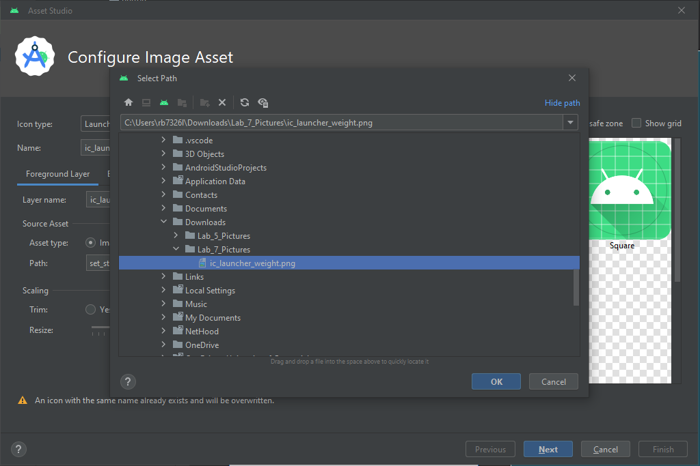

# Lab 5: Android App using Icons and Decision Making Controls

## 1. Medical Calculator App

> You will need to download the following picture folder -> [Lab_5_Picture.zip](Lab_5_Pictures.zip)

Start a new Android Studio Project and name it the Application Medical Calculator. Copy the file `ic_launcher_weight.png` from the Pictures folder you have downloaded above.

**Customizing a Launcher Icon**

- **Step 1:**
  -  In the Android Project View, click the `activity_main.xml` file.
  -  Click File on the menu bar and then click New.  From the drop-down list choose Image Asset. The Asset Studio dialog box opens to display the default launcher icons for the resolutions of various devices.  
<div align=center>


</div>

- **Step 2:**
  - In the Path: field (in the red square in the picture above) click on the folder icon at the very end of the field, and then navigate to the location of `ic_launcher_weight.png` file, and then select the file as shown in the picture below. Note that the path on your PC will be different from the path shown as this is where the file is saved on my laptop.

<div align=center>



</div>

- Click the Ok button. 

- Click the Next button and on the following window that appears, click the Finish button to add the custom launcher icon. The custom icons will be displayed in `res/mipmap` folder. Expand the `res/mipmap` folder and check that the icon is there as expected. The result is shown below:

<div align=center>


</div>

## Displaying the Action Bar Icon Using Code

**Step 1:**
- In the Android project view, expand the java folder and the first sub-folder, and then double-click on the `MainActivity.kt` to open the code window.
- Click at the end of `setContentView` line, press Enter, and type the following three statements to display the logo in the Action bar:

```kt
supportActionBar?.setDisplayShowCustomEnabled(true)
supportActionBar?.setLogo(R.mipmap.ic_launcher_foreground)
supportActionBar?.setDisplayShowTitleEnabled(true)
supportActionBar?.setDisplayUseLogoEnabled(true)
supportActionBar?.setDisplayShowHomeEnabled(true)
supportActionBar?.show()
```

- The result is shown below:

```kt
package com.example.medicalcalculator;

import androidx.appcompat.app.AppCompatActivity;

import android.os.Bundle;

override fun onCreate(savedInstanceState: Bundle?) {
  super.onCreate(savedInstanceState)
  setContentView(R.layout.activity_main)

  supportActionBar?.setDisplayShowCustomEnabled(true)
  supportActionBar?.setLogo(R.mipmap.ic_launcher_foreground)
  supportActionBar?.setDisplayShowTitleEnabled(true)
  supportActionBar?.setDisplayUseLogoEnabled(true)
  supportActionBar?.setDisplayShowHomeEnabled(true)
  supportActionBar?.show()

  }
}
```

- Next, we will play with the `themes.xml` in the `res/vaules/themes` folder, reproduce the following: 

```xml
<resources xmlns:tools="http://schemas.android.com/tools">
    <!-- Base application theme. -->
    <style name="Base.Theme.MedicalCalculator" parent="Theme.AppCompat.DayNight.DarkActionBar">
        <!-- Customize your light theme here. -->
        <!-- <item name="colorPrimary">@color/my_light_primary</item> -->
        <item name="colorPrimary">@color/design_default_color_primary</item>
        <item name="colorPrimaryDark">@color/design_default_color_primary</item>
        <item name="colorAccent">@color/design_default_color_on_secondary</item>
    </style>

    <style name="Theme.MedicalCalculator" parent="Base.Theme.MedicalCalculator" />
    
</resources>
```

<div align=center>


</div>


Run the app. The icon is displayed in the running emulator acting bar as shown below:

<div align=center>


</div>

## String Table
**Step 1:**
- In the Android project view, open the stirngs.xml file in the res\values folder.
- Click the Open Editor link and then the Add Key (+ sign) button in the Translations Editor.
- Enter the following values shown in the table below:

<div align=center>

|String Name | String Value |
|---|---|
|txtTitle | Convert Patient Weight|
|txtWeight| Weight of Patient|
|radLbToKilo| Convert LBS to Kgs|
|radKiloToLb| Convert Kgs to LBS |
|btnConvert| Convert Weight |

</div>

- Click the Save All button on the toolbar and then close the Translators Editor tab and the `strings.xml` tab. 

## Creating the GUI in the Emulator

**Step 1:**
- With the `activity_main.xml` open and displaying the emulator screen, from the Widgets category of the Palette, drag and drop the `TextView` control onto the top part of the emulator.  center it (drag it till a dashed vertical line appears).
- Click the vertical bar next to the text attribute of the `TextView` control in the Attribute Pane and in the Pick a Resource dialog choose the `txtTitle` box. Press OK. 
- Change the `textSize` property to `30sp`.
- Click the vertical bar next to the `textColor` property.  In the Pick a Resource dialog box that appears in the Color section scroll down in Android and choose `holo_red_dark` colour to change the text colour to red to match the launcher icon.  Click the OK button.
- Right-click on the `TextView` control, choose Center/ Horizontally to center the control.

**Step 2:**
- From the Text category in the Palette, drag and drop the `Number` control onto the emulator below the `TextView` control in the center.
- Click on the vertical bar next to the `hint` property in the Property pane.
- Choose `txtWeight` from the Resources dialog and then click the OK button.
- Change the `textSize` property to `24sp`.

**Step 3:**
- In the Buttons category of the Palette, select `RadioButton`, and then drag and drop the `RadioButton` control onto the user interface below the `Number` control. Expand the size of the `RadioButton`, repeat this for a second `RadioButton`, and place underneath the last. 
- Click the vertical bar next to the `text` attribute of the first `RadioButton` control in the Attribute Pane and in the Pick a Resource dialog choose the `radKiloToLbbox`. Press OK. 
- In the Attributes list for the first `RadioButton`, click on the checked property indicating that the first radio button is the default selection.
- Change the `textSize` property to `18sp` from the drop-down list. 
- Click the vertical bar next to the `text` attribute of the second `RadioButton` control in the Attribute Pane and in the Pick a Resource dialog choose the `radLbToKilo` box. Press OK. 
- Change the `textSize` property to `18sp` from the drop-down list. 

**Step 4:**
- Drag the `Button` control from the Palette to the emulator below the `RadioButton`s. 
- Click the vertical bar next to the `text` attribute of the `Button` control in the Attribute Pane and in the Pick a Resource dialog choose the `btnConvert` box. Press OK.
- Change the `textSize` property to `24sp` from the drop-down list.
- Click the vertical bar next to the `textColor` property.  In the `Pick a Resource` dialog box that appears in the `Color` section scroll down in Android and choose `holo_red_dark` colour to change the text colour to red to match the launcher icon.  Click the OK button.


**Step 5:**
- From the Common category in the Palette, drag another `TextView` control to the emulator below the `Button`.
- In the `text` attribute box delete `TextView`. The `text` attribute is now empty and the `TextView` component you just dragged to the emulator has no label.
- Change the `textSize` property to `24sp`.
- Click the vertical bar next to the `textColor` property.  In the `Pick a Resource` dialog box that appears in the `Color` section scroll down in android and choose `holo_red_dark` colour to change the text colour to red to match the launcher icon.  Click the OK button.
- Click the **Save All** button on the Standard toolbar.

Now Apply Constraints to the layout using the Infer Constraints button above the emulator and run the app in the emulator to see if you have correctly placed all the controls.  The result should look similar to this:

<div align=center>


</div>

## Coding a Radio Button Control

**Step 1:**
- Click on the `MainActivity.kt` tab.
- Click at the end of the line (just after `{`)  

```kt
override fun onCreate(savedInstanceState: Bundle?) {
```

and then press Tab to indent the line.

- To initialize the conversion rate value of 2.2., type:
```kt
val conversionRate : Double = 2.20462262
```
and press Enter.

- To initialize the `weightEntered` variable and the convertedWeight, type:

```kt
var weightEntered :  Double = 0.0
var convertedWeight : Double = 0.0
```
and press Enter.

**Step 2:**
- Click at the end of the line
```kt
supportActionBar?.show()
``` 
and press Enter.

- to instantiate and reference the `EditText` class:

```kt
val weight = findViewById<EditText>(R.id.editTextNumer)
```
Press Enter.
- To instantiate and reference the two radio buttons, type:

```kt
val kiloToLb = findViewById<RadioButton>(R.id.radiobutton)
val lbToKilo = findViewById<RadioButton>(R.id.radiobutton2)
```
- Save your work.

## Coding the Button Control

**Step 1:**
- After the two lines of code referring to the radio buttons, type:

```kt
val result = findViewById<TextView>(R.id.textView2)
```
and press Enter.

- To code the button, type:

```kt
val convert = findViewById<Button>(R.id.button)
```
and press Enter.

- Your `MainActivity.kt` class should look like this:

```kt
class MainActivity : AppCompatActivity() {

  val conversionRate : Double = 2.20462262
  var weightEntered :  Double = 0.0
  var convertedWeight : Double = 0.0

  override fun onCreate(savedInstanceState: Bundle?) {
    super.onCreate(savedInstanceState)
    setContentView(R.layout.activity_main)
    supportActionBar?.setDisplayShowCustomEnabled(true)
    supportActionBar?.setLogo(R.mipmap.ic_launcher_foreground)
    supportActionBar?.setDisplayShowTitleEnabled(true)
    supportActionBar?.setDisplayUseLogoEnabled(true)

    val kiloToLb = findViewById<RadioButton>(R.id.radiobutton)
    val lbToKilo = findViewById<RadioButton>(R.id.radiobutton2)
    val weight = findViewById<EditText>(R.id.editTextNumberDecimal)
    val result = findViewById<TextView>(R.id.textView2)
    val convert = findViewById<Button>(R.id.button)
  }
}
```

- To code the `Button` listener, type `convert.setOnClickListener{}`.

## Coding the Button Event

**Step 1:**
- Inside the `setOnClickListener{}` method stub of the MainActivity.java code, type the code to convert the weight entered to a Double data type and press Enter.

```kt
weightEntered = weight.getText().toString().toDouble()
```

- To create a decimal layout that changes the weight to a decimal rounded to the nearest tenth for use in the result later in the code, type: 

```kt
// Configure number formatting
val tenth: NumberFormat = NumberFormat.getInstance()
tenth.maximumFractionDigits = 2
tenth.minimumFractionDigits = 2
```

## Coding the Nested `If` Statements

**Step 1:**
- After the `NumberFormat` line of code, to determine if the first `RadioButton` control is selected, insert a new line and type:

```kt
if (lbToKilo.isChecked()) {

}
```

And then press Enter and reproduce the following:

```kt
convert.setOnClickListener {
  weightEntered = weight.getText().toString().toDouble()
  // Configure number formatting
  val tenth: NumberFormat = NumberFormat.getInstance()
  tenth.maximumFractionDigits = 2
  tenth.minimumFractionDigits = 2

  if (lbToKilo.isChecked()) {
   
  }
}
```

**Step 2:**
- Within the first if statement, braces create a nested `if/else` statement that determines if the weight entered for kilograms is less than or equal to 255.  Type:

```kt
if (weightEntered <= 255) { 
```

And, press Enter.  Java automatically adds the closing brace.

On line 41, after the closing brace, type `else { }` and press Enter in between the braces. See the code below:

```kt
  convert.setOnClickListener {
  weightEntered = weight.getText().toString().toDouble()
  // Configure number formatting
  val tenth: NumberFormat = NumberFormat.getInstance()
  tenth.maximumFractionDigits = 2
  tenth.minimumFractionDigits = 2

  if (lbToKilo.isChecked()) {
    if (weightEntered <=  255){

    }else{

    }
  }
}
```

**Step 3:**

- After the pounds variable is validated, the weight must be converted. To divide the weight by the conversion rate of 2.2, inside the nested if statement (line 41) after the `weightEntered` `<= 255 {` line, type:

```kt
convertedWeight = weightEntered  * conversionRate;
```
and press Enter.
- To display the result of the equation rounded to one place past the decimal point, type:

```kt
result.setText(tenth.foramt(convertedWeight) + “ pounds”);
```
- If the weight is not in valid range, a toast message requesting that the user enter a valid weight is displayed briefly. Click the line after the else statement and type:

```kt
Toast.makeText(this, “Kilos must be less than 255”, Toast.LENGHT_LONG).show();
```

The result is shown in the code below: 

```kt
convert.setOnClickListener {
  weightEntered = weight.getText().toString().toDouble()
  // Configure number formatting
  val tenth: NumberFormat = NumberFormat.getInstance()
  tenth.maximumFractionDigits = 2
  tenth.minimumFractionDigits = 2

  if (lbToKilo.isChecked()) {
      if (weightEntered <= 500) {
          convertedWeight = weightEntered / conversionRate
          result.setText(tenth.format(convertedWeight) + " kilograms")
      } else {
          Toast.makeText(
              this,
              "Pounds must be less than 500",
              Toast.LENGTH_LONG
          ).show()
      }
      lbToKilo.setChecked(false)
  }
}
```

**Step 4:**
- When the user selects the `Convert Pounds to Kilograms RadioButton` control, type the following lines of code starting after the closing brace in line 47 (the second closing `}` after `else`) and press Enter after each line, as shown on the figure below:

```kt
if (lbToKilo.isChecked()) {
    if (weightEntered <= 500) {
        convertedWeight = weightEntered / conversionRate
        result.setText(tenth.format(convertedWeight) + " kilograms")
    } else {
        Toast.makeText(
            this,
            "Pounds must be less than 500",
            Toast.LENGTH_LONG
        ).show()
    }
    lbToKilo.setChecked(false)
}
```
The result is shown below:

```kt
package com.example.medicalcalculator

import android.os.Bundle
import android.widget.Button
import android.widget.EditText
import android.widget.RadioButton
import android.widget.TextView
import android.widget.Toast
import androidx.appcompat.app.AppCompatActivity
import java.text.DecimalFormat

class MainActivity : AppCompatActivity() {

    private val conversion : Double = 2.20462262
    private var weightEntered : Double = 0.0
    private var convertedWeight : Double = 0.0
   
    override fun onCreate(savedInstanceState: Bundle?) {
        super.onCreate(savedInstanceState)
        setContentView(R.layout.activity_main)
        supportActionBar?.setDisplayShowCustomEnabled(true)
        supportActionBar?.setLogo(R.drawable.ic_launcher_foreground)
        supportActionBar?.setDisplayShowTitleEnabled(true)
        supportActionBar?.setDisplayUseLogoEnabled(true)

        val kiloToLb = findViewById<RadioButton>(R.id.radioButton)
        val lbToKilo = findViewById<RadioButton>(R.id.radioButton2)
        val weight = findViewById<EditText>(R.id.editTextNumberDecimal)
        val result = findViewById<TextView>(R.id.textView2)
        val convert = findViewById<Button>(R.id.button)
      
        kiloToLb.setOnClickListener{
            lbToKilo.setChecked(false)
        }
        lbToKilo.setOnClickListener{
            kiloToLb.setChecked(false)
        }
        convert.setOnClickListener {
            weightEntered = weight.getText().toString().toDoubleOrNull() ?: 0.0

            // Configure number formatting
            val tenth: NumberFormat = NumberFormat.getInstance()
            tenth.maximumFractionDigits = 2
            tenth.minimumFractionDigits = 2

            if (lbToKilo.isChecked()) {
                kiloToLb.setChecked(false)
                if (weightEntered > 0) {
                    convertedWeight = weightEntered / conversion
                    result.setText(tenth.format(convertedWeight) + " kilograms")
                } else {
                    Toast.makeText(this,  "Pounds must be greater than 0",Toast.LENGTH_LONG).show()
                }
            }
            else if (kiloToLb.isChecked()){
                if (weightEntered > 0){
                    convertedWeight = weightEntered * conversion
                    result.setText(tenth.format(convertedWeight) + " Kilograms")
                }else{
                    Toast.makeText(this, "Did you enter anything?", Toast.LENGTH_SHORT).show()
                }

            }
        }
    }
}
```

Now use the **Run** ‘app’ button (or SHIFT + F10) to run the app.  When you run the program, make sure you test it with correct data and then with more than 500 pounds and more than 225 kilos to see the toast message appear. Two cases of the app running with correct data are shown below. In the first case - the first radio button was clicked and in the second case – the second radio button is clicked by the user.

<div align=center>


</div>

-------------------------------------


## Converted weight on different Solar objects

- Add options (`Spinner` widget for example ) to change the effect of gravity on someone's weight. Use the table below for reference:

<div align=center>

|Planet|	Gravity (m/s²)|Conversion (%)|
|---|---|---|
|Mercury|3.78 | \\( 0.378 = \frac{3.78}{10}\\) 
|Venus|	9.07| \\( 0.907 = \frac{9.07}{10}\\) |
|Earth | 10.0|\\( 1.0 = \frac{10}{10}\\) |
|Mars|	3.77|\\( 0.377 = \frac{3.77}{10}\\) |
|Jupiter|	25.28|\\( 2.528 = \frac{25.28}{10}\\) |
|Saturn|	10.64|\\( 1.064 = \frac{10.64}{10}\\) |
|Uranus|	8.889|\\( 0.8889 = \frac{8.889}{10}\\) |
|Neptune| 11.15|\\( 1.115 = \frac{11.15}{10}\\) |
|Pluto|	0.67|\\( 0.067 = \frac{0.67}{10}\\) |
|Moon|	1.62|\\( 0.162 = \frac{1.62}{10}\\) |

Formula:

\\(yourWeightOnSolObject = convertedWeight \cdot \frac{Sol\ Object}{10}\\)

</div>
<p>

</p>

1. Add a `Spinner` and `TextView` for the list of Sol objects and the resulting conversion.
    
    <div align=center>
    
    

    </div>

2. Consider using `map` for each sol object and their conversion value, recall the slides from earlier, or...

    <details>
    <summary>Suggested Code</summary>

    After the line ending `private var convertedWeight: Double = 0.0`

    ```kt
    // Map that holds relative gravitational accelerations on celestial bodies
    private val solObjectModifiers = mapOf(
        "Moon" to 0.1622, "Mercury" to 0.378, "Venus" to 0.907,
        "Mars" to 0.377, "Jupiter" to 2.528, "Saturn" to 1.064,
        "Uranus" to 0.889, "Neptune" to 1.125, "Pluto" to 0.067
    )

    // Initialise the selected celestial body's conversion factor
    private var solConversion: Double = solObjectModifiers.entries.elementAt(0).value

    ```

    </details>

<p>

</p>

3. Remember to populate the `Spinner` using the `Adapter` class. 

    <details>
    <summary>Suggested Code</summary>

    After line ending ` val solSpinner = findViewById<Spinner>(R.id.spinner)`

    ```kt
    // Initialize the Spinner with data from the map
    val adapter = ArrayAdapter(this, android.R.layout.simple_spinner_item, solObjectModifiers.keys.toTypedArray())
    adapter.setDropDownViewResource(android.R.layout.simple_spinner_dropdown_item)
    solSpinner.adapter = adapter
    ```

    </details>

<p>

</p>

4. Inside the `convert.onClick` method after `weightEntered = weight.getText().toString().toDoubleOrNull() ?: 0.0` get the correct value from the map of sol objects by referencing the `spinner.selectedItem.toString()`
  
    <details>
        <summary>Suggested Code</summary>

        ```kt
        // Get the selected celestial body's conversion factor
        solConversion = solObjectModifiers.getValue(solSpinner.selectedItem.toString())
        ```
    </details>

<p>

</p>

5. Modify return the result of the `solConversion` to the Sol `TextView`, do this after `result.setText(tenth.format(convertedWeight) + " kilograms")` inside the `lbToKilo` radio button:

    <details>
    <summary>Suggested Code</summary>

    ```kt  
    solConversionResult.setText(tenth.format(convertedWeight * solConversion) + " kilograms")
    ```

    </details>

<p>

</p>

6. Repeat the last two steps for **KiloToLb** radio button
  
    <details>
    <summary>Suggested Code</summary>

    ```kt 
    convertedWeight = (weightEntered * conversion)
    ... 
    solConversionResult.setText(tenth.format(convertedWeight * solConversion) + " lbs")
    ```

    </details>

<p>

</p>

7.  Should look something like this...

    <div align=center>

     

    </div>


-------------------------------------------------------
-------------------------------------------------------

## Continue Here....

> You will need to download the following picture folder -> [Lab_5-2_Picture.zip](Lab_5-2_Pictures.zip)

For the exercises below, us the above lab as a reference.

## 1. Phone Photo Prints App

|Application Title|Phone Photo Prints App|
|---|---|
|Purpose|The app determines the cost of printing photos from your phone. The pictures are delivered directly to your home|
|Algorithm 1:|The opening screen requests the number of photos to print form a user’s phone|
|Algorithm 2:|The user selects a `radio button` labelled 4 x 6 prints (19 pence each), 5 x 7 prints (49 cent each) and 8 x 10 prints (79 cents each) then selects ORDER PRINTS button.|
|Alogrithm 3:|The cost is displayed for the number of prints and the result is rounded to the nearest cent. Do not enter more than 50 prints.|
|Alogrithm 4:|Use a theme that displays an Action bar with the custom Action bar icon in the finished layout.  Use a custom launcher icon named ic_aluncher_photo.png from the downloaded zip folder.|

<div align=center>


</div>

---------

## 2. Car Wash App

|Application Title|Car Wash App|
|---|---|
|Purpose|Large cities provide car wash apps where you can purchase packages for your vehicle.|
|Alogrithm 1:|The opening screen requests the type of car wash package you would like to purchase.|
|Algorithm 2:|The user selects which type of car wash – exterior only or exterior with interior vacuum services. The Car Wash App charges $8.99 for an exterior wash and $12.99 for an exterior wash with an interior vacuum for a package of 12 or more car washes. If you select less than 12 washes, the charge is $10.99 for an exterior wash and $15.99 for an exterior with interior vacuum.|
|Algorithm 3:|After the user clicks the `Button` control, the selected location and the total team coast are displayed in the `TextView` control.|
|Algorithm 4:|Use a customized launcher icon ic_launcher_carwash.png (from the zip folder) and display the same icon in the Action Bar using Theme.`AppCompat.Light theme`. Display an `ImageView` control (carwash.png, from the zip folder).  Only one `RadioButton` control can be selected. A toast message should pop up when the user enters less than 12 washes that they must buy 12 washes to receive a discount.|


<div align=center>


</div>

-----

## 3. Power Tool Rental App

|Application Title|Power Tool Rental App|
|---|---|
|Purpose|The app determines the cost of power washer or tiller|
|Algorithm 1:|The opening screen requests the number of days that the power tool will be rented.|
|Algorithm 2:|The user selects a radio button labelled Power Washer or Tiller and then selects the `COMPUTE COST` button.|
|Algorithm 3:|The final cost is displayed for the number of days rented and the result is rounded to the nearest penny.|
|Alogrithm 4:|The power washer costs £55.99 a day and the tiller - £68.99 a day.  Do not enter more than 7 days.|
|Alogrithm 5:|Locate an image online and resize it for use as a custom launcher icon and Action bar icon.|

------


## 4. Floor Tiling App

|Application Title|Floor Tiling App|
|---|---|
|Purpose|The tiling app allows you to calculate how many tiles you need to cover a rectangular area.|
|Algorithm 1:|The opening screen requests the length and the width of a room in whole feet.|
|Algorithm 2:|The user selects whether the tiles are 12 inches by 12 inches or 18 inches by 18 inches.|
|Algorithm 3:|The number of tiles to cover the area in square feet is displayed|
|Algorithm 4:|Ensure that the user can have other units of measurement, centimeters\\(^{2}\\), meters\\(^{2}\\) etc.
