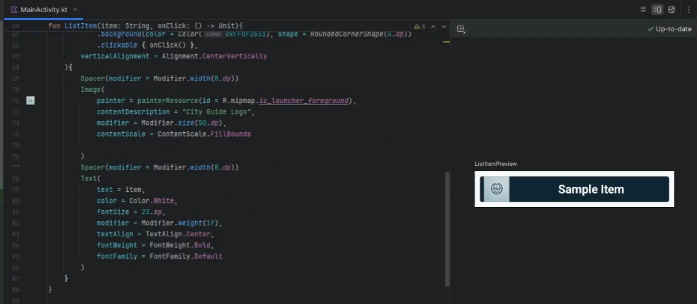
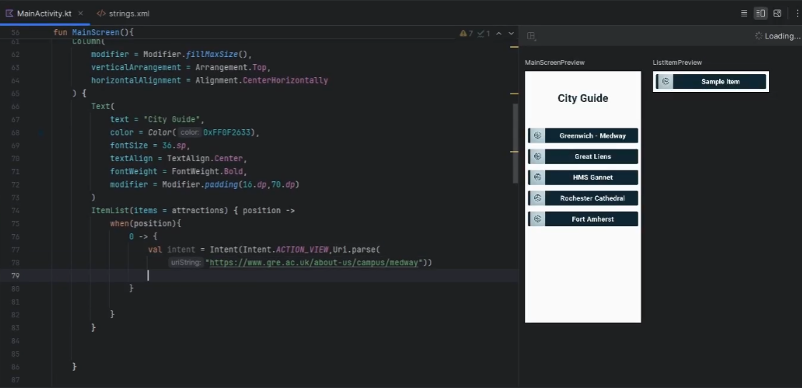
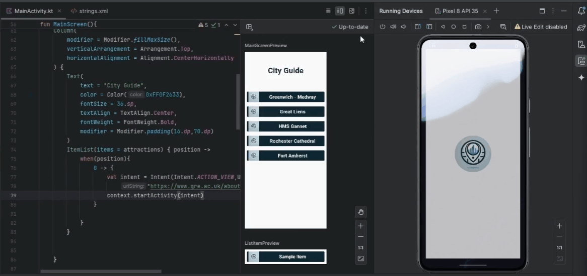
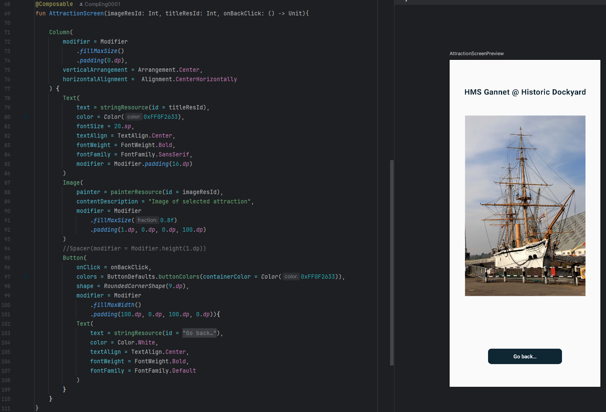

# Lab 6-2: City Guide App Walkthrough

You will be developing travel guide for Medway app that highlights the best attractions the city has to offer.  The City Guide app opening screen is shown below:

~~~admonish info

- You will need to download the following picture folder -> [Lab_6-2_Picture.zip](Lab_6-2_Pictures.zip)

- The completed project can be found here at end of session -> [https://github.com/UniofGreenwich/MobileApps-CityGuide](https://github.com/UniofGreenwich/MobileApps-CityGuide)

~~~

<div align=center>

<table>
<tr>
<td style="width: 60%; padding: 10px; border: 0px solid #ddd;">

The City Guide app displays 5 Medway attractions. When the user taps one of the attractions, a second window opens displaying either an image or a web site providing more information about the site or activity.  The first two items on the list link to websites, as shown on the two figures below. A browser opens to display a web site for the University of Greenwich @ Medway or the The Great Lines. 

If the user selects HMS Gannet, Rochester Cathedral, or Fort Amherst, an image appears on a second screen as shown on the figures below.  By pressing the a button on the selected activity, you can return to the list of the attractions.
</td>
<td style="width: 50%; padding: 10px; border: 0px solid #ddd;">


</td>
</tr>
</table>

</div>


## Setting Up the Project

### Video @ 0:02 - 4.20

1. **Create a New Project:**
    - Select "Empty Activity" and click "Next".
    - Name your application "City Guide".
    - Ensure the package name is set to `com.uog.cityguide`.
    - Set the minimum API level to 24.
    - Click "Finish" to create the project.

        

    
2. **Adding images and creating logo assest**

    - There are three images that appear when the user selects the HMS Gannet, Fort Amherst and Rochester Cathedral.  All the images are available in the Pictures folder downloaded in the zip.  Drag the files to the mipmap folder like you did for the `city_guide_logo.png`.

    - For the assest right clock the city_guide_logo.png and get the `absolute path` 
    - right click the res folder and add new image asset
    - In the Path: field paste the **Absolute File** path you copied earlier, and then select the file. 
    - Click the Next button to add the custom launcher icon. 
    - On the next dialog window, click the Finish button. The custom icons will be displayed in `res/mipmap` folder

        


---

## Modifying the Main Activity

### Video @ 4.20 - 18.36

1. **Modify the Main Activity Layout:**
    - Open `MainActivity.kt`.
    - Reprodce this:

        ~~~admonish code

        ```kotlin
        package com.uog.cityguide

        ...

        class MainActivity : ComponentActivity() {
            override fun onCreate(savedInstanceState: Bundle?) {
                super.onCreate(savedInstanceState)
                enableEdgeToEdge()
                setContent {
                    CityGuideTheme {
                        MainScreen()
                    }
                }
            }
        }

        @Composable
        fun MainScreen(){
        }

        @Preview(showBackground = true)
        @Composable
        fun MainScreenPreview(){
            CityGuideTheme {
                MainScreen()
            }
        }

        @Preview(showBackground = true)
        @Composable
        fun ListItemPreview(){
            ListItem(item = "Sample Item", onClick = {})
        }

        @Composable
        fun ListItem(item: String, onClick: () -> Unit){
            Row (
                modifier = Modifier
                    .fillMaxWidth()
                    .padding(10.dp)
                    .background(color = Color(0xFF0F2633), shape = RoundedCornerShape(4.dp))
                    .clickable { onClick() },
                verticalAlignment = Alignment.CenterVertically
            ){
                Spacer(modifier = Modifier.width(8.dp))
                Image(
                    painter = painterResource(id = R.mipmap.ic_launcher_foreground),
                    contentDescription = "City Guide Logo",
                    modifier = Modifier.size(50.dp),
                    contentScale = ContentScale.FillBounds
                )
                Spacer(modifier = Modifier.width(8.dp))
                Text(
                    text = item,
                    color = Color.White,
                    fontSize = 23.sp,
                    modifier = Modifier.weight(1f),
                    textAlign = TextAlign.Center,
                    fontWeight = FontWeight.Bold,
                    fontFamily = FontFamily.Default
                )
            }
        }
        ``` 

        ~~~


        

    - Continue with making a list of ListItem:

        ~~~admonish code

        ```kt
        ... 

        @Composable
        fun ListItem(item: String, onClick: () -> Unit){
        ...
        }

        @Composable
        fun ItemList(items: List<String>, onItemClick: (Int) -> Unit){
            LazyColumn {
                itemsIndexed(items){index, item ->
                ListItem(item = item, onClick = {onItemClick(index)})
                }
            }
        }
        ```

        ~~~

        - `LazyColumn`: `LazyColumn` is a scrollable list component in Jetpack Compose. It is designed to handle large datasets efficiently by only composing and laying out the visible items. This improves performance and memory usage. LazyColumn supports various features like item spacing, item animations, and more.

        - `ListItem`: composable is a custom component designed to display each item in a list. It uses various Jetpack Compose elements to create a styled, clickable item. 

## **Building the MainScreen**

### Video @ 18.36 - 34.12


1. **Updating `MainScreen()`**

    - Go back up to the `MainScreen()` so we can implement the design and use the `ItemList()`:

        ~~~admonish code

        ```kt
        ...

        @Composable
        fun MainScreen(){
            val context = LocalContext.current
            val attractions = listOf("Greenwich - Medway","Great Lines", "HMS Gannet",
                "Rochester Cathedral", "Fort Amherst")

            Column(
                modifier = Modifier.fillMaxSize(),
                verticalArrangement = Arrangement.Top,
                horizontalAlignment = Alignment.CenterHorizontally
            ) {
                Text(
                    text = "City Guide",
                    color = Color(0xFF0F2633),
                    fontSize = 36.sp,
                    textAlign = TextAlign.Center,
                    fontWeight = FontWeight.Bold,
                    modifier = Modifier.padding(16.dp,70.dp)
                )
                ItemList(items = attractions) { position ->
                    when(position){
                        0 -> {
                            val intent = Intent(Intent.ACTION_VIEW,Uri.parse(
                                "https://www.gre.ac.uk/about-us/campus/medway"))
                            context.startActivity(intent)
                        }
                    }
                }
            }
        }
        ```

        ~~~

        

    - Build and run in the emulator and you should be able to click the **Greenwich - Medway** `ListItem` item and it will load the corresponding webpage:

        

    - Continue buidling the `ItemList` options:

        ~~~admonish code

        ```kt
        ItemList(items = attractions) { position ->
            when(position){
                0 -> {
                    val intent = Intent(Intent.ACTION_VIEW,Uri.parse(
                        "https://www.gre.ac.uk/about-us/campus/medway"))
                    context.startActivity(intent)
                }
                1 -> {
                        val intent = Intent(Intent.ACTION_VIEW,Uri.parse(
                            "https://en.wikipedia.org/wiki/Great_Lines_Heritage_Park"))
                        context.startActivity(intent)
                    }
                2 , 3 ,4 -> {
                    val intent = Intent(context, Attraction::class.java)
                    intent.putExtra("index",position)
                    context.startActivity(intent)
                }
            }
        }
        ```
        
        ~~~

    - If you rebuild the app and run, the Great lines item should take you to the correct webpag, however, the other items will cause the app to crash.

---

## Building the AttractionScreen Class

### Video @ 34.12 - 42.34

1.  **AttractionScreen.kt creation**
    - Create a new Kotlin file named `AttractionScreen.kt`.

2. **Global variables**
    - Adding global scoped variables for the images and the attractions titles

        ~~~admonish code

        ```kt
        class Attraction : ComponentActivity() {

        private val attractionResourceImages = arrayOf(
            R.mipmap.hms_gannet, R.mipmap.rochester_cathedral,
            R.mipmap.fort_amherst
        )
        private val attractionStringTitles = arrayOf(
            R.string.dockyard, R.string.cathedral,
            R.string.amherst
        )
        
        ...
        }
        ```

        ~~~

    - You should visit the res/strings.xml and place the following items: 

        ~~~admonish code

        ```xml
        <resources>
            <string name="app_name">CityGuide</string>
            <string name="dockyard">HMS Gannet @ Historic Dockyard</string>
            <string name="cathedral">Rochester Cathedral @ Rochester</string>
            <string name="amherst">Fort Amherst @ Chatham</string>
            <string name="back_button">Go back…</string>
        </resources>  
        ```

        ~~~

    - Update the class with the fun `onCreate()}{...}`


        ~~~admonish code

        ```kt
        
        ...

        override fun onCreate(savedInstanceState: Bundle?) {
            super.onCreate(savedInstanceState)
            enableEdgeToEdge()
            setContent {
                CityGuideTheme {
                    val index = (intent.getIntExtra("index",0)) - 2
                    
                    AttractionScreen()
                }
            }
        }
        ```

        ~~~


3. **Create the navigateBack function**
    - Directly underneath the `onCreate()` closing brace add the following code:
        
        ~~~admonish code
        
        ```kt
        ...
        class Attraction : ... {
            override fun onCreate(...){
                ...
                }

            private fun navigateBack(){
                val intent = Intent(this, MainActivity::class.java)
                startActivity(intent)
            }
        }
        ```

        ~~~

        - **navigateBack**:  invokes the `startActivity` function to launch the `MainActivity.kt`, so we can go back a page, when this function is invoked via an `onclick` method on a `Button` object.


 ## Create the Attraction Screen

 ### Video @ 42.34 - 58.05

1.  **Building the AttractionScreen Composable**

    - After the closing brace of the Attraction Class we are going to add the AttractionScreen Composable function with the following parameters:

        ~~~admonish code

        ```kt
        class Attraction : ...{
            ...
        }
        
        @Composable
        fun AttractionScreen(imageResId: Int, titleResId: Int, onBackClick: () -> Unit){

        }
        ```

        ~~~

2. **Revisit the `AttractionScreen()` invocation in the `onCreate` method and provide the following argumnets**

    ~~~admonish code

    ```kt
    override fun onCreate(savedInstanceState: Bundle?) {
        ...
        setContent {
            CityGuideTheme {
                ...
                AttractionScreen(
                                    imageResId = attractionResourceImages[index],
                                    titleResId = attractionStringTitles[index],
                                    onBackClick = { navigateBack() }
                                )
            }
        }
    }
    ```

    ~~~

3. **Create a `Preview` for the `AttractionScreen()`**
    - Go the bottom of the file underneath the closing brace of the `AttractionScreen()` and add a `Composable` `Preview` for it:

        ~~~admonish code

        ```kt
        @Preview(showBackground = true)
        @Composable
        fun AttractionScreenPreview(){
            CityGuideTheme {
                AttractionScreen(
                    imageResId = R.mipmap.hms_gannet,
                    titleResId = R.string.dockyard,
                    onBackClick = {}
                )
            }
        }
        ```

        ~~~

        -  Here we are referencin the following items statically, so that we can see the layout of our Composable view. As we start building it should start to render. 

4. **Composing the `AttractionScreen()`**

    - Now we can start to design the UI of the `AttractionScreen()`

        ~~~admonish code

        ```kt
        @Composable
        fun AttractionScreen(imageResId: Int, titleResId: Int, onBackClick: () -> Unit){
            Column(
            modifier = Modifier
                .fillMaxSize()
                .padding(0.dp),
            verticalArrangement = Arrangement.Center,
            horizontalAlignment =  Alignment.CenterHorizontally
            ) {
                Text(
                    text = stringResource(id = titleResId),
                    color = Color(0xFF0F2633),
                    fontSize = 20.sp,
                    textAlign = TextAlign.Center,
                    fontWeight = FontWeight.Bold,
                    fontFamily = FontFamily.SansSerif,
                    modifier = Modifier.padding(16.dp)
                )
                Image(
                    painter = painterResource(id = imageResId),
                    contentDescription = "Image of selected attraction",
                    modifier = Modifier
                        .fillMaxSize(0.8f)
                        .padding(1.dp, 0.dp, 0.dp, 100.dp)
                )
                //Spacer(modifier = Modifier.height(1.dp))
                Button(
                    onClick = onBackClick,
                    colors = ButtonDefaults.buttonColors(containerColor = Color(0xFF0F2633)),
                    shape = RoundedCornerShape(9.dp),
                    modifier = Modifier
                        .fillMaxWidth()
                        .padding(100.dp, 0.dp, 100.dp, 0.dp)){
                    Text(
                        text = stringResource(id = R.string.back_button),
                        color = Color.White,
                        textAlign = TextAlign.Center,
                        fontWeight = FontWeight.Bold,
                        fontFamily = FontFamily.Default
                    )
                }
            }
        }
        ```

        ~~~

        

    - **Column**: Column is a layout composable that places its children in a vertical sequence. It's similar to a vertical LinearLayout in traditional Android development.

    - **Modifier**: Modifiers in Jetpack Compose are used to decorate or augment composables. They can be used to adjust the layout, add padding, set click actions, and more.

    - **Text**: The Text composable is used to display text on the screen. It can be styled using various properties.

    - **Spacer**: Spacer is a composable used to create space between other composables. It can be given specific height or width to create padding.

    - **MaterialTheme**: MaterialTheme provides theming capabilities based on Material Design principles. It includes typography, shapes, and colors that can be applied to composables.

    - **Button**: Button is a composable that represents a clickable button, styled according to Material Design guidelines.


---

## Running and Updating the `AndroidManifest.xml` File

### Video @ 58.05 - 59.49

1. ~~~admonish error title='Running and getting an error:'

    - When you run this code, you will encounter an error when you select the any link that is not a url to a webpage.

        
        - Error: `Unable to find explicit activity class {com.uog.cityguide/com.uog.cityguide/Attraction} have you declared this in your AndroidManifest.xml`
    ~~~

2. **Updating the  AndroidManifest.xml**

    - You can open the `AndroidManifest.xml` in the parent directory of the project:

        - include the following `activity` tag in side the parent `application` tag, 

            ~~~admonish code

            ```kt
            <activity android:name=".Attraction">

            </activity>
            ```

            ```kt
            <?xml version="1.0" encoding="utf-8"?>
            <manifest xmlns:android="http://schemas.android.com/apk/res/android"
                xmlns:tools="http://schemas.android.com/tools" >

                <application
                    android:allowBackup="true"
                    ...
                    tools:targetApi="31" >
                    <activity
                        android:name=".MainActivity"
                        ...
                        android:theme="@style/Theme.CityGuide" >
                        <intent-filter>
                            <action android:name="android.intent.action.MAIN" />

                            <category android:name="android.intent.category.LAUNCHER" />
                        </intent-filter>
                    </activity>
                    <!--New Activity here-->
                    <activity android:name=".Attraction">

                    </activity>
                </application>

            </manifest>    
            ```

            ~~~

            

    - Rerun the app:

        

## Conclusion

Congratulations! You have successfully built a City Guide App using Kotlin and Jetpack Compose. You can now extend this app by adding more attractions, improving the UI, and using external data sources.

-----------------------------


## Continue Here...

~~~admonish info

You will need to download the following picture folder -> [Lab_6-3_Picture.zip](Lab_6-3_Pictures.zip)

~~~

For the exercises below, follow the steps from above.

## 1. Beach and Mountain Bike Rental App

|Application Title|Beach and Mountain Bike Rental App|
|---|---|
|Purpose|A bike rental shop would like an app that displays information about their beach and mountain bike rental services. As each bike is selected, a rental bike is displayed.|
|Algorithm 1:|The opening screen displays a list of bikes for rent: beach bikes, mountain bikes, and full bike rental shop website.|
|Algorithm 2:|When the user selects an item from the list, a full screen image of the item is displayed for the first two bike rentals. The third option opens the website [http://www.campusbikeshop.com](http://www.campusbikeshop.com).|
|Alogrithm 3:|The pictures of the two types of bikes are available on the course web page in moodle in the folder Pictures (beach.png and mountain.png).  Use build-in layout `simple_list_item_1`. Use the switch decision structure. Use a String table for image descriptions. |


<div align=center>


</div>

---------

## 2. Chocolate Cafe App

|Application Title|Chocolate Cafe App|
|---|---|
|Purpose|A café specializing in chocolate desserts is named Chocolate and would like an app that lists the specials of the day. As each desert special is selected, an image is displayed.|
|Alogrithm 1:|The opening screen lists the three desserts specials of the day and displays the restaurant’s full web site with a custom icon.|
|Algorithm 2:|When the user selects one of the three specials (chocolate mousse, chocolate cake, or chocolate macarons), an image of the special is displayed. If the full website is requested, [http://www.chocolatharlem.com](http://www.chocolatharlem.com) opens.|
|Algorithm 3:|AThe dessert icon is available on the course web page in moodle in folder Pictures and it is named ic_launcher_dessert.png. The three images for the specials are named mousse.png, cake.png, and macaron.png (available in the folder Pictures as well). Design a custom layout similar to the figure below.  Use the switch decision structure. Use a String table.|


<div align=center>


</div>

-----

## 3. Rent a Car App

|Application Title|Rent a Car App|
|---|---|
|Purpose|A rental car app provides a listing of six nationally known car rental companies.  By selecting a car company, a car rental site opens.|
|Algorithm 1:|An opening screen displays an image of a car and a button.|
|Algorithm 2:|The second screen displays a listing of six car rental companies. This screen also contains a custom icon and layout.|
|Alogrithm 3:|Each car rental agency can be selected to view a website of the corresponding company.|
|Alogrithm 4:|Select the six companies using online search. Select your own images. Create a custom layout for the list.|

------
