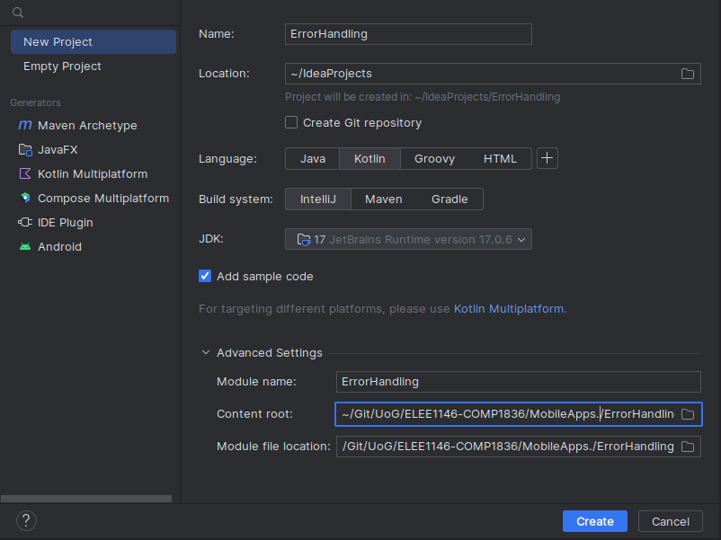
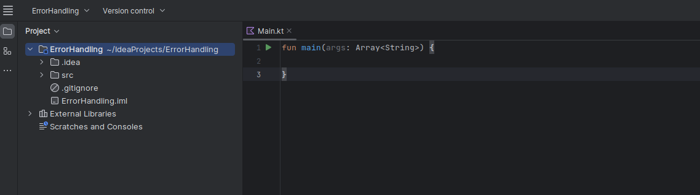
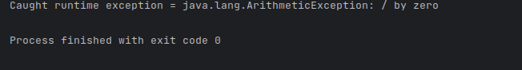

# Lab 7: Exception Handling

Using IntelliJ you are going to do some error handling exploration. 

 - Open IntelliJ 
 - Create a new project
   - Call it `ErrorHandling` like the screen shot below.
   - Note you can use any JDK for this exercise, I am using JDK 17.0.6

    <div align=center>

    

    </div>


## Step 1

Reproduce the following to set up the project

<div align=center>



</div>


Now you can edit `main()` with the following code, then compile and run.
```kt
{
    System.out.println(3/0);
}
```

>**Note**
>> - We are explicity calling the `println()` from the function from the `System` library.
>> - You can do this implicitly just by writing `println(...)`
>> - I would recommend the former, until you undestand this.

You should see the following output in the Run terminal... 

<div align=center>


</div>

Modify the `Main.kt` as shown below. The change is to catch an exception through try-catch block.

```kt
    try{
        System.out.println(3/0);
    } 
    catch(e : Exception){
        System.out.printf("Caught runtime exception = %s\n", e);
    }
```

If you run the program again you should get the following output:

<div align=center>


</div>


Modify the Main.java as shown below. The change is to use more specific Exception class, `ArithmeticException` in this case.


```kt
    try{
        System.out.println(3/0);
    } 
    catch( e : ArithmeticException ){
        System.out.printf("Caught runtime exception = %s\n", e);
    }
```

If you run the program again you should get the following output:

<div align=center>



</div>

Let's try changing the Exception Class, to `NumberFormatExpression`.

```kt
    try{
            System.out.println(3/0);
        } 
        catch( e : NumberFormatException){
            System.out.printf("Caught runtime exception = %s\n", e);
        }
```

<details>
<summary>What happens when you run it?</summary>

<div align=center>


</div>

Because the expected Exception Class is wrong.

</details>

For fun, do the following, what happens and why?

```kt
    try{
            System.out.println(3/0);
        } catch( e : ArithmeticException){
            System.out.printf("Caught runtime exception = %s\n", e);
            System.out.println(3/0);
        }
```
## Step 2: Catch multiple exceptions

Reproduce the following code:

```kt
import javax.swing.JOptionPane

fun main(args: Array<String>) {

    // Enter the following values and see what exception is caught.
    //    0, 4, character, <no value>
    try {
        val value = JOptionPane.showInputDialog(null, "Enter value:")
        // Non-numeric value will result an NumberFormatException
        val divisor = value.toInt()
        // If the divisor is 0, it will result in ArithmetricException
        println(3 / divisor)
    } catch (e: NumberFormatException) {
        println("Exception caught by this program: Enter numeric value.")
    } catch (e: ArithmeticException) {
        println("Exception caught by this program: Divisor was 0.")
    }
    println("After exception.")
}
```

You'll notice that we are now importing a library on line 2 `import javax.swing.JOptionPane;` we now will be able to have a GUI.

- Build and run the program
  - Observe Input dialog box appears.
  - Enter 0 in the field.
  - Click OK.


<div align=center>


</div>

Notice that the exception was caught.

<div align=center>


</div>

- Build and run the program
  - Observe Input dialog box appears.
  - Enter 4 in the field.
  - Click OK.

<div align=center>


</div>

Notice that the No exception was caught as it was not needed

<div align=center>


</div>


What happens when you enter a character or nothing instead? 


# Step 3

- Either start a new project or remove what you have done before

You are now going to implement a larger program that illustrates many different types of `Exception`'s

1. Import the following libraries at the top of the script:
    ```kt
    import java.awt.Frame
    import java.awt.GridLayout
    import java.awt.event.ActionEvent
    import java.awt.event.ActionListener
    import java.awt.event.WindowAdapter
    import java.awt.event.WindowEvent
    import java.io.FileInputStream
    import javax.swing.ButtonGroup
    import javax.swing.JFrame
    import javax.swing.JPanel
    import javax.swing.JRadioButton
    ````

2. Modify the `main` class line: 
    ```kt
    // Create a class Main that extends JFrame and implements ActionListener
    class Main : JFrame(), ActionListener {
    ```

    > **Note:**
    >> This declares a class named `Main` that extends `JFrame` (a `Swing` component for creating windows) and implements the `ActionListener` interface (for handling button clicks).


3. After updating `main` in step 2, add declare and initialise a private immutable array of Doubles with two elements with values `0.0`. 

    <details>
    <summary>Solution</summary>

    ```kt
    private val a = arrayOf<Double>(0.0,0.0)  // Create an array of Doubles
    ```

    </details>

4. Now create n JButton objects:
    - divideByZeroButton
    - badCastButton
    - arrayBoundsButton
    - nullPointerButton
    - overflowButton
    - noSuchFileButton
    - throwUnknownButton
   
    <p></p>

    <details>
    <summary>Solution</summary>

    ```kt
    private val divideByZeroButton: JRadioButton
    private val badCastButton: JRadioButton
    private val arrayBoundsButton: JRadioButton
    private val nullPointerButton: JRadioButton
    private val overflowButton: JRadioButton
    private val noSuchFileButton: JRadioButton
    private val throwUnknownButton: JRadioButton
    ```

    </details>

5. Now we are going to use `init` to initialise our graphical setup
   ```kt
    // Constructor
    init {
        // Create a JPanel and GridLayout
        val p = JPanel()
        p.layout = GridLayout(8, 1)
   ```
    > **Note:**
    >> This is the constructor (`init` block) of the `Main` class. It creates a `JPanel` (a container) and sets its layout to a grid with 8 rows and 1 column.
   
6. Now create a block of radio buttons, after the `p.layout = GridLayout(8,1)` line, for the various exception scenarios by adding them to a button group (`ButtonGroup` ensures only one button is selected at a time), and adds them to the panel. 

    ```kt
        // Create radio buttons and add them to the panel
        val g = ButtonGroup()
        divideByZeroButton = addRadioButton("Divide by zero", g, p)
        badCastButton = addRadioButton("Bad cast", g, p)
        arrayBoundsButton = addRadioButton("Array bounds", g, p)
        nullPointerButton = addRadioButton("Null pointer", g, p)
        overflowButton = addRadioButton("Overflow", g, p)
        noSuchFileButton = addRadioButton("No such file", g, p)
        throwUnknownButton = addRadioButton("Throw unknown", g, p)
        contentPane.add(p)
    } // remeber to add this closing brace for init
    ```

7. After the closing brace `}` for `init` create a new function that is called `addRadioButton()`, that takes the following arguments: 
   - `String` declared as `s`
   - `ButtonGroup` declared as `g`
   - `JPanel` declared as `p`

    <p></p>

    <details>
    <summary>Solution</summary>

    ```kt
    private fun addRadioButton(s: String, g: ButtonGroup, p: JPanel): JRadioButton {
    ```

    </details>

8. Inside the function reproduce the follwing:

    ```kt
        val button = JRadioButton(s, false)
        button.addActionListener(this)
        g.add(button)
        p.add(button)
        return button
    }
    ```

> **Note:**
>> This function creates and configures a radio button, adds it to the specified `ButtonGroup` and `JPanel`, then returns the button.


9. After the closing `}` of the `addRadioButton()` we are going to add the core functionality of the program, create the following `actionPerformed` function: 

```kt
// Handle button clicks and trigger/catch exceptions
override fun actionPerformed(evt: ActionEvent) {
    try {
        val source = evt.source
        if (source === divideByZeroButton) {
            // Attempt to divide by zero, which will throw an ArithmeticException
            print(0/0)
        } else if (source === badCastButton) {
            // Attempt to perform a bad cast, which will throw a ClassCastException
            val f = evt.source as Frame
        } else if (source === arrayBoundsButton) {
            // Attempt to access an out-of-bounds array index, which will throw an ArrayIndexOutOfBoundsException
            a[1] = a[10]
        } else if (source === nullPointerButton) {
            // Attempt to access a null object, which will throw a NullPointerException
            val f: Frame? = null
            f!!.setSize(200, 200);
        } else if (source === overflowButton) {
            // Perform integer overflow, which Kotlin does not natively detect
            a[1] = (1000 * 1000 * 1000 * 1000).toDouble()
            val n = a[1].toInt()
            print("Value of a[1]: ${a[1]}... Value of n: $n\n")

            // Manually check for integer overflow and throw an exception
            check((n) > Int.MAX_VALUE) { "Integer overflow detected" }
        } else if (source === noSuchFileButton) {
            // Attempt to open a non-existent file, which will throw a FileNotFoundException
            val `is` = FileInputStream("Java Source and Support")
        } else if (source === throwUnknownButton) {
            // Explicitly throw an UnknownError
            throw UnknownError()
        }
    } catch (e: RuntimeException) {
        // Catch and print a RuntimeException
        println("Caught RuntimeException: $e")
    } catch (e: Exception) {
        // Catch and print a more general Exception
        println("Caught Exception: $e")
    }
}
```

>**Note:**
>> This function is called when a **button** is clicked. It tries different actions based on the clicked button, and catches specific exceptions (e.g., `ArithmeticException`, `ClassCastException`). It also catches more general exceptions (`RuntimeException`, `Exception`).

10. Now create a `Companion` object after the closing brace of the previous function, which will act as the main entry point for the program:

    ```kt
    companion object {
        @JvmStatic
        fun main(args: Array<String>) {
            // Create a frame and set up the UI

            try{
                println(3/0);
            }
            catch(e : Exception){
                println("Caught runtime exception = ${e}\n" );
            }
            val frame: JFrame = Main()
            frame.type = Type.POPUP
            frame.setLocation(800,300)
            frame.setSize(200, 250)
            frame.addWindowListener(object : WindowAdapter() {
                override fun windowClosing(e: WindowEvent) {
                    exitProcess(0)
                }
            })
            frame.isVisible = true
        }
    }
    ```
    >**Note:**
    >>A **companion** object is a type of object declaration that allows an object to act similar to **static** objects in other languages. A companion object is always declared inside of another class, and its properties and functions can be accessed directly with the class name. The Kotlin compiler ensures that there is only one instance of a companion object.

11. Build and run the program.
  - Observe dialog box appears.
    - Click any of the radio buttons. 
    - Clicking a button will execute code fragement that generates an exception.

<div align=center>

 


</div>

12. Please do the following tasks
    - Try other buttons and observe the exceptions that are caught
    - Try to catch exceptions using more specific exception classes (over `RuntimeException` and `Exception` classes).

13. If you have got to here, great job. 3
    -  Convert the `try` and `catch` to t `runCatching` with `onSuccess` and `onFailure` extension methods (see lecture if unsure) inside the `actionPerformed` function.

-----------------
-----------------


<details>
<summary>Full code for up to section 10. </summary>

```kt
import java.awt.Frame
import java.awt.GridLayout
import java.awt.event.ActionEvent
import java.awt.event.ActionListener
import java.awt.event.WindowAdapter
import java.awt.event.WindowEvent
import java.io.FileInputStream
import javax.swing.ButtonGroup
import javax.swing.JFrame
import javax.swing.JPanel
import javax.swing.JRadioButton

// Create a class Main that extends JFrame and implements ActionListener
class Main : JFrame(), ActionListener {
    private val a = arrayOf<Double>(0.0,0.0)  // Create an array of Doubles
    private val divideByZeroButton: JRadioButton
    private val badCastButton: JRadioButton
    private val arrayBoundsButton: JRadioButton
    private val nullPointerButton: JRadioButton
    private val overflowButton: JRadioButton
    private val noSuchFileButton: JRadioButton
    private val throwUnknownButton: JRadioButton

    // Constructor
    init {
        // Create a JPanel and GridLayout
        val p = JPanel()
        p.layout = GridLayout(8, 1)

        // Create radio buttons and add them to the panel
        val g = ButtonGroup()
        divideByZeroButton = addRadioButton("Divide by zero", g, p)
        badCastButton = addRadioButton("Bad cast", g, p)
        arrayBoundsButton = addRadioButton("Array bounds", g, p)
        nullPointerButton = addRadioButton("Null pointer", g, p)
        overflowButton = addRadioButton("Overflow", g, p)
        noSuchFileButton = addRadioButton("No such file", g, p)
        throwUnknownButton = addRadioButton("Throw unknown", g, p)
        contentPane.add(p)
    }

    private fun addRadioButton(s: String, g: ButtonGroup, p: JPanel): JRadioButton {
        val button = JRadioButton(s, false)
        button.addActionListener(this)
        g.add(button)
        p.add(button)
        return button
    }

    // Handle button clicks and trigger/catch exceptions
    override fun actionPerformed(evt: ActionEvent) {
        try {
            val source = evt.source
            if (source === divideByZeroButton) {
                // Attempt to divide by zero, which will throw an ArithmeticException
                 print(0/0)
            } else if (source === badCastButton) {
                // Attempt to perform a bad cast, which will throw a ClassCastException
                val f = evt.source as Frame
            } else if (source === arrayBoundsButton) {
                // Attempt to access an out-of-bounds array index, which will throw an ArrayIndexOutOfBoundsException
                a[1] = a[10]
            } else if (source === nullPointerButton) {
                // Attempt to access a null object, which will throw a NullPointerException
                val f: Frame? = null
                f!!.setSize(200, 200);
            } else if (source === overflowButton) {
                // Perform integer overflow, which Kotlin does not natively detect
                a[1] = (1000 * 1000 * 1000 * 1000).toDouble()
                val n = a[1].toInt()
                print("Value of a[1]: ${a[1]}... Value of n: $n\n")

                // Manually check for integer overflow and throw an exception
                check((n) > Int.MAX_VALUE) { "Integer overflow detected" }
            } else if (source === noSuchFileButton) {
                // Attempt to open a non-existent file, which will throw a FileNotFoundException
                val `is` = FileInputStream("Java Source and Support")
            } else if (source === throwUnknownButton) {
                // Explicitly throw an UnknownError
                throw UnknownError()
            }
        } catch (e: RuntimeException) {
            // Catch and print a RuntimeException
            println("Caught RuntimeException: $e")
        } catch (e: Exception) {
            // Catch and print a more general Exception
            println("Caught Exception: $e")
        }
    }

    // Main entry point
    companion object {
        @JvmStatic
        fun main(args: Array<String>) {
            // Create a frame and set up the UI
            val frame: JFrame = Main()
            frame.type = Type.POPUP
            frame.setSize(200, 300)
            frame.addWindowListener(object : WindowAdapter() {
                override fun windowClosing(e: WindowEvent) {
                    exitProcess(0)
                }
            })
            frame.isVisible = true
        }
    }
}
```

</details>

<p></p>

<details>
<summary>actionPerformed: runCatching code for section 12. </summary>

In this version, `runCatching` is used to encapsulate the code that might throw exceptions. `onSuccess` is a block that executes when there is no exception, and `onFailure` is a block that executes when an exception occurs. The specific exception types are checked inside the `onFailure` block, and other exceptions are rethrown.

```kt
override fun actionPerformed(evt: ActionEvent) {
    runCatching {
        val source = evt.source
        when {
            source === divideByZeroButton -> {
                // Attempt to divide by zero, which will throw an ArithmeticException
                print(0 / 0)
            }
            source === badCastButton -> {
                // Attempt to perform a bad cast, which will throw a ClassCastException
                val f = evt.source as Frame
            }
            source === arrayBoundsButton -> {
                // Attempt to access an out-of-bounds array index, which will throw an ArrayIndexOutOfBoundsException
                a[1] = a[10]
            }
            source === nullPointerButton -> {
                // Attempt to access a null object, which will throw a NullPointerException
                val f: Frame? = null
                f!!.setSize(200, 200)
            }
            source === overflowButton -> {
                // Perform integer overflow, which Kotlin does not natively detect
                a[1] = (1000 * 1000 * 1000 * 1000).toDouble()
                val n = a[1].toInt()
                print("Value of a[1]: ${a[1]}... Value of n: $n\n")

                // Manually check for integer overflow and throw an exception
                check((n) > Int.MAX_VALUE) { "Integer overflow detected" }
            }
            source === noSuchFileButton -> {
                // Attempt to open a non-existent file, which will throw a FileNotFoundException
                val `is` = FileInputStream("Java Source and Support")
            }
            source === throwUnknownButton -> {
                // Explicitly throw an UnknownError
                throw UnknownError()
            }
        }
    }.onSuccess {
        // This block executes if there is no exception
        println("No exception occurred")
    }.onFailure { e ->
        // This block executes if an exception occurs
        when (e) {
            is RuntimeException -> println("Caught RuntimeException: $e")
            is Exception -> println("Caught Exception: $e")
            else -> throw e // rethrow other exceptions
        }
    }
}
```