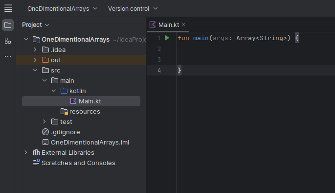
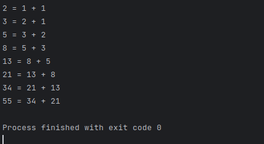

# One Dimensional Arrays (Intellij)

Using IntelliJ you are going to do some one dimensional array coding and exploration. 

 - Open IntelliJ 
 - Create a new project
   - Call it `OneDimensionalArrays` like the screen shot below.
   - Note you can use any JDK for this exercise, I am using JDK 17.0.06


- Once created select the Main.kt script and refactor the code to look like below:

<div align="center">



</div>

## Arrays.

Remove the everything from inside the `fun main(args: Array<String>) {...}` function and lets declare and interger array allocated enough memory for 10 integers to store the first 10 digits of the Fibonacci sequence.


```kt
var fibonacciArray = IntArray(10)
```

For reference, the Fibonacci sequence is the sequence of numbers F(0), F(1)... defined by the following recurrence relations:

\\(F(O) = 1,F(1)=1,F(n) =F(n-1)+F(n-2)\ for\ all\ n > 1.\\)

or... 

\\[ F(n) = \frac{\frac{1+\sqrt{5}^n}{2}-\frac{1-\sqrt{5}^n}{2}}{\sqrt{5}}\\]

which becomes...

\\[ F(n) = \frac{\phi^n - (1-\phi^n)}{\sqrt{5}}\\]

where:
- \\(\phi\\) is the golden ration (1.618)
- \\(n\\) is the position number of the term in the sequence
- \\(F(n)\\) is the term in the sequence you are trying to find.

Finally, this translates as...

\\[F(n) = F_{n-1}+F_{n-2}\\]

Reproduce the following code inside of the `main(){ ... }`,

```kt 
var fibonacciArray = IntArray(10)
fibonacciArray[0] = 1 // assign element 0, with the value 1
fibonacciArray[1] = 1 // assign element 1, with the value 1

/* create a for loop that will iterate over the length of the
   array and compute the next 8 position in the sequence
*/

for (i in 2 until fibonacciArray.size) {
    //F(n) = F_n-1 + F_n-2
    fibonacciArray[i] = fibonacciArray[i - 1] + fibonacciArray[i - 2]

    // Use the StringBuilder Class to efficiently modify a string, which will be the output of the fib sequence
    val strBuilder = StringBuilder()

    // build the string by appending to the empty val the fib seq
    strBuilder.append(fibonacciArray[i]," = ",fibonacciArray[i-1], " + " , fibonacciArray[i - 2])

    // print the strBuilder to standard Out
    println(strBuilder)
}
```

Run the code and you should see the following output... 



Modifiy this code to get the 45th number in the sequence

<details>

<summary>Suggested Answer</summary>

```kt
var fibonacciArray = IntArray(45)
fibonacciArray[0] = 1 // assign element 0, with the value 1
fibonacciArray[1] = 1 // assign element 1, with the value 1

/* create a for loop that will iterate over the length of the
    array and compute the next 8 position in the sequence
    */

for (i in 2 until fibonacciArray.size) {
    //F(n) = F_n-1 + F_n-2
    fibonacciArray[i] = fibonacciArray[i - 1] + fibonacciArray[i - 2]

    // Use the StringBuilder Class to efficiently modify a string, which will be the output of the fib sequence
    val strBuilder = StringBuilder()

    // build the string by appending to the empty val the fib seq
    strBuilder.append(fibonacciArray[i]," = ",fibonacciArray[i-1], " + " , fibonacciArray[i - 2])

    // print the strBuilder to standard Out
    println(strBuilder)
}
```

</details>

What happens when you print the 46th and 47th number in the sequence?

<details>
<summary>Answer</summary>

- `-1323752223 = 1836311903 + 1134903170`

- `Int` is by default a data type that can represent a number that is 32 bits long. Infact this is a signed value, so:

  -  \\(4,294,967,295 = 2^{32}\\) (Unsigned)
  -  \\(-2,147,483,648 = -2^{31}\\) 
  -  \\(2,147,483,647 = 2^{31} - 1 \\)
  - \\(\therefore\\)
<p>
   <span class="math display">
      \[
         \begin{aligned}
            2,971,215,073 &amp;= \hspace{0.7em}1,836,311,903 + 1,134,903,170\\
            823,731,426 &amp;=  \hspace{0.7em}2,971,215,073 - 2,147,483,647 \\
            -1,323,752,223 &amp;=  -2,147,483,648 + 823,731,426\\
            \hline
            -1,323,752,223 &amp; \equiv  \hspace{0.7em}1,836,311,903 + 1,134,903,170
         \end{aligned}
      \]
   </span>
</p>

</details>

<p>
</p>

Reproduce the following code, after the closing brace of the `for` loop above:

```kt
val pangram = arrayOf("quick", "over", "dog", "jumps", "brown", "The", "lazy", "fox", "the")
```

Try to use indexing to produce the correctly ordered pangram on the same line, remeber to use `println` to return the string to standard out:

"The quick brown fox jumps over the lazy dog"

> **Hint**
>> You can use the `StringBuilder` class when declaring a variable to hold the output:
>>
>> `val pangramBuilder = StringBuilder()`
>>
>> `pangramBuilder.append(something/anything that can be a string)`

<details>
<summary>Answer</summary>

```kt
// Declare an array of strings
val pangram = arrayOf("quick", "over", "dog", "jumps", "brown", "The", "lazy", "fox", "the")

val pangramBuilder = StringBuilder()

pangramBuilder.append(pangram[5]," ",pangram[0]," ",pangram[4]," ",pangram[7]," ",pangram[3]," ",pangram[1],
    " ",pangram[8]," ",pangram[6]," ",pangram[2],)

println(pangramBuilder)
```

</details>