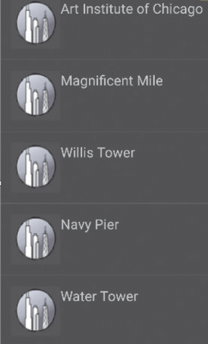
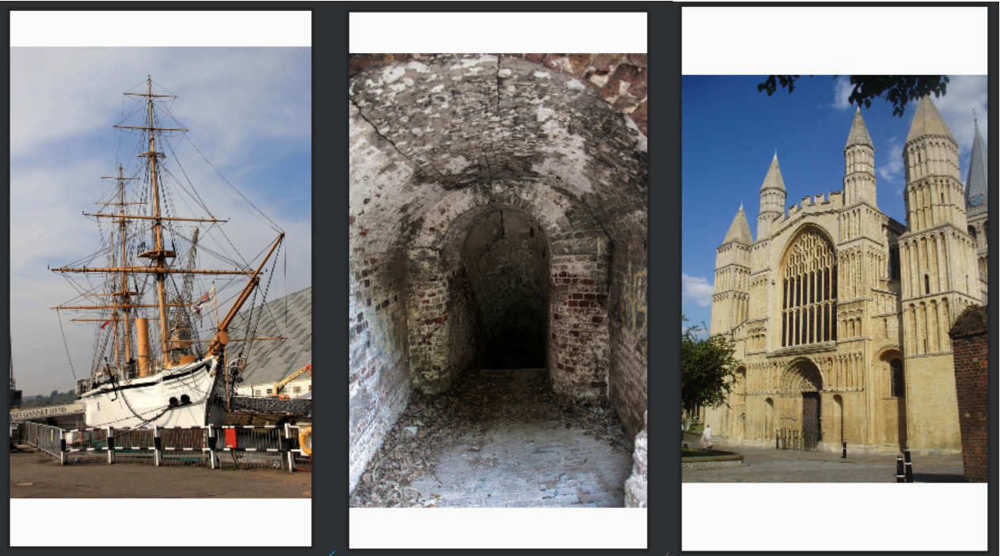
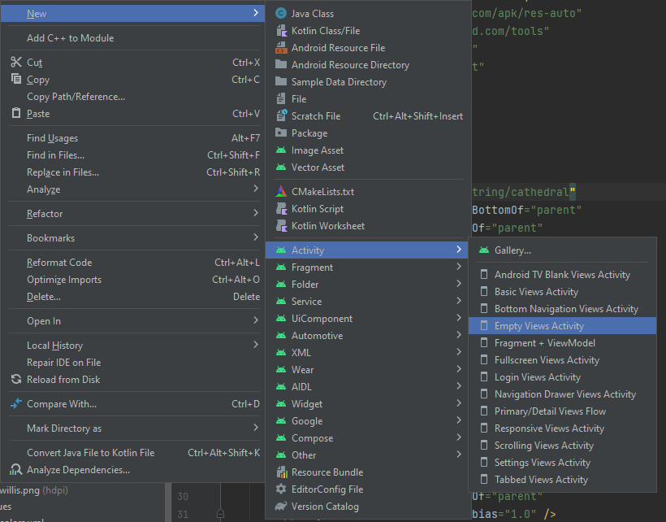
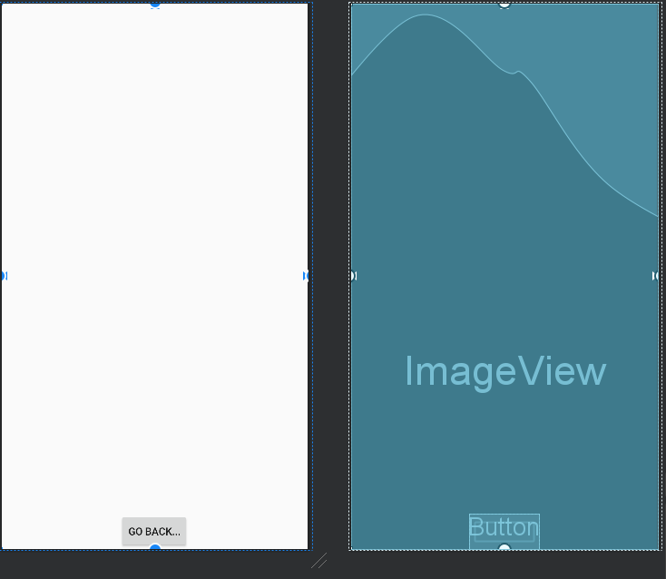

## Lab 9-2 Android Lists, Arrays and Web Browsers

You will be developing travel guide for Medway app that highlights the best attractions the city has to offer.  The City Guide app opening screen is shown below:

> - You will need to download the following picture folder -> [Lab_9_Picture.zip](Lab_9_Pictures.zip)
> - The completed project can be found here at end of session -> [https://github.com/TeachingMaterial/MobileApps-CityGuide](https://github.com/TeachingMaterial/MobileApps-CityGuide)

<div align=center>



</div>

The City Guide app displays 5 Medway attractions. When the user taps one of the attractions, a second window opens displaying either an image or a web site providing more information about the site or activity.  The first two items on the list link to websites, as shown on the two figures below. A browser opens to display a web site for the University of Greenwich @ Medway or the The Great Lines.

<div align=center>


</div>

If the user selects HMS Gannet, Rochester Cathedral, or Fort Amherst, an image appears on a second screen as shown on the figures below.  By pressing the a button on the selected activity, you can return to the list of the attractions.

<div align=center>


</div>

Complete the following steps to develop the app.

**Step 1:**
- Create a New Project with the name **CityGuide** in the Application name text box. 
- Open `activity_main.xml`.
- Copy the `ic_launcher_medway.png` file from the Pictures above.
- Click `File` on the menu bar and then click New to open the New menu.
- Click Image Asset on the New menu.  In the Asset Studio dialog window that appears, in Asset Type, click on the Image radio button.

<div align=center>


</div>

**Step 2:**
- In the Path: field click on the folder icon to the very end of the field and navigate to the location of `ic_launcher_medway.png` file, and then select the file. 
- Click the Next button to add the custom launcher icon. 
- On the next dialog window, click the Finish button. The custom icons will be displayed in `res/mipmap` folder.

<div align=center>


</div>

**Step 3:**
- Click `MainActivity.kt` tab, and modify the `Class MainActivity...` to include a reference to a Class we are going to build ` CustomAdapter.OnItemClickListener`:

```kt
class MainActivity : AppCompatActivity(), CustomAdapter.OnItemClickListener {
    ....
}
```

>**Note**
>> You will see an error indicated as this Class does not exist yet...


**Step 4:**

- Next modify the MainActivity, to store a list of items an, instance of our Class (which is not yet made), and an array of strings:

```kt
class MainActivity : ....

    private val itemsList = ArrayList<String>()
    private lateinit var customAdapter: CustomAdapter
    private val attractions = arrayOf("Greenwich - Medway","Great Lines",
        "HMS Gannet","Rochester Cathedral","Fort Amherst")
```

>**Note:**
>> - `lateinit`: This is a modifier that is used to tell the Kotlin compiler that the property will be initialized at a later time, and it won't have an initial value when it's declared. It's often used for non-null properties that can't be assigned a value in the constructor or during object creation. It's your responsibility to ensure that you initialize the property before accessing it, or you'll get a `lateinit` exception at runtime if you try to access it before it's initialized.

**Step 5:**

- Continuing inside the `Oncreate(...)` function, add support for the action bar:

```kt
supportActionBar?.setDisplayShowCustomEnabled(true)
supportActionBar?.setLogo(R.mipmap.ic_launcher_foreground)
supportActionBar?.setDisplayShowTitleEnabled(true)
supportActionBar?.setDisplayUseLogoEnabled(true)
supportActionBar?.setDisplayShowHomeEnabled(true)
supportActionBar?.show()
```


**Step 6:**
- Modify the `activity_main.xml` so that you have included a RecycleView widget.

<div align=center>


</div>

## Creating and Developing the `CustomAdapter.kt` 

**Step 7:**

- You need to right click the `com.example.cityguide` package in the Project view and select **New**>**Kotlin Class/file**

- Name the file `CustomAdapter`

<div align=center>


</div>

**Step 8:**

- Open the newly created `CustomAdapter.kt` file and reproduce the following: 


```kt
package com.example.cityguide

import android.view.LayoutInflater
import android.view.View
import android.view.ViewGroup
import android.widget.TextView
import androidx.annotation.NonNull
import androidx.recyclerview.widget.RecyclerView

/**
 * Custom adapter for a RecyclerView that displays a list of items.
 *
 * @property itemsList The data source for the adapter.
 * @property itemClickListener The click listener interface for handling item clicks.
 * @author Your Name
 * @since dd/mm/yyyy
 */
internal class CustomAdapter(
    private var itemsList: List<String>,
    private val itemClickListener: OnItemClickListener
) : RecyclerView.Adapter<CustomAdapter.MyViewHolder>() {

    /**
     * Inner class to hold the view items for each item in the RecyclerView.
     *
     * @param view The view for a single item in the RecyclerView.
     */
    internal inner class MyViewHolder(view: View) : RecyclerView.ViewHolder(view) {
        var itemTextView: TextView = view.findViewById(R.id.itemTextView)
    }

    /**
     * Called to create a new ViewHolder when needed.
     *
     * @param parent The parent view group.
     * @param viewType The type of the view to be created.
     * @return A new MyViewHolder for an item view.
     * @author Your Name
     * @since dd/mm/yyyy
     */
    @NonNull
    override fun onCreateViewHolder(parent: ViewGroup, viewType: Int): MyViewHolder {
        val itemView = LayoutInflater.from(parent.context)
            .inflate(R.layout.item, parent, false)
        return MyViewHolder(itemView)
    }

    /**
     * Called to bind data to the ViewHolder.
     *
     * @param holder The ViewHolder to bind data to.
     * @param position The position of the item in the list.
     * @author Your Name
     * @since dd/mm/yyyy
     */
    override fun onBindViewHolder(holder: MyViewHolder, position: Int) {
        val item = itemsList[position]
        holder.itemTextView.text = item

        // Set a click listener for the item's view
        holder.itemView.setOnClickListener {
            itemClickListener.onItemClick(position)
        }
    }

    /**
     * Get the total number of items in the data source.
     *
     * @return The number of items in the data source.
     * @author Your Name
     * @since dd/mm/yyyy
     */
    override fun getItemCount(): Int {
        return itemsList.size
    }

    /**
     * Interface for handling item click events.
     */
    interface OnItemClickListener {
        /**
         * Called when an item is clicked.
         *
         * @param position The position of the clicked item.
         * @author Your Name
         * @since dd/mm/yyyy
         */
        fun onItemClick(position: Int)
    }
}
```

>**Note**
>> - You may have some errors to do with referencing a `TextView` widget. This will be resolved as you progress below.


## Programming the `item.xml`

**Step 9:**

- You need to right click the `res/layout` package in the Project view and select New>Kotlin Class/file

<div align=center>


</div>

- Open the `item.xml` and change to **Code** view and reproduce the following:

```xml
<?xml version="1.0" encoding="utf-8"?>
<LinearLayout xmlns:android="http://schemas.android.com/apk/res/android"
    android:layout_width="match_parent"
    android:layout_height="wrap_content"
    android:layout_margin="8dp"
    android:background="#272728">
    <TextView
        android:id="@+id/itemTextView"
        android:layout_width="match_parent"
        android:layout_height="match_parent"
        android:layout_alignParentStart="true"
        android:textColor="#FFFFFF"
        android:gravity="center"
        android:textSize="20sp"
        android:drawableLeft="@mipmap/ic_launcher_foreground"/>
</LinearLayout>
```

- Save the `item.xml` file and close the tab

## Finishing `MainActivity.kt`

**Step 10**

- After the line `supportActionBar?.Show()` add the following: 

```kt
...
val layoutManager = LinearLayoutManager(applicationContext)
val recyclerView: RecyclerView = findViewById(R.id.recyclerView)

customAdapter = CustomAdapter(itemsList,this)
recyclerView.layoutManager = layoutManager
recyclerView.adapter = customAdapter

 // calls the prepare function to populate the recycler view using out adapter class.
 prepareItems(attractions)
}
```

**Step 11**

- After the `onCreate` closing `}`, we need to create the `prepareItems()` function and program the `onItemClick()` block of code to respond to when an item is clicked and launch a new activity:

```kt 
  /**
      * Fill recycler view with list.
      * @param Array<String>
      * @sample prepareItems(arrayOfStrings)
      * @author Your name`
      * @since dd/mm/yyyy
      *
  */
  private fun prepareItems(array : Array<String>) {
      for (item in array) {
          itemsList.add(item)
      }
      customAdapter.notifyDataSetChanged()
  }

override fun onItemClick(position: Int) {
  // Handle item click here
  Toast.makeText(this, "Item clicked at position $position", Toast.LENGTH_SHORT).show()
  
  // Use a when expression to handle different values of the 'position' parameter
  when (position) {
      0 -> {
          // Create an intent to view a webpage and set the URL to "https://www.gre.ac.uk/about-us/campus/medway"
          val intent = Intent(Intent.ACTION_VIEW)
          intent.data = Uri.parse("https://www.gre.ac.uk/about-us/campus/medway")
          // Start an activity to view the webpage
          startActivity(intent)
      }
      1 -> {
          // Create an intent to view a webpage and set the URL to "https://en.wikipedia.org/wiki/Great_Lines_Heritage_Park"
          val intent = Intent(Intent.ACTION_VIEW)
          intent.data = Uri.parse("https://en.wikipedia.org/wiki/Great_Lines_Heritage_Park")
          // Start an activity to view the webpage
          startActivity(intent)
      }
      2 -> {
          val intent = Intent(this, HMSGanettActivity::class.java)
          startActivity(intent)
      }
      3 -> {
          val intent = Intent(this, RochesterCathedralActivity::class.java)
          startActivity(intent)
      }
      4 -> {
          val intent = Intent(this, FortAmherstActivity::class.java)
          startActivity(intent)
      }
  }
}
```

## Adding Images to the drawable Folder

There are three images that appear when the user selects the HMS Gannet, Fort Amherst and Rochester Cathedral.  All the images are available in the Pictures folder downloaded in the zip.  Copy the files to the computer.  Copy also the `ic_launcher_medway.png` icon. 

**Step 12:**
- To add the three images to the drawable resource folder, select the four files form wherever you copied them on your computer: `hms_Gannet.jpg`, `fort_amherst.jpg` and `rochester_cathedral.jpg`.

- To paste the image files to the drawable folder, right click the drawable folder in the Android project view pane. And then click Paste.

- Click Save All to save your work.

**Adding the String Table**

**Step 13:**
- In the `res\values folder`, double click the `strings.xml` file.
- Click the Open editor link in `strings.xml`, and write in the following strings:

<div align=center>

|Key|Default Value|
|---|----|
|dockyard|HMS Gannet @ Historic Dockyard|
|cathedral|Rochester Cathedral @ Rochester|
|amherst|Fort Amherst @ Chatham|
|back_button|Go back...|

</div>

- Save the `strings.xml` and close the tab.

## Creating the activities for each location

**Step 14:**

- Create three new empty view activities called:
  - FortAmherstActivity.kt
  - HMSGanettActivity.kt
  - RochesterCathedralActivity.kt

**Step 15:**

- Modify each of the new `xml` layouts:
  - `activity_fort_amherst.xml`
  - `activity_hmsganett.xml`
  - `activity_rochester_cathedral.xml`

- By adding an `ImageView` widget placing the appropriate image in each from the mipmap folder.
- ```xml
  <?xml version="1.0" encoding="utf-8"?>
    <androidx.constraintlayout.widget.ConstraintLayout xmlns:android="http://schemas.android.com/apk/res/android"
    xmlns:app="http://schemas.android.com/apk/res-auto"
    xmlns:tools="http://schemas.android.com/tools"
    android:layout_width="match_parent"
    android:layout_height="match_parent"
    tools:context=".FortAmherstActivity">

        <ImageView
            android:id="@+id/imageView2"
            android:layout_width="wrap_content"
            android:layout_height="wrap_content"
            app:layout_constraintBottom_toBottomOf="parent"
            app:layout_constraintEnd_toEndOf="parent"
            app:layout_constraintStart_toStartOf="parent"
            app:layout_constraintTop_toTopOf="parent"
            app:srcCompat="@mipmap/fort_amherst" />
    </androidx.constraintlayout.widget.ConstraintLayout>
  ```

<div align=center>



</div>


- You should now be able to launch this version of the app.
- Try each item in the `RecyclerView`


--------------------

## Creating the Location Activities

**Step 16:**

-  Create a new Empty View activities:
    - Attraction

<div align=center>



</div>

**Designing XML Layout Files**

**Step 17:**
- Open the `activity_attraction.xml` tab and click the Design tab at the bottom.
- In the Common category in the Palette, drag the `ImageView` control to the middle of the emulator (both horizontal and vertical dashed lines will appear).
- Do not place an image into this widget, this will be handled by the class file.
- Also add a button so that you can navigate back the `MainActivity`
- The result is shown below:

<div align=center>



</div>

XML would look like this:

```xml
<?xml version="1.0" encoding="utf-8"?>
<androidx.constraintlayout.widget.ConstraintLayout xmlns:android="http://schemas.android.com/apk/res/android"
    xmlns:app="http://schemas.android.com/apk/res-auto"
    xmlns:tools="http://schemas.android.com/tools"
    android:layout_width="match_parent"
    android:layout_height="match_parent"
    tools:context=".Attraction">

    <ImageView
        android:id="@+id/imageView"
        android:layout_width="420dp"
        android:layout_height="735dp"
        android:contentDescription=""
        app:layout_constraintBottom_toBottomOf="parent"
        app:layout_constraintEnd_toEndOf="parent"
        app:layout_constraintStart_toStartOf="parent"
        app:layout_constraintTop_toTopOf="parent"
        app:layout_constraintVertical_bias="1.0"
         />

    <Button
        android:id="@+id/button"
        android:layout_width="wrap_content"
        android:layout_height="wrap_content"
        android:text="@string/back_button"
        app:layout_constraintBottom_toBottomOf="@+id/imageView"
        app:layout_constraintEnd_toEndOf="parent"
        app:layout_constraintHorizontal_bias="0.498"
        app:layout_constraintStart_toStartOf="parent"
        app:layout_constraintTop_toTopOf="parent"
        app:layout_constraintVertical_bias="1.0" />

</androidx.constraintlayout.widget.ConstraintLayout>
```

**Step 18:**

- Open the `Attraction.kt` and inside the class above the `onCreate()` method add the following: 

```kt
class Attraction : AppCompatActivity() {
    // Arrays containing resource IDs for images and string titles
    val attractionResourceImages = arrayOf(R.mipmap.hms_gannet, R.mipmap.rochester_cathedral, R.mipmap.fort_amherst)
    // instead of writing the strings out, we can use the string.xml elements
    val attractionStringTitles = arrayOf(R.string.dockyard, R.string.cathedral, R.string.amherst)

    override fun onCreate(...)
    ...
```

- Continuing in side the `onCreate(...){...}` add code for an `ImageView`, `supportActionBar`, and getting the *extra* `Intent`.

```kt
// Find the ImageView with the ID "imageView" in the layout
val attractionImageView: ImageView = findViewById(R.id.imageView)

// Get the integer extra with the key "index" from the intent, subtract 2, and store it in passThroughIntent
var passThroughIntent: Int = (intent.getIntExtra("index", 0)) - 2

// Set the image resource for index of passthroughIntent
attractionImageView.setImageResource(attractionResourceImages[passThroughIntent])

// set the image content description for index of passthroughIntent
attractionImageView.contentDescription = attractionStringTitles[passThroughIntent].toString()

// Set the action bar title for index of passthroughIntent
supportActionBar?.setTitle(attractionStringTitles[passThroughIntent])

// Enable the title in the action bar and make it visible
supportActionBar?.setDisplayShowTitleEnabled(true)
supportActionBar?.show()
```

**Step 19:** 

- Place the button functionality in this new activity so that you can navigate back to the `MainActivity.kt` class: 
- ```kt
  bntBack.setOnClickListener {
     val intent = Intent(this, <MainActivity>::class.java)
     // start your next activity
     startActivity(intent)
  }
  ```

**Step 20:**

- Finally we need to go back to the `MainActivity.kt` and refactor some of the code in the `when` block of code. Modify the `when` block so that options 2, 3 and 4 are condensed to one block of code:

    ```kt
    ...
    /*2 -> {
        val intent = Intent(this, HMSGanettActivity::class.java)
        startActivity(intent)
    }
    3 -> {
        val intent = Intent(this, RochesterCathedralActivity::class.java)
        startActivity(intent)
    }
    4 -> {
        val intent = Intent(this, FortAmherstActivity::class.java)
        startActivity(intent)
    }*/
    2, 3, 4 -> {
        // Create an intent to start the 'Attraction' activity and pass the 'position' as an extra
        val intent = Intent(this, Attraction::class.java)
        intent.putExtra("index", position) // (key, value)
        // Start the 'Attraction' activity with the specified 'position'
        startActivity(intent)
    }
    ```

Your App should look what was shown earlier:

<div align=center>


</div>

-----------------------------


## Full Code, `MainActivity.kt`:

```kt
package com.example.cityguide

import android.content.Intent
import android.net.Uri
import androidx.appcompat.app.AppCompatActivity
import android.os.Bundle
import android.widget.Toast
import androidx.recyclerview.widget.LinearLayoutManager
import androidx.recyclerview.widget.RecyclerView

class MainActivity : AppCompatActivity(), CustomAdapter.OnItemClickListener {
    private val itemsList = ArrayList<String>()
    private lateinit var customAdapter: CustomAdapter
    private val attractions = arrayOf("Greenwich - Medway","Great Lines",
        "HMS Gannet","Rochester Cathedral","Fort Amherst")

    override fun onCreate(savedInstanceState: Bundle?) {
        super.onCreate(savedInstanceState)
        setContentView(R.layout.activity_main)

        supportActionBar?.setDisplayShowCustomEnabled(true)
        supportActionBar?.setLogo(R.mipmap.ic_launcher_foreground)
        supportActionBar?.setDisplayShowTitleEnabled(true)
        supportActionBar?.setDisplayUseLogoEnabled(true)
        supportActionBar?.setDisplayShowHomeEnabled(true)
        supportActionBar?.show()

        val layoutManager = LinearLayoutManager(applicationContext)
        val recyclerView: RecyclerView = findViewById(R.id.recyclerView)

        customAdapter = CustomAdapter(itemsList,this)
        recyclerView.layoutManager = layoutManager
        recyclerView.adapter = customAdapter

        prepareItems()
    }

    private fun prepareItems() {
        for (attraction in attractions) {
            itemsList.add(attraction)
        }
        customAdapter.notifyDataSetChanged()
    }

    override fun onItemClick(position: Int) {
        // Handle item click here
        Toast.makeText(this, "Item clicked at position $position", Toast.LENGTH_SHORT).show()

        // Use a when expression to handle different values of the 'position' parameter
        when (position) {
            0 -> {
                // Create an intent to view a webpage and set the URL to "https://www.gre.ac.uk/about-us/campus/medway"
                val intent = Intent(Intent.ACTION_VIEW)
                intent.data = Uri.parse("https://www.gre.ac.uk/about-us/campus/medway")
                // Start an activity to view the webpage
                startActivity(intent)
            }
            1 -> {
                // Create an intent to view a webpage and set the URL to "https://en.wikipedia.org/wiki/Great_Lines_Heritage_Park"
                val intent = Intent(Intent.ACTION_VIEW)
                intent.data = Uri.parse("https://en.wikipedia.org/wiki/Great_Lines_Heritage_Park")
                // Start an activity to view the webpage
                startActivity(intent)
            }
            2, 3, 4 -> {
                // Create an intent to start the 'Attraction' activity and pass the 'position' as an extra
                val intent = Intent(this, Attraction::class.java)
                intent.putExtra("index", position) // (key, value)
                // Start the 'Attraction' activity with the specified 'position'
                startActivity(intent)
            }
        }
    }
}
```

## Full Code, `CustomAdapter.kt`:
```kt
package com.example.cityguide

import android.view.LayoutInflater
import android.view.View
import android.view.ViewGroup
import android.widget.TextView
import androidx.annotation.NonNull
import androidx.recyclerview.widget.RecyclerView

// Define a custom adapter for a RecyclerView
internal class CustomAdapter(
    private var itemsList: List<String>, // Data source for the adapter
    private val itemClickListener: OnItemClickListener // Click listener interface
) : RecyclerView.Adapter<CustomAdapter.MyViewHolder>() {

    // Inner class to hold the view items for each item in the RecyclerView
    internal inner class MyViewHolder(view: View) : RecyclerView.ViewHolder(view) {
        var itemTextView: TextView = view.findViewById(R.id.itemTextView) // TextView for displaying the item
    }

    // Create a new ViewHolder when needed
    @NonNull
    override fun onCreateViewHolder(parent: ViewGroup, viewType: Int): MyViewHolder {
        val itemView = LayoutInflater.from(parent.context)
            .inflate(R.layout.item, parent, false) // Inflates the layout for an item
        return MyViewHolder(itemView) // Return a new MyViewHolder
    }

    // Bind data to the ViewHolder
    override fun onBindViewHolder(holder: MyViewHolder, position: Int) {
        val item = itemsList[position] // Get the data for this position
        holder.itemTextView.text = item // Set the text of the itemTextView

        // Set a click listener for the item's view
        holder.itemView.setOnClickListener {
            itemClickListener.onItemClick(position) // Notify the listener when an item is clicked
        }
    }

    // Return the total number of items in the data source
    override fun getItemCount(): Int {
        return itemsList.size
    }

    // Interface for item click events
    interface OnItemClickListener {
        fun onItemClick(position: Int)
    }
}
```

## Full Code, `Attraction.kt`:

```kt
package com.example.cityguide

import android.content.Intent
import android.content.res.Resources
import androidx.appcompat.app.AppCompatActivity
import android.os.Bundle
import android.widget.Button
import android.widget.ImageView

class Attraction : AppCompatActivity() {

    val attractionResourceImages = arrayOf(R.mipmap.hms_gannet, R.mipmap.rochester_cathedral, R.mipmap.fort_amherst)
    val attractionStringTitles = arrayOf(R.string.dockyard, R.string.cathedral, R.string.amherst)

    override fun onCreate(savedInstanceState: Bundle?) {
        super.onCreate(savedInstanceState)
        setContentView(R.layout.activity_attraction) // Set the content view to the attraction activity layout

        // Find the ImageView with the ID "imageView" in the layout
        val attractionImageView: ImageView = findViewById(R.id.imageView)

        // Get the integer extra with the key "index" from the intent, subtract 2, and store it in passThroughIntent
        var passThroughIntent: Int = (intent.getIntExtra("index", 0)) - 2

        // Set the image resource for index of passthroughIntent
        attractionImageView.setImageResource(attractionResourceImages[passThroughIntent])

        // set the image content description for index of passthroughIntent
        attractionImageView.contentDescription = attractionStringTitles[passThroughIntent].toString()

        // Set the action bar title for index of passthroughIntent
        supportActionBar?.setTitle(attractionStringTitles[passThroughIntent])

        // Enable the title in the action bar and make it visible
        supportActionBar?.setDisplayShowTitleEnabled(true)
        supportActionBar?.show()

        // Find the Button with the ID "button" in the layout
        val backBtn: Button = findViewById(R.id.button)

        // Set a click listener for the back button
        backBtn.setOnClickListener {
            val intent = Intent(this, MainActivity::class.java)
            // Start the MainActivity when the button is clicked
            startActivity(intent)
        }
    }
}
```