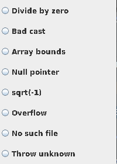

# Lab 11: Exception Handling

Using IntelliJ you are going to do some error handling exploration. 

 - Open IntelliJ 
 - Create a new project
   - Call it `Shapes` like the screen shot below.
   - Note you can use any JDK for this exercise, I am using JDK 11.0.13

## Step 1

Reproduce the following to set up the project

<div align=center>


</div>


Now you can edit `main()` with the following code, then compile and run.
```java
{
    System.out.println(3/0);
}
```

You should see the following output in the Run terminal... 


<div align=center>


</div>

Modify the Main.java as shown below. The change is to catch an exception through try-catch block.

```java
    try{
        System.out.println(3/0);
    } 
    catch(Exception e){
        System.out.printf("Caught runtime exception = %s\n", e);
    }
```

If you run the program again you should get the following output:

<div align=center>


</div>


Modify the Main.java as shown below. The change is to use more specific Exception class, `ArithmeticException` in this case.


```java
    try{
        System.out.println(3/0);
    } 
    catch(ArithmeticException e){
        System.out.printf("Caught runtime exception = %s\n", e);
    }
```

If you run the program again you should get the following output:

<div align=center>


</div>

Let's try changing the Exception Class, to `NumberFormatExpression`.

```java
    try{
            System.out.println(3/0);
        } 
        catch(NumberFormatException e){
            System.out.printf("Caught runtime exception = %s\n", e);
        }
```

<details>
<summary>What happens when you run it?</summary>

<div align=center>


</div>

Because the expected Exception Class is wrong.

</details>

For fun, do the following, what happens and why?

```java
    try{
            System.out.println(3/0);
        } catch(ArithmeticException e){
            System.out.printf("Caught runtime exception = %s\n", e);
            System.out.println(3/0);
        }
```
## Step 2: Catch multiple exceptions

Reproduce the following code:

```java
package com.example.ExeceptionHandling;
import javax.swing.JOptionPane;

public class Main {
    public static void main(String[] args) {
        // Enter the following values and see what exception is caught.
        //    0, 4, character, <no value>
        try {
            String value = JOptionPane.showInputDialog(null, "Enter value:");
            // Non-numeric value will result an NumberFormatException
            int divisor = Integer.parseInt(value);
            // If the divisor is 0, it will result in ArithmetricException
            System.out.println(3/divisor);
        } catch (NumberFormatException nfe){
            System.out.println("Exception caught by this program: Enter numeric value.");
        } catch (ArithmeticException exc) {
            System.out.println("Exception caught by this program: Divisor was 0.");
        }
        System.out.println("After exception.");
    }
}
```

You'll notice that we are now importing a library on line 2 `import javax.swing.JOptionPane;` we now will be able to have a GUI.

- Build and run the program
  - Observe Input dialog box appears.
  - Enter 0 in the field.
  - Click OK.


<div align=center>


</div>

Notice that the exception was caught.

<div align=center>


</div>

- Build and run the program
  - Observe Input dialog box appears.
  - Enter 4 in the field.
  - Click OK.

<div align=center>


</div>

Notice that the No exception was caught as it was not needed

<div align=center>


</div>


What happens when you enter a character or nothing instead? 


# Step 3

Modify the program to look like the following code:

> This is a larger program 89 lines.


```java
package com.example.ExeceptionHandling;
import java.awt.Frame;
import java.awt.GridLayout;
import java.awt.event.ActionEvent;
import java.awt.event.ActionListener;
import java.awt.event.WindowAdapter;
import java.awt.event.WindowEvent;
import java.io.FileInputStream;

import javax.swing.ButtonGroup;
import javax.swing.JFrame;
import javax.swing.JPanel;
import javax.swing.JRadioButton;

public class Main extends JFrame implements ActionListener {
    private double[] a;
    private JRadioButton divideByZeroButton,badCastButton,arrayBoundsButton, nullPointerButton,
            negSqrtButton, overflowButton,noSuchFileButton, throwUnknownButton;

    public Main() {
        // Create a JPanel and GridLayout
        JPanel p = new JPanel();
        p.setLayout(new GridLayout(8, 1));

        // Create buttons and add them to the panel
        ButtonGroup g = new ButtonGroup();
        divideByZeroButton = addRadioButton("Divide by zero", g, p);
        badCastButton = addRadioButton("Bad cast", g, p);
        arrayBoundsButton = addRadioButton("Array bounds", g, p);
        nullPointerButton = addRadioButton("Null pointer", g, p);
        negSqrtButton = addRadioButton("sqrt(-1)", g, p);
        overflowButton = addRadioButton("Overflow", g, p);
        noSuchFileButton = addRadioButton("No such file", g, p);
        throwUnknownButton = addRadioButton("Throw unknown", g, p);
        getContentPane().add(p);
    }

    private JRadioButton addRadioButton(String s, ButtonGroup g, JPanel p) {
        JRadioButton button = new JRadioButton(s, false);
        button.addActionListener(this);
        g.add(button);
        p.add(button);
        return button;
    }

    // Trigger and catch various exceptions
    public void actionPerformed(ActionEvent evt) {
        try {
            Object source = evt.getSource();
            if (source == divideByZeroButton) {
                a[1] = a[1] / a[1] - a[1];
            } else if (source == badCastButton) {
                Frame f = (Frame) evt.getSource();
            } else if (source == arrayBoundsButton) {
                a[1] = a[10];
            } else if (source == nullPointerButton) {
                Frame f = null;
                f.setSize(200, 200);
            } else if (source == negSqrtButton) {
                a[1] = Math.sqrt(-1);
            } else if (source == overflowButton) {
                a[1] = 1000 * 1000 * 1000 * 1000;
                int n = (int) a[1];
            } else if (source == noSuchFileButton) {
                FileInputStream is = new FileInputStream("Java Source and Support");
            } else if (source == throwUnknownButton) {
                throw new UnknownError();
            }
        } catch (RuntimeException e) {
            System.out.println("Caught RuntimeException: " + e);
        } catch (Exception e) {
            System.out.println("Caught Exception: " + e);
        }
    }

    public static void main(String[] args) {
        JFrame frame = new Main();
        frame.setType(Type.POPUP);
        frame.setSize(200, 300);
        frame.addWindowListener(new WindowAdapter() {
            public void windowClosing(WindowEvent e) {
                System.exit(0);
            }
        });
        frame.setVisible(true);
    }
}
```

- Build and run the program.
  - Observe dialog box appears.
    - Click any of the radio buttons. 
    - Clicking a button will execute code fragement that generates an exception.

<div align=center>

 


</div>

- For your own exercise, please do the following tasks
- Try other buttons and observe the exceptions that are caught
- Try to catch exceptions using more specific exception classes (over RuntimeException and Exception classes).
