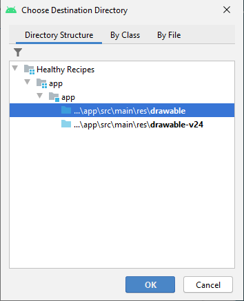
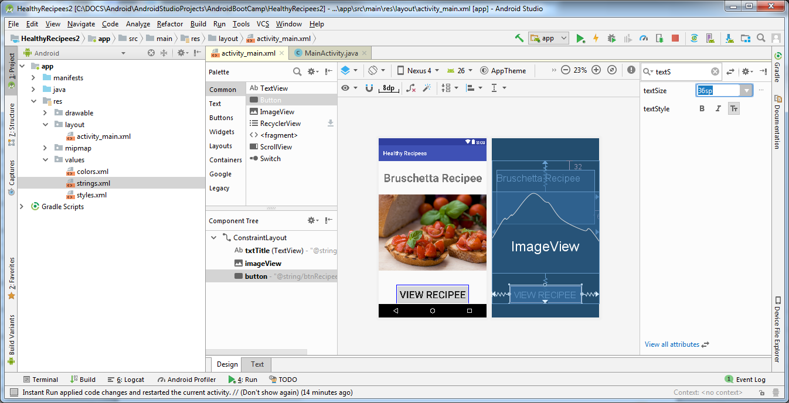

# Lab 2 Android User Interface. Part 1

Do the example from the lecture following the guidelines below.

## Using the Android User Interface
### Step 1

• Start a new project.  Open Android Studio.  Select File/New/New Project... from the main menu. 

• On the window that appears just click the Next button, making sure the Empty Activity is chosen (it is by default!).

### Step 2:
• After clicking the next button, the Create New Project dialog appears.

• In the Name: text box, type in Healthy Recipes. 7

• Choose the location where you want to save your projects or just use the default suggested location if =you are happy with it.

• Make sure the language chosen is Java and NOT Kotlin!

• If necessary, select API16: Android 4.1 (Jelly Bean) for the Minimum SDK as shown below:

### Step 3:
• Click the Finish button. 

• The Android project is now created and the `activity_main.xml` file and `MainActivity.java` file are visible as tabs. 

### Step 4:

• Click on the `activity_main.xml` tab.

• Click the Hello world! TextView widget (displayed by default) in the emulator and press the Delete key. 

## Using the String Table in the Transitions Editor

### Step 1:

• In the Android project view, expand the values folder within the res folder.

• Double-click the strings.xml file to display its default string resources

### Step 2:

• Click the Open editor link.

• Click the Add Key (+) button in the Translations Editor.

• In the Key text box, type `txtTitle` to name the string for the TextView control.

• In the Default Value text box, type `Bruschetta Recipe` to define the text to display.

### Step 3:

• Click the OK button.

• Click the Add key (~) button in the Translations Editor.

• In the Key text box, type btnRecipe to name the string for the Button control.

• In the Default Value text box, type View Recipe to define the text.

• Click the OK button.

• Click the Add key (+) button in the Translations Editor.

• In the Key text box, type description to name the string for the Button control.

• In the Default Value text box, type Recipe Image to define the text.
 
### Step 4:

• Click the OK button to add the string for the Button control to the String table, and then click the Add Key (plus sign) button in the Translations Editor.

• In the Key text box, type txtIngredients to name the string for a TextView control to display on the second app screen.

• In the Default Value text box, type Ingredients to define the text, and then click the OK button to add the string to the String table.

• Using the techniques taught in this step, add the strings in the table below to the String table in the Translations Editor:

|Key|Default Value|
|---|----|
|txtItem1| 4 plum tomatoes|
|txtItem2| 6 basil leaves|
|txtItem3| 3 garlic cloves, chopped|
|txtItem4| 3 TB olive oil |
|txtDirections| Directions|
|txtMix| Combine the ingredients and add salt to taste. Top French bread slices with mixture.|

## Android Text Properties

### Step 1:

• In the Common category in the Palette, select the widget named TextView and drag it near the top of the emulator.

• To centre the TextView control, drag it to the centre of the emulator until a dashed vertical line identifying the window’s centre is displayed.

### Step 2:

• Click on the TextView control on the emulator.

• Click on the vertical bar next to the text Property of the textView in the Attributes window.

• Choose txtTitle by clicking on it to choose it as an option and then click the OK button. Now the textView will change to Bruschetta Recipe as that is the value we have entered for txtTitle using the Translations Editor.

**Step 2:**

• Click on the textView and then right click and choose Center and then Horizontally from the drop down menu. 

• In the Attributes pane, choose the  and type in text. Find the textSize property from the list of text properties that appears.

• Click to the right of the textSize property, type `40sp`, and the press Enter.

• The result is shown below:

## Adding a File to the Resources Folder

**Step 1:**

• Copy the bruschetta.png file from the Pictures folder on the module moodle page to your PC or USB drive.

• To copy the bruschetta.png file, click the file on the PC or USB drive, then press Ctrl+C.

• To paste the image file into the drawable folder, right click the drawable folder in the Android project view.

• Click Paste on the shortcut menu.

**Step 2:**

• From the window that appears choose the first option for drawable and click the OK button.

• Click the OK button and then another dialog box appears in the Copy dialog box. Click the OK button again. 

The bruschetta.png file will appear in the drawable folder as shown below:

## Adding an ImageView Control

**Step 1:**

• Click ImageView in the Common category in the Palette on the Design tab and drag it to the centre of the emulator until a dashed vertical line appears, indicating the control is centred.  

• A Resources pane will appear, choose the bruschetta image.

• Press the Ok button.

**Step 2:**

• In the Attributes pane find the contentDescription property.

• Click the vertical bar next to it. 

• In the Pick a Resource Pane choose description and then press Enter.

## Adding a Button Control

**Step 1:**

• From the Common category in the Palette, drag the Button control to the emulator below the ImageView control until a dashed vertical line appears, indicating the control is centred.  Release the mouse button.

• Click the button and in the Attributes pane, click on the vertical line next to the text attribute.

• In the Pick a Resource Pane which appears, btnRecipe and then press Enter.

• In the Attributes pane, choose the  and type in text. Find the textSize property from the list of text properties that appears.

• Click to the right of the textSize property, type 36sp, and the press Enter.

• Now press the Infer Constraints button as shown below in order to automatically create constraints.  If constraints are not present, all the controls will appear at the top of the emulator. 

Now run the emulator to see how the layout will look like.  In order to do that click the Run ‘app’ green arrow below the main menu or press Shift +F10.  

The result is shown below:

## Adding a New Class File

**Step 1:**

• Close the activity_main.xml tab.

• In the Android project view, expand the java folder and the first package to view the MainActivity Java class.

• To create a second class, press and hold or right click the first folder, click New and the shortcut menu , and then click Activity,

**Step 2:**

• Click Empty Activity to create a second Activity class.

• In the Activity Name text box, type Recipe to create a second class.

**Step 3:**

• Click the Finish button to finish creating the Recipe class and XML layout for the second screen.

• Delete the default Hello world! Text object from the activity_recipe.xml emulator.

• Using the techniques described earlier, create the second user interface, `activity_recipe.xml`, as shown below with multiple TextView controls.

• Do not forget after you have finished developing the user interface, to Infer Constraints using the button on the top of the emulator screen.   Otherwise, all the text will appear at the top of the emulator, and it will overlap!

• The result is shown below:

## Coding a Button Event Handler

The `MainActivity.java` class was created automatically by Android Studio.

**Step 1:**

• Click the `MainActivity.java` tab to open its code window.

• Click to the right of `setContentView(R.layout.activity_main);` in Line 14, and the press Enter.

• To initialize and reference the Button control, type: `Button button = findViewbyId(R.id.button)`;

**Step 2:**
    
• Click at the end of the line and press Enter.

• To code the button listener that awaits user interaction, type `button.setOn` to display an auto-complete listing with all the possible entries that are valid at that point in the code. 

• Double click the first `setOnClickListener` to select it from the auto-complete listing.

• In the parentheses, type `new On` to view possible auto-complete options.

**Step 3:**
• Double click the first choice, which lists an `OnClickListener(...)`.  Auto-generated code adds an `onClick()` method.

• If necessary, click View if the text is red and then press Alt + Enter to import View.

• Click to place the insertion point on line 21 inside the `public void onClick (View v)` braces.

**Step 4:**
• Type `startA` and select `startActivity(Intent intent)` from the auto-complete listing.

• In the parentheses, change the intent text by typing new Int and then double `click Intent (android.content)` in the auto-complete listing.

• In the next set of parenthesis, type `MainActivity.this, Recipe.class`.

• Click the Save All button on the toolbar. 

Now click the Run ‘app’  (or press Shift + F10) button on the toolbar to test the application in the emulator.  

> **Reference:**
Hoisington, C. (2016) Android Boot Camp for Developers Using Java: A Guide to Creating Your First Android Apps, Cengage Learning, Chapter 2
>
> Material reproduced from Radostinka Dontcheva 2021-22

